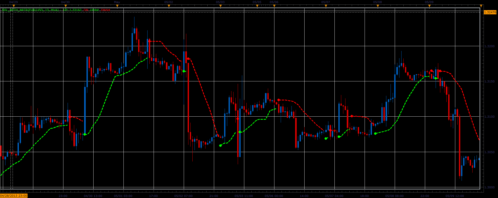

# SSL with NRTR indicator

> Source: https://fxcodebase.com/code/viewtopic.php?f=17&t=41294  
> Forum: 17 · Topic 41294 · 19 post(s)

---

## SSL with NRTR indicator

**Alexander.Gettinger** · Tue Jun 18, 2013 1:09 pm

This indicator is a ported MQL5 indicator from [http://www.mql5.com/en/code/1682](http://www.mql5.com/en/code/1682)

 

Download:

 [SSL_with_NRTR.lua](files/67517/SSL_with_NRTR.lua)

For this indicator must be installed Averages indicator ([viewtopic.php?f=17&t=2430](https://fxcodebase.com/code/viewtopic.php?f=17&t=2430)).

 

 [MTF SSL_with_NRTR.lua](files/67517/MTF%20SSL_with_NRTR.lua)

 [SSL_with_NRTR with Alert.lua](files/67517/SSL_with_NRTR%20with%20Alert.lua)

The indicator was revised and updated

---

## Re: SSL with NRTR indicator

**7510109079** · Fri Jun 21, 2013 5:39 am

thx for this port which works quite nicely.

Can you make this into a strategy?

If so. is it possible to somehow specify a custom stop amount or is this built in?

rgrds

---

## Re: SSL with NRTR indicator

**Apprentice** · Sun Jun 23, 2013 2:26 pm

Your request is added to the development list.

---

## Re: SSL with NRTR indicator

**7510109079** · Thu Jul 11, 2013 2:55 am

many thx. Just checking in again. This indicator continues to perform well

---

## Re: SSL with NRTR indicator

**7510109079** · Thu Jul 11, 2013 3:25 am

Evaluating this indicator further it shows to be performing well. However for it to function efficiently as a strategy, provision would have to be made for the use of Stops to limit losses and secure profits.

It would be beneficial if the user would be able to specify:

(i) a stop loss either as a percentage price move compared to that of current price or an absolute currency amount

(ii) a trailing stop to capture profits

Would it be possible to build in such functionality to the strategy?

many thx in advance
Lawrence

---

## Re: SSL with NRTR indicator

**7510109079** · Thu Jul 11, 2013 1:39 pm

Would it also make sense to be able to change the k value of the NRTR offset?

What is this set to be default in your code?

---

## Re: SSL with NRTR indicator

**Apprentice** · Sun Jul 14, 2013 2:40 am

NRTR offset Is not set by variable.

This is the formula.
 DN[period]=math.min(HMA.DATA[period-1], DN[period-1]);
 UP[period]=math.max(LMA.DATA[period-1], UP[period-1]);

---

## Re: SSL with NRTR indicator

**7510109079** · Tue Jul 16, 2013 3:07 am

Ah OK , then I don't understand it clearly , but do not be put off by that, as the indicator still works well.

Is it still possible to put stop loss and trailing stop functionality into the strategy?

thx

---

## Re: SSL with NRTR indicator

**Apprentice** · Wed Jul 17, 2013 3:59 am

Yes it is possible.

---

## Re: SSL with NRTR indicator

**Apprentice** · Thu Jul 18, 2013 2:11 pm

MTF Version Added.

---

## Re: SSL with NRTR indicator

**7510109079** · Fri Jul 19, 2013 4:39 am

thx App. for MTF addition. Are we still on for the migration to a strategy?

---

## Re: SSL with NRTR indicator

**Apprentice** · Sat Jul 20, 2013 9:41 am

Yes

---

## Re: SSL with NRTR indicator

**7510109079** · Wed Aug 07, 2013 4:30 pm

just checking in. any progress on this one?

---

## Re: SSL with NRTR indicator

**Kyriakos** · Thu Aug 29, 2013 9:52 am

Hi. int the MTF version can you add the option in which of the corners we can place the panel, like the ATR PIPS indicator. Thanks

---

## Re: SSL with NRTR indicator

**Apprentice** · Fri Aug 30, 2013 3:57 am

Your request is added to the development list.

---

## Re: SSL with NRTR indicator

**Kyriakos** · Thu Dec 12, 2013 6:10 am

Hi. Just checking if you are going to develop the strategy. Thanks

---

## Re: SSL with NRTR indicator

**allerner** · Fri Oct 07, 2016 12:29 pm

> **Alexander.Gettinger wrote:**
> This indicator is a ported MQL5 indicator from [http://www.mql5.com/en/code/1682](http://www.mql5.com/en/code/1682)
>
>
>
> SSL_With_NRTR.PNG
>
>
>
> Download:
>
>
> SSL_with_NRTR.lua
>
>
>
> For this indicator must be installed Averages indicator ([viewtopic.php?f=17&t=2430](https://fxcodebase.com/code/viewtopic.php?f=17&t=2430)).
>
>
>
>
> MTF SSL_with_NRTR.png
>
>
>
>
> MTF SSL_with_NRTR.lua

"
 Hi , it is possible to add functionality to this indicator to send an email alert when the condition is met ?
Thank You
"

---

## Re: SSL with NRTR indicator

**Apprentice** · Tue Oct 11, 2016 4:17 am

SSL_with_NRTR with Alert.lua added.

---

## Re: SSL with NRTR indicator

**Apprentice** · Tue Mar 13, 2018 11:07 am

The indicator was revised and updated
