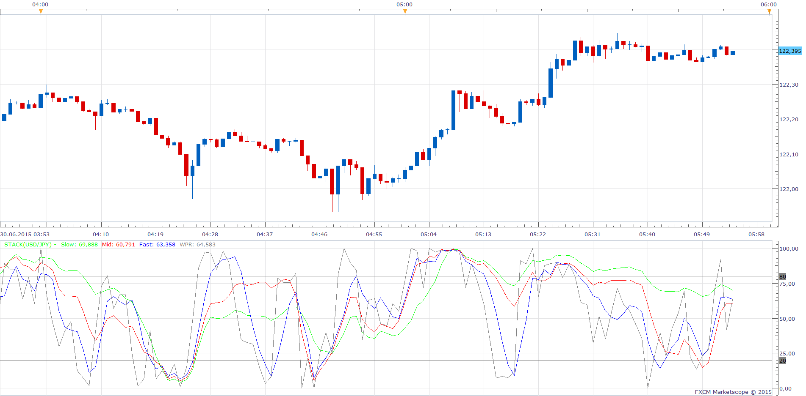

# Stack

> Source: https://fxcodebase.com/code/viewtopic.php?f=17&t=62380  
> Forum: 17 · Topic 62380 · 2 post(s)

---

## Stack

**Apprentice** · Tue Jun 30, 2015 5:31 am

Based on request.
[viewtopic.php?f=27&t=62371&p=101225#p101225](https://fxcodebase.com/code/viewtopic.php?f=27&t=62371&p=101225#p101225)
Stack will stack up three period Stochastic Oscillator and RLW indicator shifted by 100

 [Stack.lua](files/101226/Stack.lua)

---

## Re: Stack

**Apprentice** · Tue Oct 23, 2018 7:00 am

The indicator was revised and updated.
