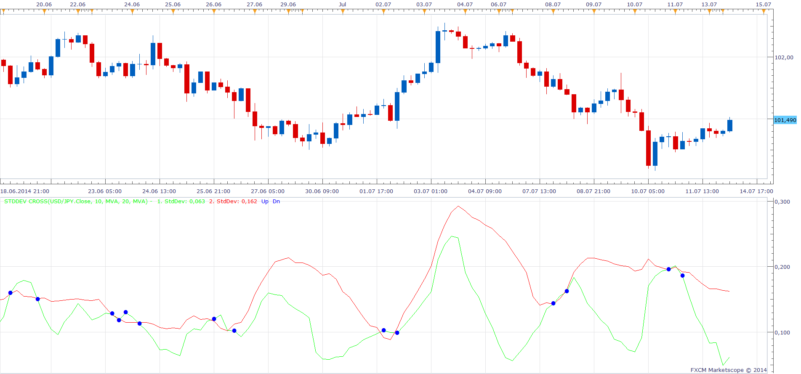

# Standard Deviation Cross

> Source: https://fxcodebase.com/code/viewtopic.php?f=17&t=60896  
> Forum: 17 · Topic 60896 · 6 post(s)

---

## Standard Deviation Cross

**Apprentice** · Mon Jul 14, 2014 2:13 am

Based on Standard Deviation Indicator.
[viewtopic.php?f=17&t=870](https://fxcodebase.com/code/viewtopic.php?f=17&t=870)

This indicator provides Audio / Email Alerts on Two Standard Deviation Line Cross.

 [StdDev Cross.lua](files/94875/StdDev%20Cross.lua)

Dec 14, 2015: Compatibility issue Fixed. _Alert helper is not longer needed.

If you want to use updated version of this indicator,
please make sure to use TS Version 01.14.101415. or higher.

The indicator was revised and updated

---

## Re: Standard Deviation Cross

**SenseClash** · Mon Jul 14, 2014 5:05 pm

I wonder if this could be modified to give people a choice about when to be alerted/notified:
1) alert only when the faster crosses OVER the slower
2) alert only when the faster crosses UNDER the slower
3) alert both OVER and UNDER crosses

I personally prefer option 1) above. Regarding option 2), I don't need to know when the market is getting quiet.

A modification like this would make a big difference in how much sleep I get at night.

---

## Re: Standard Deviation Cross

**Apprentice** · Tue Jul 15, 2014 2:33 am

Your request is added to the development list.

---

## Re: Standard Deviation Cross

**Alexander.Gettinger** · Thu Apr 30, 2015 10:32 am

MQL4 version of Standard Deviation Cross oscillator: [viewtopic.php?f=38&t=62173](https://fxcodebase.com/code/viewtopic.php?f=38&t=62173).

---

## Re: Standard Deviation Cross

**Apprentice** · Mon Dec 14, 2015 5:21 am

Dec 14, 2015: Compatibility issue Fixed. _Alert helper is not longer needed.

If you want to use updated version of this indicator,
please make sure to use TS Version 01.14.101415. or higher.

---

## Re: Standard Deviation Cross

**Apprentice** · Wed Aug 02, 2017 7:36 am

The indicator was revised and updated.
