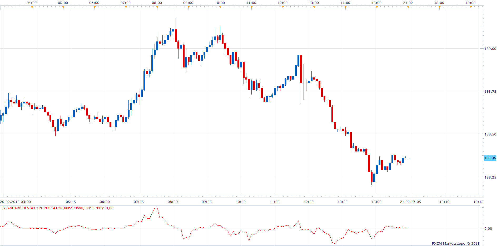

# Standard Deviation Indicator

> Source: https://fxcodebase.com/code/viewtopic.php?f=17&t=61851  
> Forum: 17 · Topic 61851 · 8 post(s)

---

## Standard Deviation Indicator

**Apprentice** · Sat Feb 21, 2015 10:16 am

Based on the request.
[viewtopic.php?f=27&t=61801](https://fxcodebase.com/code/viewtopic.php?f=27&t=61801)

 [Standard Deviation Indicator.lua](files/98769/Standard%20Deviation%20Indicator.lua)

The indicator was revised and updated

---

## Re: Standard Deviation Indicator

**juju1024** · Sun Feb 22, 2015 12:04 am

hi,
Sorry, I have this message : "An error occurred during the calculation of the indicator 'STANDARD DEVIATION INDICATOR'. The error details: Standard Deviation Indicator.lua:82: Index is out of range."

---

## Re: Standard Deviation Indicator

**Apprentice** · Sun Feb 22, 2015 3:45 am

Try updated version.

---

## Re: Standard Deviation Indicator

**blueseahorse** · Thu Aug 06, 2015 12:23 am

> **Apprentice wrote:**
> Try updated version.

hi sir

can this be translated into mq4, please?

thanks a lot

---

## Re: Standard Deviation Indicator

**Apprentice** · Thu Aug 06, 2015 5:41 am

Your request is added to the development list.

---

## Re: Standard Deviation Indicator

**Apprentice** · Thu Aug 06, 2015 7:19 am

Try this version.
[viewtopic.php?f=38&t=62506](https://fxcodebase.com/code/viewtopic.php?f=38&t=62506)

---

## Re: Standard Deviation Indicator

**blueseahorse** · Fri Aug 07, 2015 1:26 am

thanks a lot!

---

## Re: Standard Deviation Indicator

**Apprentice** · Wed Jul 19, 2017 8:15 am

The indicator was revised and updated.
