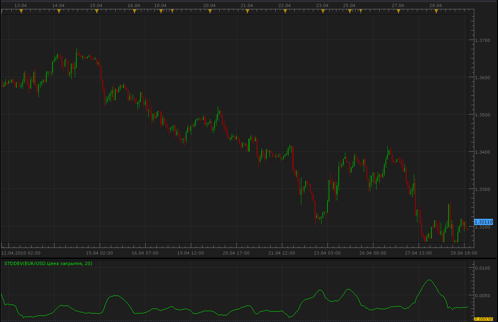

# Standard Deviation Indicator

> Source: https://fxcodebase.com/code/viewtopic.php?f=17&t=870  
> Forum: 17 · Topic 870 · 23 post(s)

---

## Standard Deviation Indicator

**Alexander.Gettinger** · Thu Apr 29, 2010 1:41 am

The formula is:
StdDev (i) = SQRT (AMOUNT (j = i - N, i) / N)
AMOUNT (j = i - N, i) = SUM ((ApPRICE (j) - MA (ApPRICE (i), N, i)) ^ 2)
Where:
StdDev (i) — Standard Deviation of the current bar;
SQRT — square root;
AMOUNT(j = i - N, i) — sum of squares from j = i - N to i;
N — smoothing period;
ApPRICE (j) — the price of the j-th bar;
MA (ApPRICE (i), N, i) — any moving average of the current bar for N periods;
ApPRICE (i) — the price of the current bar.

 



```lua
function Init()
    indicator:name("Standard Deviation Indicator");
    indicator:description("Technical indicator named Standard Deviation (StdDev) measures the market volatility.");
    indicator:requiredSource(core.Tick);
    indicator:type(core.Oscillator);
   
    indicator.parameters:addInteger("N", "N", "Period", 20);

    indicator.parameters:addColor("clrStdDev", "Color of StdDev", "Color of StdDev", core.rgb(0, 255, 0));
end

local first;
local source = nil;
local MA;
local N;

function Prepare()
    source = instance.source;
    N=instance.parameters.N;
    MA = core.indicators:create("MVA", source, N);
    first = MA.DATA:first()+N;
    local name = profile:id() .. "(" .. source:name() .. ", " .. N .. ")";
    instance:name(name);
    StdDev = instance:addStream("StdDev", core.Line, name .. ".StdDev", "StdDev", instance.parameters.clrStdDev, first);
end

function Update(period, mode)
    MA:update(mode);
    if (period>first+N) then
     local dAmount=0.;
     local dMovingAverage=MA.DATA[period];
     local i;
     for i=0,N,1 do
      dAmount=dAmount+math.pow((source[period-i]-dMovingAverage),2);
     end
     StdDev[period]=math.sqrt(dAmount/N);
    end
end
```

 [StdDev.lua](files/1577/StdDev.lua)

 [Normalized Standard Deviation Indicator.lua](files/1577/Normalized%20Standard%20Deviation%20Indicator.lua)

---

## Re: Standard Deviation Indicator

**keyrama** · Thu Apr 29, 2010 1:56 am

Hi there,

Great but could you explain how do we interpret it efficiently ?

Thanks,

Keyrama

---

## Re: Standard Deviation Indicator

**Nikolay.Gekht** · Thu Apr 29, 2010 8:08 am

The indicator shows how much the price at the particular period differs from the price expected in the trend (i.e. sequence of the prices which looks predictable). So, higher value can point to the change of the price direction.

---

## Re: Standard Deviation Indicator

**keyrama** · Thu Apr 29, 2010 9:16 am

Ok, that's what i thought.
That means when a peak is starting to fall back, price as started the correction of the move.
On 20 periods it seems too laggy for me, but around 16periods and not too choppy.

What is interesting is that it reflects well the gravity model, so maybe we could the use the symetry to anticipate where price starts and ends a corrective move.

I will look if there is something good to get out of this indicator.

Thanks,

keyrama

---

## Re: Standard Deviation Indicator

**Alexander.Gettinger** · Tue Oct 12, 2010 1:37 am

Update indicator.
Added method of MA.

```lua
function Init()
    indicator:name("Standard Deviation Indicator");
    indicator:description("Technical indicator named Standard Deviation (StdDev) measures the market volatility.");
    indicator:requiredSource(core.Tick);
    indicator:type(core.Oscillator);
   
    indicator.parameters:addInteger("N", "N", "Period", 20);
    indicator.parameters:addString("Method", "Method", "", "MVA");
    indicator.parameters:addStringAlternative("Method", "MVA", "", "MVA");
    indicator.parameters:addStringAlternative("Method", "EMA", "", "EMA");
    indicator.parameters:addStringAlternative("Method", "KAMA", "", "KAMA");
    indicator.parameters:addStringAlternative("Method", "LWMA", "", "LWMA");
    indicator.parameters:addStringAlternative("Method", "TMA", "", "TMA");

    indicator.parameters:addColor("clrStdDev", "Color of StdDev", "Color of StdDev", core.rgb(0, 255, 0));
end

local first;
local source = nil;
local MA;
local N;
local Method;

function Prepare()
    source = instance.source;
    N=instance.parameters.N;
    Method=instance.parameters.Method;
    MA = core.indicators:create(Method, source, N);
    first = MA.DATA:first()+N;
    local name = profile:id() .. "(" .. source:name() .. ", " .. N .. ", " .. Method .. ")";
    instance:name(name);
    StdDev = instance:addStream("StdDev", core.Line, name .. ".StdDev", "StdDev", instance.parameters.clrStdDev, first);
end

function Update(period, mode)
    MA:update(mode);
    if (period>first+N) then
     local dAmount=0.;
     local dMovingAverage=MA.DATA[period];
     local i;
     for i=0,N,1 do
      dAmount=dAmount+math.pow((source[period-i]-dMovingAverage),2);
     end
     StdDev[period]=math.sqrt(dAmount/N);
    end
end
```

 [StdDev2.lua](files/5132/StdDev2.lua)

 [StdDev with Alert.lua](files/5132/StdDev%20with%20Alert.lua)

This indicator provides Audio / Email Alerts on Standard Deviation Line / Triger Lines Cross.
Make sure to define the trigger line which is different from default 0.

---

## Standard Deviation Indicator

**Kactassem** · Mon Oct 18, 2010 12:20 pm

Since a workcenter has only 6 standard values, why would you want the standard value key to have more than that?

---

## Re: Standard Deviation Indicator

**Coondawg71** · Sun Feb 02, 2014 8:14 am

Can we please add Alert function to this indicator.

Please allow three levels of Standard Deviation to be entered by user.

Each breach of level would trigger an Audible and Visual alert within the StdDev2 indicator panel as illustrated in attached image. Alert will have "Dialog box alert" function.

Thanks!

sjc

---

## Re: Standard Deviation Indicator

**Apprentice** · Mon Feb 03, 2014 6:46 am

Standard Deviation Indicator with Alert Added.

---

## Re: Standard Deviation Indicator

**SenseClash** · Sun Jul 13, 2014 12:27 pm

I like using two moving averages of standard deviations and taking a trade when they cross. For example, when a 10-period simple moving average of the standard deviation crosses over the 20-period SMA of the SD, as shown in the attached example. It shows me that volatility has increased in a way that is more useful than Bollinger bands. Would you be willing to create an indicator for this?

---

## Re: Standard Deviation Indicator

**Apprentice** · Sun Jul 13, 2014 1:37 pm

From what I can see, u have two Standard Deviation Indicator attached to the chart.

Can u give a more detailed description.
Probably with formula and a description of the desired presentation.

---

## Re: Standard Deviation Indicator

**SenseClash** · Sun Jul 13, 2014 7:25 pm

Yes, there are 2 standard deviation indicators attached to the chart. The formula is the same as yours:
----------------------------------------------------------------------------------------------
StdDev (i) = SQRT (AMOUNT (j = i - N, i) / N)
AMOUNT (j = i - N, i) = SUM ((ApPRICE (j) - MA (ApPRICE (i), N, i)) ^ 2)
etc.
----------------------------------------------------------------------------------------------
Each SD indicator has its own N (Smoothing period), which in my attached chart was a fast one (10) and a slower one (20). I'd like to have both plotted on the same chart (with options I can choose for colors and also styles like histograms), with an alert when the faster one (N=10 in my example) crosses the slower one (N=20 in my example). The overall purpose is to give an alert when volatility increases.

---

## Re: Standard Deviation Indicator

**Apprentice** · Mon Jul 14, 2014 2:14 am

Requested can be found here.
[viewtopic.php?f=17&t=60896](https://fxcodebase.com/code/viewtopic.php?f=17&t=60896)

---

## Re: Standard Deviation Indicator

**SenseClash** · Thu Jul 31, 2014 2:26 am

I have installed StdDev2.lua, StdDev with Alert.lua, and _Alert.lua and I keep getting this error message when the alert goes off :

"NZD/USD	STDDEV WITH ALERT	An error occurred during the calculation of the indicator 'STDDEV WITH ALERT'. The error details: StdDev with Alert.lua:299: attempt to call method 'barSize' (a nil value).	07/31/2014 03:18:46"

Any idea why? It's set to alert on a 20MVA when the SD reaches .00050.

---

## Re: Standard Deviation Indicator

**Apprentice** · Thu Jul 31, 2014 5:50 am

Please Re-Download.

---

## Re: Standard Deviation Indicator

**SenseClash** · Mon Aug 04, 2014 2:34 am

I reloaded this and the previous error message went away, so thanks.

Now one last problem: I'm not receiving email messages when the alert fires off. I believe my email settings are correct. I tested them using the Moving Average Crossover Strategy on a 1-minute chart of the AUD/JPY with the EMAs set to 1 and 3. I got a crossover quickly and an email right away.

Then I put the SD With Alert indicator on a 1-minute chart of the GBP/JPY and set the level at .025. I soon got a popup indicating that the alert had occurred, but still no email.

I've attached my settings for the SD with Alert for you to see if there are any problems with how I've set it up. As always, I'm grateful for your great indicators and strategies and willingness to help!

---

## Re: Standard Deviation Indicator

**Apprentice** · Mon Aug 04, 2014 8:23 am

I do not see Activ _Alert on your chart.
U have to have one Activ _Alert per currency pair.

---

## Re: Standard Deviation Indicator

**SenseClash** · Mon Aug 04, 2014 9:54 am

Okay, I have _Alert as a strategy active on my currency pair. The alert tried to fire, but I got the error message below and the SD indicator went blank:

GBP/JPY	STDDEV WITH ALERT	An error occurred during the calculation of the indicator 'STDDEV WITH ALERT'. The error details: StdDev with Alert.lua:360: attempt to concatenate field '?' (a nil value).	08/04/2014 10:45:45

---

## Re: Standard Deviation Indicator

**SenseClash** · Thu Aug 07, 2014 4:19 am

In addition to some help with the email problem above, I wonder if this indicator can be changed to give me the option to alert only when SD crosses above (not under). In other words, I'd like the option of getting an alert when volatility increases, but not when it decreases.

Thank you.

---

## Re: Standard Deviation Indicator

**Apprentice** · Sat Aug 09, 2014 4:27 am

Please Re-Download.
Unfortunately i have limited internet access,
it makes difficult to work.
Will think about your proposal,
after my return to the office from vacation.

---

## Re: Standard Deviation Indicator

**Victor.Tereschenko** · Wed Dec 02, 2015 5:35 am

Version with support of latest TS version (with Indicore 3.0)

---

## Re: Standard Deviation Indicator

**Apprentice** · Tue Mar 21, 2017 6:32 am

Indicator was revised and updated.

---

## Re: Standard Deviation Indicator

**Apprentice** · Tue Oct 17, 2017 3:53 am

Normalized Standard Deviation Indicator.lua added.

---

## Re: Standard Deviation Indicator

**Apprentice** · Fri Aug 17, 2018 6:46 am

The Indicator was revised and updated.
