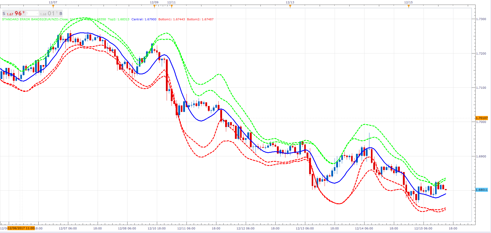

# Standard Error Bands

> Source: https://fxcodebase.com/code/viewtopic.php?f=17&t=62102  
> Forum: 17 · Topic 62102 · 8 post(s)

---

## Standard Error Bands

**Apprentice** · Sun Apr 12, 2015 5:04 am


Smoothed Linear Regression Line: Generally a 21-period linear regression curve that is smoothed by a 3-period simple moving average
Upper Standard Error Band: The linear regression line plus 2 standard errors.
Lower Standard Error Band: The linear regression line minus 2 standard errors.
Introduced by John Andersen in a September 1996 'Stock and Commodities' magazine artikle.

 [Standard Error Bands.lua](files/99737/Standard%20Error%20Bands.lua)

---

## Re: Standard Error Bands

**Alexander.Gettinger** · Fri May 22, 2015 9:55 am

MQL4 version of Standard Error Bands indicator: [viewtopic.php?f=38&t=62244](https://fxcodebase.com/code/viewtopic.php?f=38&t=62244).

---

## Re: Standard Error Bands

**Apprentice** · Tue May 24, 2016 2:15 am

Minor Update.

---

## Re: Standard Error Bands

**xel_arjona** · Tue Jun 07, 2016 4:39 pm

Just for the record, Bands are badly calculated.

Here's the implementation I made at TradingView's Pine if you like to re-code it to LUA:

[https://www.tradingview.com/script/qQjavJxT-Standard-Error-of-the-Estimate-Composite-Bands/](https://www.tradingview.com/script/qQjavJxT-Standard-Error-of-the-Estimate-Composite-Bands/)

Basically you need to define 2 functions prior to calculate error which are Alpha and Beta, then define the Standard Error Estimate from the Linear Regression Curve (I like to use TSF)

```
beta(array,periods) where
    n     = barindex
    val1 = sum(n*array,periods)-(periods*sma(n,periods)*sma(array,periods))
    val2 = sum(pow(n,2),periods)-(periods*pow(sma(n,periods),2))
    calcB = val1/val2

alpha(array,periods) =>
    n       = barindex
    calcA = sma(array,periods)-(beta(array,periods)*sma(n,periods))

see(array,periods)  //  This function must supplant StdDev for band creation with mult factor
    lr = linearregression(array,periods)  // Can be supplanted with TSF
    val1 = (sum(pow(array,2),periods))-((alpha(array,periods)*sum(array,periods)))-((beta(array,periods)*sum(n*array,periods)))
    val2 = periods - 2
    eest = sqrt(val1/val2)
```

Hope it helps!

---

## Re: Standard Error Bands

**Apprentice** · Fri Jun 10, 2016 3:03 am

Your request is added to the development list.
Bugzilla Bug 3539

---

## Re: Standard Error Bands

**Apprentice** · Mon Aug 28, 2017 9:30 am

The indicator was revised and updated.

---

## Re: Standard Error Bands

**Alexander.Gettinger** · Fri Dec 15, 2017 4:57 pm

> **xel_arjona wrote:**
> Just for the record, Bands are badly calculated.
>
> Here's the implementation I made at TradingView's Pine if you like to re-code it to LUA:
>
> [https://www.tradingview.com/script/qQjavJxT-Standard-Error-of-the-Estimate-Composite-Bands/](https://www.tradingview.com/script/qQjavJxT-Standard-Error-of-the-Estimate-Composite-Bands/)
>
> Basically you need to define 2 functions prior to calculate error which are Alpha and Beta, then define the Standard Error Estimate from the Linear Regression Curve (I like to use TSF)

Please, try this version of the indicator:

 



 [Standard Error Bands2.lua](files/116501/Standard%20Error%20Bands2.lua)

---

## Re: Standard Error Bands

**Apprentice** · Wed Jun 20, 2018 6:08 am

The Indicator was revised and updated.
