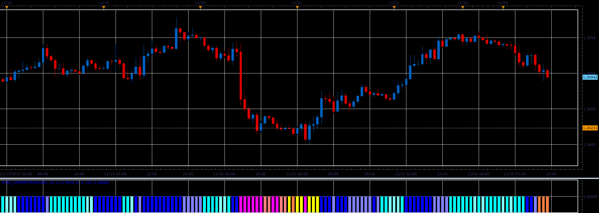

# Step choppy oscillator

> Source: https://fxcodebase.com/code/viewtopic.php?f=17&t=59997  
> Forum: 17 · Topic 59997 · 4 post(s)

---

## Step choppy oscillator

**Alexander.Gettinger** · Tue Nov 26, 2013 5:01 pm

This indicator is a ported MQL5 indicator from [http://www.mql5.com/ru/code/1882](http://www.mql5.com/ru/code/1882) (in Russian).

 

 [Step_Choppy.lua](files/91154/Step_Choppy.lua)

 

 [MCP MTF Step Choppy.lua](files/91154/MCP%20MTF%20Step%20Choppy.lua)

This indicator must be installed for Step_MA ([viewtopic.php?f=17&t=59995](https://fxcodebase.com/code/viewtopic.php?f=17&t=59995)), Step_RSI2 ([viewtopic.php?f=17&t=59996](https://fxcodebase.com/code/viewtopic.php?f=17&t=59996)), and Averages([viewtopic.php?f=17&t=2430](https://fxcodebase.com/code/viewtopic.php?f=17&t=2430)) indicators.

The indicator was revised and updated

---

## Re: Step choppy oscillator

**supertrader123** · Sun Feb 23, 2014 7:25 pm

hi,

can you create mtf mcp list of step choppy oscillator with same coloring options

---

## Re: Step choppy oscillator

**Apprentice** · Mon Feb 24, 2014 6:03 am

MCP MTF Step Choppy Added.

---

## Re: Step choppy oscillator

**Apprentice** · Fri Jun 02, 2017 6:28 am

Indicator was revised and updated.
