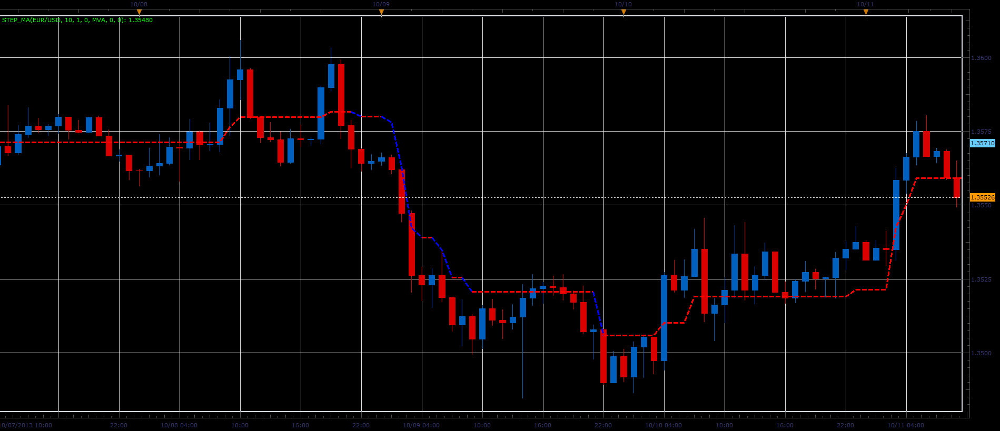

# Step MA indicator

> Source: https://fxcodebase.com/code/viewtopic.php?f=17&t=59995  
> Forum: 17 · Topic 59995 · 3 post(s)

---

## Step MA indicator

**Alexander.Gettinger** · Tue Nov 26, 2013 4:56 pm

The indicator idea is from [http://finance.groups.yahoo.com/group/TrendLaboratory](http://finance.groups.yahoo.com/group/TrendLaboratory) group.

 

Download:

 [Step_MA.lua](files/91152/Step_MA.lua)

For this indicator must be installed Averages indicator ([viewtopic.php?f=17&t=2430](https://fxcodebase.com/code/viewtopic.php?f=17&t=2430)).

The indicator was revised and updated

---

## Re: Step MA indicator

**Patrick Sweet** · Tue Nov 26, 2013 6:12 pm

Nice!

---

## Re: Step MA indicator

**Apprentice** · Sat Jun 17, 2017 4:24 am

The indicator was revised and updated.
