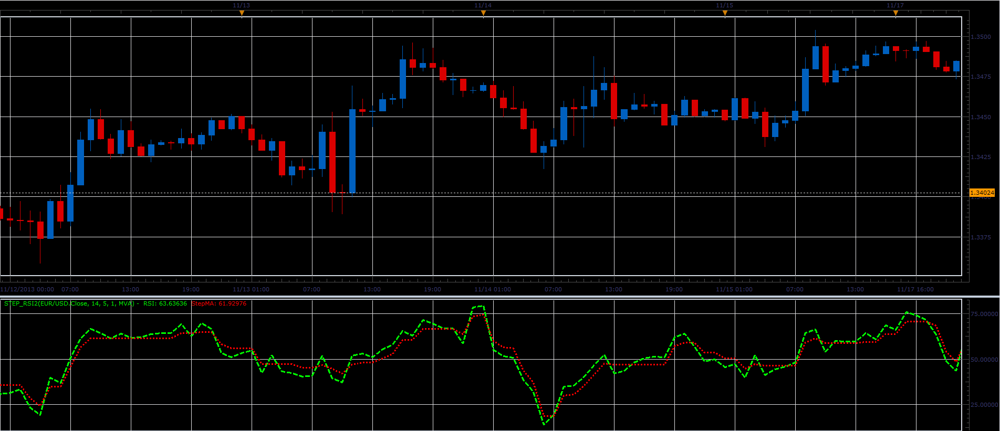

# Step RSI oscillator

> Source: https://fxcodebase.com/code/viewtopic.php?f=17&t=59996  
> Forum: 17 · Topic 59996 · 2 post(s)

---

## Step RSI oscillator

**Alexander.Gettinger** · Tue Nov 26, 2013 4:58 pm

The indicator idea is from [http://finance.groups.yahoo.com/group/TrendLaboratory](http://finance.groups.yahoo.com/group/TrendLaboratory)

 

Download:

 [Step_RSI2.lua](files/91153/Step_RSI2.lua)

For this indicator must be installed Averages indicator ([viewtopic.php?f=17&t=2430](https://fxcodebase.com/code/viewtopic.php?f=17&t=2430)).

The indicator was revised and updated

---

## Re: Step RSI oscillator

**Apprentice** · Sat Jun 17, 2017 4:26 am

The indicator was revised and updated.
