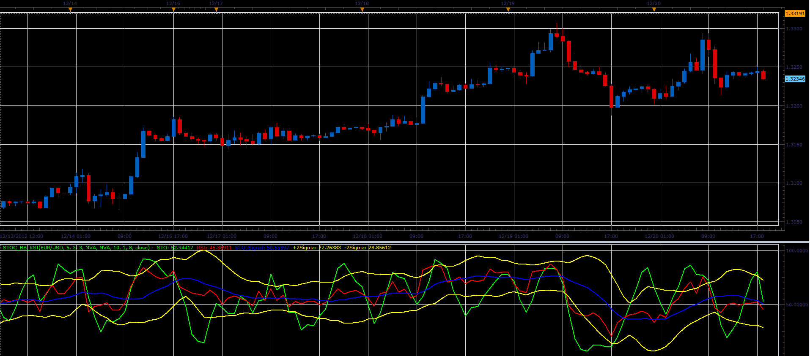

# Stoc+BB+RSI indicator

> Source: https://fxcodebase.com/code/viewtopic.php?f=17&t=27881  
> Forum: 17 · Topic 27881 · 4 post(s)

---

## Stoc+BB+RSI indicator

**Alexander.Gettinger** · Fri Dec 21, 2012 5:16 pm

This indicator is a ported MQL5 indicator from [viewtopic.php?f=27&t=27732&p=48582#p48582](https://fxcodebase.com/code/viewtopic.php?f=27&t=27732&p=48582#p48582)

 

Download:

 [Stoc_BB_RSI.lua](files/48922/Stoc_BB_RSI.lua)

For this indicator must be installed StdDev indicator ([viewtopic.php?f=17&t=870](https://fxcodebase.com/code/viewtopic.php?f=17&t=870)).

 

**green dot: sto > rsi and rsi>sto signal and sto signal > buy level and sto< +2 sigma**
**red dot: sto< rsi and rsi<sto signal and sto signal < sell level and sto>-2 sigma**

 [MTF MCP STOC BB RSI Indicator.lua](files/48922/MTF%20MCP%20STOC%20BB%20RSI%20Indicator.lua)

The indicator was revised and updated

---

## Re: Stoc+BB+RSI indicator

**Apprentice** · Thu Apr 27, 2017 4:53 am

Indicator was revised and updated.

---

## MTF MCP STOCH BB RSI INDICATOR REQUEST

**fxlion** · Wed Jun 14, 2017 11:42 am

hi apprendice,

can you create mtf mcp stoc bb rsi indicator with following conditions

**indicators:**
stoc bb rsi indicator with default parameters

buy level: 50
sell level: 50

**green dot: sto > rsi and rsi>sto signal and sto signal > buy level and sto< +2 sigma**

**red dot: sto< rsi and rsi<sto signal and sto signal < sell level and sto>-2 sigma**

yellow dot: other wice

thank u.

---

## Re: Stoc+BB+RSI indicator

**Apprentice** · Fri Jun 16, 2017 5:16 am

MTF MCP STOC BB RSI Indicator.lua added.
