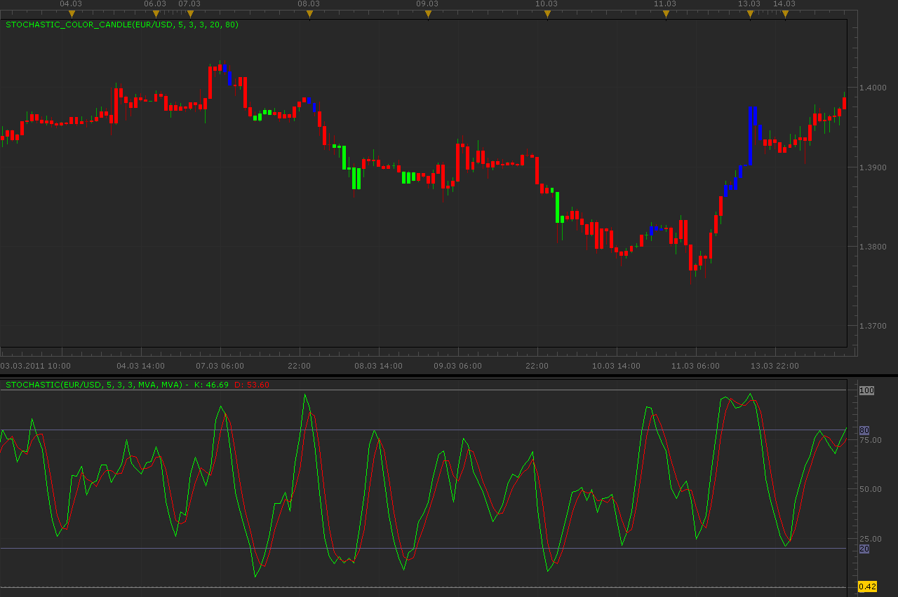

# Stochastic color candle

> Source: https://fxcodebase.com/code/viewtopic.php?f=17&t=3682  
> Forum: 17 · Topic 3682 · 3 post(s)

---

## Stochastic color candle

**Alexander.Gettinger** · Mon Mar 21, 2011 2:00 am

Indicator paints candle in correspondence to Stochastic values.
If Stochastic<[Level1] candle have a [Color1],
if Stochastic>[Level1] and <[Level2] candle have a [Color2] and
if Stochastic>[Level2] candle have a [Color3].

 

Download:

 [Stochastic_Color_Candle.lua](files/8908/Stochastic_Color_Candle.lua)

The indicator was revised and updated

---

## Re: Stochastic color candle

**Alexander.Gettinger** · Tue Mar 29, 2011 10:54 pm

Version of the Stochastic color candle in which candle color depends on positions K and D stochastic lines (K>D or K<D).

Download:

 [Stochastic_Color_Candle2.lua](files/9183/Stochastic_Color_Candle2.lua)

---

## Re: Stochastic color candle

**Apprentice** · Fri Mar 03, 2017 9:32 am

Indicator was revised and updated.
