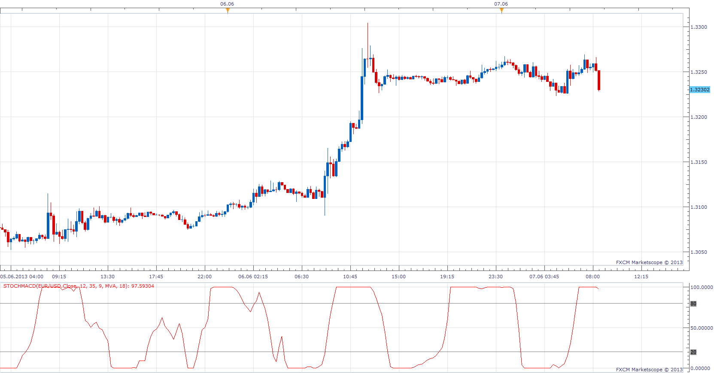
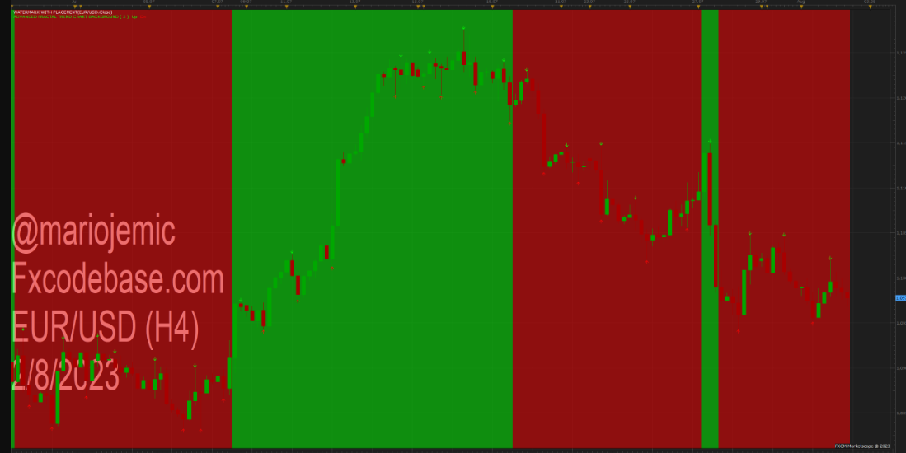

# Stochastic MACD

> Source: https://fxcodebase.com/code/viewtopic.php?f=17&t=40074  
> Forum: 17 · Topic 40074 · 7 post(s)

---

## Stochastic MACD

**Apprentice** · Fri Jun 07, 2013 7:32 am

 [Stochastic MACD.lua](files/65723/Stochastic%20MACD.lua)

 

 [Stochastic MACD Overlay.lua](files/65723/Stochastic%20MACD%20Overlay.lua)

---

## Re: Stochastic MACD

**Alexander.Gettinger** · Wed Aug 14, 2013 2:55 pm

MQL4 version of Stochastic MACD: [http://www.fxcodebase.com/code/viewtopi ... 38&t=59126](http://www.fxcodebase.com/code/viewtopic.php?f=38&t=59126)

---

## Re: Stochastic MACD

**Apprentice** · Fri Jun 09, 2017 7:38 am

The indicator was revised and updated.

---

## Re: Stochastic MACD

**jasonone156** · Thu Oct 26, 2023 3:53 am

Hello,
I want to request an candle overlay based off the Stochastic MACD.
For example,Stochastic MACD=0 , 0<Stochastic MACD<100 Stochastic MACD=100

 

---

## Re: Stochastic MACD

**Apprentice** · Fri Oct 27, 2023 11:40 am

We have added your request to the development list.
Development reference 977

---

## Re: Stochastic MACD

**Apprentice** · Fri Oct 27, 2023 12:17 pm

Stochastic MACD Overlay.lua added.

---

## Re: Stochastic MACD

**jasonone156** · Fri Nov 17, 2023 2:18 am

Dear Apprentice, many thanks for your efforts.
