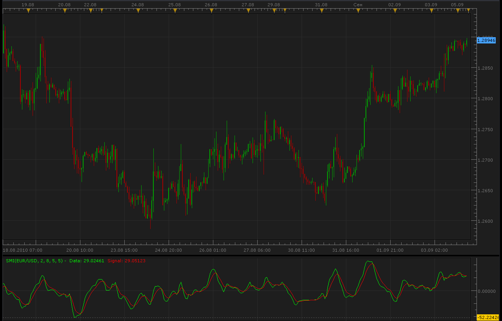

# Stochastic Momentum Index indicator

> Source: https://fxcodebase.com/code/viewtopic.php?f=17&t=2071  
> Forum: 17 · Topic 2071 · 21 post(s)

---

## Stochastic Momentum Index indicator

**Alexander.Gettinger** · Sun Sep 05, 2010 10:55 pm

[viewtopic.php?f=27&t=1870#p3972](https://fxcodebase.com/code/viewtopic.php?f=27&t=1870#p3972)

 

 [SMI.lua](files/4241/SMI.lua)

 [SMI with Alert.lua](files/4241/SMI%20with%20Alert.lua)

 

 [MTF MCP SMI Heat Map with Alert.lua](files/4241/MTF%20MCP%20SMI%20Heat%20Map%20with%20Alert.lua)

 [MTF MCP SMI Heat Map with Alert Carimwell.lua](files/4241/MTF%20MCP%20SMI%20Heat%20Map%20with%20Alert%20Carimwell.lua)

Based on the request.
[viewtopic.php?f=27&t=65054&start=10](https://fxcodebase.com/code/viewtopic.php?f=27&t=65054&start=10)

The indicator was revised and updated

---

## Re: SMI indicator

**RJH501** · Mon Aug 22, 2011 2:29 am

Hello Alexander

Thank you for the SMI indicator. When you get time could you make the following improvements?

Thanks and Regards,

Richard

---

## Re: SMI indicator

**RJH501** · Mon Aug 22, 2011 2:32 am

Hello Alexander and Members;

A short description of the SMI for anyone interested:

"Stochastic Momentum Index"

SMI was created by William Blau in January 1993 issue of Technical Analysis of Stocks & Commodities. The SMI demonstrates where the close is relative to the middle of the last high/low range, in comparison to the close relative to the recent low/high with the Stochastic Oscillator, which resembles the Stochastic Momentum Index.
This oscillator shifts between 100 and 100 and can be a bit less inconstant than an equal period Stochastic Oscillator. The oscillator consists of 2 lines: the moving average of the SMI (red) and the SMI (blue). The SMI will be negative if the close is less than the middle point of the range. The SMI will be positive if the close is greater than the middle point of the range.
The SMI interpretation is in fact the same as that of the Stochastic Oscillator. The most ordinary way of using it is to trade from is to sell when the SMI rises above +40 and then returns to the point under that level and to purchase at the moment when the SMI decreases under -40 and then shifts back above it. Another trading sign is to purchase when the SMI shifts above the moving average, and sell when the SMI decreases below the moving average.
Usually before basing any trades on strict oversold or overbought levels, it is better to qualify the trendiness of the market using an indicator, for example, R-Squared. If indicators provide a non-trending market trades based on strict oversold or overbought, then levels should provide the most effective results.

Regards,

Richard

---

## Re: SMI indicator

**RJH501** · Mon Aug 22, 2011 2:48 am

Hello Alexander,

I have attached a Strategy outline for use with the SMI Indicator. When you get time would create this strategy using the SMI Indicator?

Thanks and Regards,

Richard

.pdf attachment outlines the SMI improvements and strategy

---

## Re: SMI indicator

**Alexey** · Sun Nov 20, 2011 5:06 pm

Hello,

The Marketscope application has been upgraded by FXCM this weekend. And a lot of users of the SMI.lua file mentionned in this topic, are embarrassed.
I mean after adding the SMI indicator to the marketscope, there isn't any signal now ... (Signal: H/A)
I think the SMI script need to be revised in order to be compatible again.

Do you have the same problem since the upgrade of yesterday ?

Best regards,

Alexey, for the members of the french community optionbinaire.net.

---

## Re: SMI indicator

**Apprentice** · Sun Nov 20, 2011 6:12 pm

Now I see what is missing.
Signal lines.
and I'll take a look tomorrow.

---

## Re: SMI indicator

**Apprentice** · Mon Nov 21, 2011 4:01 am

Signal Line Problem Fixed.

---

## Re: SMI indicator

**Alexey** · Mon Nov 21, 2011 8:47 am

Thank you very much for the revision.
It runs again now !
Bye.

---

## Re: SMI indicator

**wonder68** · Wed Nov 23, 2011 2:56 am

Hi Apprentice,

Could you please create an alert with this indicator ? Only an alert when both lines cross ?
Thanks for your help

---

## Re: SMI indicator

**nicolovitch** · Sat Jan 14, 2012 11:43 am

Hello members !

Do you have news for this alert (strategy) about the SMI ??

Thanks

---

## Re: SMI indicator

**Apprentice** · Sun Jan 15, 2012 4:39 am

I have just take this task.

---

## Re: SMI indicator

**Alexander.Gettinger** · Mon Jan 23, 2012 1:38 am

Strategy, based on this indicator: [viewtopic.php?f=31&t=12168](https://fxcodebase.com/code/viewtopic.php?f=31&t=12168)

---

## Re: SMI indicator

**andrej33** · Fri Jan 03, 2014 9:05 am

Please, would it be possible to add a "line thickness" option to this. I have a very hard time seeing the thin lines. Apart from that, this is a great indicator!!
Thanks!
Andre

---

## Re: SMI indicator

**Apprentice** · Fri Jan 03, 2014 1:21 pm

Please Re-Download.

---

## Re: SMI indicator

**arb56ea1** · Wed Feb 05, 2014 3:17 pm

Hello,

I would like to request adding to the SMI indicator horizontal line levels of +40, -40, and 0, along with color, line style and line width controls for each level. Also please adjust the Y axis scale to eliminate the decimal point followed by 3 zeros, and display a the line levels as whole numbers.

I tried to manually add horizontal lines and save my chart as a template, but MarketScope2.0 does not preserve the horizontal lines.

Thanks in advance for your help.

Warmest Regards

Andy

---

## Re: SMI indicator

**Apprentice** · Thu Feb 06, 2014 3:36 am

OB/OS Levels Added.

---

## Re: SMI indicator

**arb56ea1** · Thu Feb 06, 2014 7:19 am

Thanks Apprentice. It looks good!

Warmest Regards

Andy

---

## Re: Stochastic Momentum Index indicator

**Apprentice** · Sat Jul 29, 2017 10:01 am

The indicator was revised and updated.

---

## Re: Stochastic Momentum Index indicator

**Apprentice** · Tue Sep 05, 2017 5:28 am

MTF MCP SMI Heat Map with Alert.lua added.

---

## Re: Stochastic Momentum Index indicator

**Apprentice** · Wed Sep 06, 2017 8:10 am

SMI with Alert.lua added.

---

## Re: Stochastic Momentum Index indicator

**Apprentice** · Thu Jan 11, 2018 6:16 am

MTF MCP SMI Heat Map with Alert Carimwell.lua added
