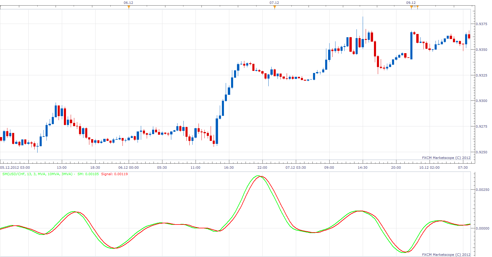

# STOCHASTIC MOMENTUM

> Source: https://fxcodebase.com/code/viewtopic.php?f=17&t=27917  
> Forum: 17 · Topic 27917 · 3 post(s)

---

## STOCHASTIC MOMENTUM

**Apprentice** · Sat Dec 22, 2012 9:31 am

As described in the 1993, January issue of S & C Magazine.
Two in one indicator.
If smoothing is applied, it is average stochastic momentum (ASM)
if not, it is the Stochastic Momentum (SM).

 [SM.lua](files/48983/SM.lua)

---

## Re: STOCHASTIC MOMENTUM

**Apprentice** · Thu Jun 06, 2013 4:47 am

MQ4 version can be found here.
[viewtopic.php?f=38&t=39961](http://www.fxcodebase.com/code/viewtopic.php?f=38&t=39961)

---

## Re: STOCHASTIC MOMENTUM

**Apprentice** · Fri Jun 22, 2018 8:11 am

The indicator was revised and updated.
