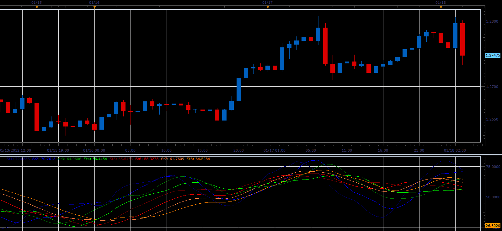
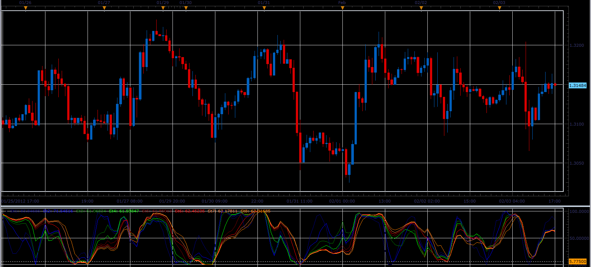

# Stochastic Rainbow

> Source: https://fxcodebase.com/code/viewtopic.php?f=17&t=11901  
> Forum: 17 · Topic 11901 · 17 post(s)

---

## Stochastic Rainbow

**Alexander.Gettinger** · Wed Jan 18, 2012 3:52 am

Indicator shows set of stochastics with different parameters.

 

Download:

 [Stochastic_Rainbow.lua](files/23755/Stochastic_Rainbow.lua)

The indicator was revised and updated

---

## Re: Stochastic Rainbow

**ThemBonez** · Tue Jan 24, 2012 4:54 pm

Hi
Can you create this same indicator of StochRsi?
Thank You

---

## Re: Stochastic Rainbow

**Apprentice** · Wed Jan 25, 2012 6:23 pm

Your request is added to the developmental cue.

---

## Re: Stochastic Rainbow

**Alexander.Gettinger** · Sat Feb 04, 2012 8:49 pm

Stochastic RSI Rainbow.

 

Download:

 [StochasticRSI_Rainbow.lua](files/25179/StochasticRSI_Rainbow.lua)

---

## Re: Stochastic Rainbow

**ThemBonez** · Fri Mar 02, 2012 11:27 am

Hi,
I cant get this to work, when I click on it, I get the message:

[string "StochasticRSI_Rainbow.lua"]: [string "StochasticRSI.lua"]:59 The indicator with id AVERAGES is not found

Any suggestions
Thx
Barry

---

## Re: Stochastic Rainbow

**Apprentice** · Sun Mar 04, 2012 3:38 am

For this indicator must be installed AVERAGES indicator ([viewtopic.php?f=17&t=2430](https://fxcodebase.com/code/viewtopic.php?f=17&t=2430)).
and Alex Version of StochasticRSI
[download/file.php?id=4294](https://fxcodebase.com/code/download/file.php?id=4294)

---

## Re: Stochastic Rainbow

**ThemBonez** · Sun Mar 04, 2012 7:34 am

Thank You
Can you tell me the StochRSI parameters for each color?

---

## Re: Stochastic Rainbow

**Apprentice** · Mon Mar 05, 2012 2:54 am

for i = 1, 8 , 2 do
 RSI_Period*(i+2), K_Period*(i+2), 3, "MVA"
end

StochRSI parameters will be as follows
RSI_Period + 3, K_Period + 3, 3, "MVA"
RSI_Period + 5, K_Period + 5, 3, "MVA"
RSI_Period + 7, K_Period + 7, 3, "MVA"
RSI_Period + 9, K_Period + 9, 3, "MVA"
RSI_Period + 11, K_Period + 11, 3, "MVA"
RSI_Period + 13, K_Period + 13, 3, "MVA"
RSI_Period + 15, K_Period + 15, 3, "MVA"
RSI_Period + 17, K_Period + 17, 3, "MVA"

---

## Re: Stochastic Rainbow

**ThemBonez** · Mon Mar 05, 2012 6:43 am

How could we create this with four lines that have the following parameters:

8,5,3,3
13,8,5,5
21,13,8,8
34,21,13,13

As you can see, its based ona Fibonacci sequence.

Thx

---

## Re: Stochastic Rainbow

**Alexander.Gettinger** · Mon Mar 05, 2012 3:16 pm

> **ThemBonez wrote:**
> How could we create this with four lines that have the following parameters:
>
> 8,5,3,3
> 13,8,5,5
> 21,13,8,8
> 34,21,13,13
>
> As you can see, its based ona Fibonacci sequence.

Please, see this version of stochastic rainbow:

 [Stochastic_Fibo_Rainbow.lua](files/27630/Stochastic_Fibo_Rainbow.lua)

---

## Re: Stochastic Rainbow

**ThemBonez** · Mon Mar 05, 2012 3:36 pm

That's great....now with the StochRSI

---

## Re: Stochastic Rainbow

**ThemBonez** · Mon Mar 05, 2012 3:38 pm

...and the Rainbow.

---

## Re: Stochastic Rainbow

**ThemBonez** · Tue Mar 06, 2012 6:27 pm

Hi,
I made an effort to make the changes myself but it will not load. I can't see where the error is. Can you check it over for me and show me where the error is and make the correction. The lua file is attached as well as the code below
Thank You

Code: [Select all](https://fxcodebase.com/code/)
`function Init()
    indicator:name("StochasticRSI Fibo Rainbow indicator");
    indicator:description("StochasticRSI Fibo Rainbow indicator");
    indicator:requiredSource(core.Bar);
    indicator:type(core.Oscillator);

    indicator.parameters:addGroup("Calculation");
    indicator.parameters:addInteger("K_Period", "Initial K_Period", "", 5);
    indicator.parameters:addInteger("K_Slowing", "Initial K_Slowing", "", 3);
    indicator.parameters:addInteger("D_Slowing", "Initial D_Slowing", "", 3);
    indicator.parameters:addInteger("RSI_Period", "RSI_Period", "", 8);

    indicator.parameters:addGroup("Style");
     indicator.parameters:addGroup("Style");
    indicator.parameters:addColor("clr1", "Color 1", "Color 1", core.rgb(0, 0, 128));
    indicator.parameters:addColor("clr2", "Color 2", "Color 2", core.rgb(0, 0, 255));
    indicator.parameters:addColor("clr3", "Color 3", "Color 3", core.rgb(0, 128, 0));
    indicator.parameters:addColor("clr4", "Color 4", "Color 4", core.rgb(0, 255, 0));
    indicator.parameters:addInteger("widthLinReg", "Line width", "Line width", 1, 1, 5);
    indicator.parameters:addInteger("styleLinReg", "Line style", "Line style", core.LINE_SOLID);
    indicator.parameters:setFlag("styleLinReg", core.FLAG_LINE_STYLE);
end

local first;
local source = nil;
local K_Slowing;
local D_Period;
local D_Slowing;
local FiboK;
local Ind_St={};
local St={};

function Prepare()
    source = instance.source;
    K_Period=instance.parameters.K_Period;
    K-Slowing=instance.parameters.K_Slowing;
    D_Slowing=instance.parameters.D_Slowing;
    RSI_Period=instance.parameters.RSI_Period;
    first = source:first()+2;
    local name = profile:id() .. "(" .. source:name() .. ", " .. instance.parameters.RSI_Period .. ", " .. instance.parameters.K_Period .. ", " .. instance.parameters.K_Slowing .. ", " .. instance.parameters.D_Slowing .. ")";
    local K_P=K_Period;
    local K_S=K_Slowing;
    local D_S=D_Slowing;
    FiboK=(1+math.sqrt(5))/2;
    for i=1,RSI_Period,1 do
     Ind_St[i]=core.indicators:create("STOCHASTICRSI", source, K_P, K_S, D_P,"MVA","MVA");
     K_P=math.floor(K_P*FiboK+0.5);
     K_S=math.floor(K_S*FiboK+0.5);
     D_S=math.floor(D_S*FiboK+0.5);
     St[i]=instance:addStream("St" .. i, core.Line, name .. ".St" .. i, "St" .. i, instance.parameters.clr, first);
     St[i]:setWidth(instance.parameters.widthLinReg);
     St[i]:setStyle(instance.parameters.styleLinReg);
    end
end

function Update(period, mode)
   if (period>first) then
    for i=1,RSI_Period,1 do
     Ind_St[i]:update(mode);
     St[i][period]=Ind_St[i].D[period];
    end
   end
end`

---

## Re: Stochastic Rainbow

**Apprentice** · Thu Mar 08, 2012 6:24 am

Corrected a few problems.
You have to fix a few more.
Algorithm for random color.
You can have unlimited number of colors.
But you can not have so many color parameters.

Second, the parameters that you are passing to STOCHASTICRSI are not valid.

 [Stochastic_RSI Fibo Rainbow.lua](files/27731/Stochastic_RSI%20Fibo%20Rainbow.lua)

If you write what you want to achieve, I can finish this job for you.

---

## Re: Stochastic Rainbow

**ThemBonez** · Thu Mar 08, 2012 7:05 am

I look at 4 different StochRSI charts with the below parameters. I liked the concept of the Stochastic Rainbow you created.

I would like 4 stochrsi lines with the following parameters based on Fibonacci Sequence:
8,5,3,3
13,8,5,5
21,13,8,8
34,21,13,13

(Parameters = RSI Periods, %K Stochastic Periods, %K SLowing Periods, %D Slowing Stochastic Periods)

Each line a different color.

On the right side of chart 70 and 30 lines.

If you could finish it for me, that would be great!
Thanx!

---

## Re: Stochastic Rainbow

**Alexander.Gettinger** · Thu Mar 08, 2012 9:54 am

> **ThemBonez wrote:**
> Each line a different color.
>
> On the right side of chart 70 and 30 lines.

 [Stochastic_Fibo_Rainbow2.lua](files/27745/Stochastic_Fibo_Rainbow2.lua)

 [Stochastic_RSI Fibo Rainbow2.lua](files/27745/Stochastic_RSI%20Fibo%20Rainbow2.lua)

---

## Re: Stochastic Rainbow

**Apprentice** · Mon Apr 03, 2017 6:43 am

Indicator was revised and updated.
