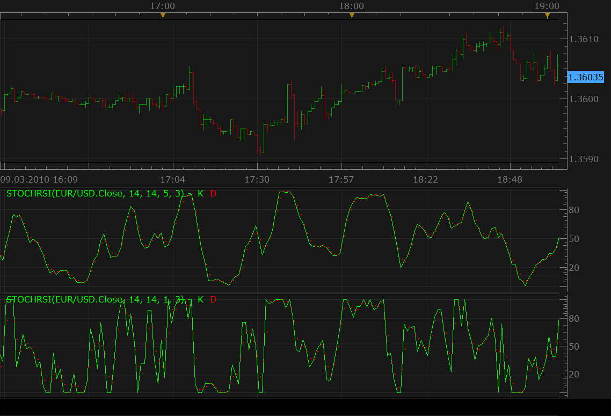

# Stochastic RSI

> Source: https://fxcodebase.com/code/viewtopic.php?f=17&t=451  
> Forum: 17 · Topic 451 · 28 post(s)

---

## Stochastic RSI

**Nikolay.Gekht** · Tue Mar 09, 2010 7:36 pm

The indicator was introduced by by Tuschar Chande and Stanley Kroll in December, 1992 Stocks and Commodities' article and combines two indicators RSI and Stochastic.

The Stochastic RSI Oscillator is a momentum indicator which shows the relation of the current RSI value relative to its high/low range over a given number of periods.

The indicator has four parameters:
N - the number of periods for RSI calculation
K - the number of periods to calculate the stochastic fast line
SK - the number of periods to smooth the stochastic fast line (use 1 to do not smooth the fast line)
D - the number of periods to calculate the stochastic slow line

The formula is:
LR = Lowest RSI(PRICE, N) for K periods
HR = Highest RSI(PRICE, N) for K periods
FAST = MVA((RSI(PRICE, N)[now] - LR) / (HR - LR) * 100), SK)
SLOW = MVA(FAST, D)

 



```lua
-- Indicator profile initialization routine
-- Defines indicator profile properties and indicator parameters
function Init()
    indicator:name("Stochastic RSI");
    indicator:description("");
    indicator:requiredSource(core.Tick);
    indicator:type(core.Oscillator);

    indicator.parameters:addInteger("N", "Number of periods for RSI", "", 14, 1, 200);
    indicator.parameters:addInteger("K", "%K Stochastic Periods", "", 14, 1, 200);
    indicator.parameters:addInteger("KS", "%K Slowing Periods", "", 5, 1, 200);
    indicator.parameters:addInteger("D", "%D Slowing Stochastic Periods", "", 3, 1, 200);
    indicator.parameters:addColor("K_color", "Color of K", "Color of K", core.rgb(0, 255, 0));
    indicator.parameters:addColor("D_color", "Color of D", "Color of D", core.rgb(255, 0, 0));
end

-- Indicator instance initialization routine

-- Parameters block
local N;
local K;
local KS;
local D;

local firstSKI;
local firstK;
local firstD;
local source = nil;

-- Streams block
local SKI = nil;
local SK = nil;
local SD = nil;
local RSI = nil;
local MVA1 = nil;
local MVA2 = nil;

-- Routine
function Prepare()
    N = instance.parameters.N;
    K = instance.parameters.K;
    KS = instance.parameters.KS;
    D = instance.parameters.D;
    source = instance.source;
    first = source:first();

    RSI = core.indicators:create("RSI", source, N);
    local name = profile:id() .. "(" .. source:name() .. ", " .. N .. ", " .. K .. ", " .. KS ..", " .. D .. ")";
    instance:name(name);
    firstSKI = RSI.DATA:first() + K;
    SKI = instance:addInternalStream(firstSKI, 0);
    MVA1 = core.indicators:create("MVA", SKI, KS);
    firstK = MVA1.DATA:first();
    SK = instance:addStream("K", core.Line, name .. ".K", "K", instance.parameters.K_color, firstK);
    SK:addLevel(20);
    SK:addLevel(50);
    SK:addLevel(80);
    MVA2 = core.indicators:create("MVA", SK, D);
    firstD = MVA2.DATA:first();
    SD = instance:addStream("D", core.Dot, name .. ".D", "D", instance.parameters.D_color, firstD);
end

-- Indicator calculation routine
function Update(period, mode)
    RSI:update(mode);

    if (period >= firstSKI) then
        local min, max;
        local range;
        range = core.rangeTo(period, K);
        min = core.min(RSI.DATA, range);
        max = core.max(RSI.DATA, range);
        if (min == max) then
            SKI[period] = 100;
        else
            SKI[period] = (RSI.DATA[period] - min) / (max - min) * 100;
        end
    end

    MVA1:update(mode);

    if period >= firstK then
        SK[period] = MVA1.DATA[period];
    end

    MVA2:update(mode);

    if (period >= firstD) then
        SD[period] = MVA2.DATA[period];
    end
end
```

 [StochRSI.lua](files/735/StochRSI.lua)

Other two version can be found here.
[viewtopic.php?f=17&t=8169](https://fxcodebase.com/code/viewtopic.php?f=17&t=8169)

p.s. Sorry for delays with publishing new indicators. I'm deep in preparing a new Marketscope release...
p.p.s. I'm already moved to the new release, so, in case anything fails on the previous version - please do not hesitate to report it immediatelly.

Added By Apprentice

 


This indicator provides Audio / Email Alerts for six signals.
1) OB Zone Cross
2) OS Zone Cross
3) Cental Line Cross
4) Slope change
5) Slope change in OB zone
6) Slope change in OS zone

 [Stochastic RSI with Alert.lua](files/735/Stochastic%20RSI%20with%20Alert.lua)

Dec 5, 2015: Compatibility issue Fix. _Alert helper is not longer needed.

I also made Style and Performance Updates
using subsequently available functionality.

The indicator was revised and updated

---

## Re: Stochastic RSI

**kkhart1935** · Tue Mar 01, 2011 9:09 am

I cannot get this to work. I get an error that says to download stochrsi. What am I doing wrong?

---

## Re: Stochastic RSI

**kkhart1935** · Tue Mar 01, 2011 9:43 am

I get the following error
An error occurred during the calculation of the indicator 'MTF_ STOCHRSI'. The error details: [string "MTF_ StochRSI.lua"]:140: [string "StochRSI.lua"]:219: attempt to call method 'barSize' (a nil value).

---

## Re: Stochastic RSI

**Apprentice** · Tue Mar 01, 2011 10:07 am

I tested both MTF indicators.
I can not repeat the bug.

Interesting.
Can you restart the platform.

---

## Re: Stochastic RSI

**Apprentice** · Tue Apr 26, 2011 3:58 am

Line Style Option Added.

 [StochRSI.lua](files/10039/StochRSI.lua)

---

## Re: Stochastic RSI

**jeisenm** · Tue Apr 26, 2011 1:40 pm

very nice indicator. thanks apprentice.

---

## Re: Stochastic RSI

**ayatullah** · Wed Apr 27, 2011 7:48 am

Dear Apprentice

Thank you for adding this indicator.

Is there a possibility of you adding an alert for when the SK line and SD crossover to this indicator?

Thanks

Jawad

---

## Re: Stochastic RSI

**station0524** · Sat May 14, 2011 4:47 pm

I do not know why but the indicator seems to be incorrect. When compared to the same indicator on other charting programs like Metatrader and Fib Trader the values that yours produce is not the same. Put them side by side, same chart, same time frame, same settings, yours is the only one that is different.

---

## Re: Stochastic RSI

**Apprentice** · Sun May 15, 2011 9:41 am

There are several solutions.
Can you post the version you mention.
(Code or Link)

---

## Re: Stochastic RSI

**station0524** · Sat May 21, 2011 1:13 pm

The version I downloaded is the one posted here on this page. Not sure if you want me to post the metatrader versions or yours.

---

## Re: Stochastic RSI

**Apprentice** · Sun May 22, 2011 3:24 am

Post, mq4 code you are using.
So we could see the difference.
Out there is a lot of different versions.

---

## Re: Stochastic RSI

**station0524** · Sun May 22, 2011 10:43 am

Here is the code,

```
Input Parameters:
RSIPeriod = The RSI Period to use (Default 8)
PeriodK = The Stochastic %K period. (Default 8)
SlowPeriod = The final smoothing (slow) value (Default 3)

Revision History

Version 1.0
* Initial Release

Version 1.1 ( 14 Nov 2007 )
* Fixed bug in HHV/LLV calculations to use current bar.  This avoids values > 100
   
*/   

#property copyright "Copyright © 2007, Bruce Hellstrom (brucehvn)"
#property link      "http: //www.metaquotes.net/"

#property indicator_separate_window
#property indicator_buffers 1
#property indicator_color1 Blue
#property indicator_style1 STYLE_SOLID
#property indicator_width1 2

#property indicator_level1 20.0
#property indicator_level2 80.0
#property indicator_levelcolor Red
#property indicator_levelwidth 1
#property indicator_levelstyle STYLE_DOT

#define INDICATOR_VERSION "v1.1"

// Input Parameters
extern int RSIPeriod = 8;
extern int PeriodK = 8;
extern int SlowPeriod = 3;

// Buffers
double RSIBuffer[];
double StochBuffer[];
double TempBuffer[];
bool debug = false;

// Other Variables
string ShortName;

/////////////////////////////////////////////////////////////////////
// Custom indicator initialization function
/////////////////////////////////////////////////////////////////////

int init() {

    IndicatorBuffers( 1 );
    SetIndexStyle( 0, DRAW_LINE, STYLE_SOLID, 1 );
    SetIndexBuffer( 0, StochBuffer );
    SetIndexDrawBegin( 0, RSIPeriod );
   
    ShortName = "MT4-StochasticRSI-Oscillator-" + INDICATOR_VERSION + " (" + RSIPeriod + "," + PeriodK + "," + SlowPeriod + ")";
   
    IndicatorShortName( ShortName );
    SetIndexLabel( 0, ShortName );
   
    ArraySetAsSeries( RSIBuffer, true );
    ArraySetAsSeries( TempBuffer, true );
   
    Print( ShortName );
    Print( "Copyright (c) 2007 - Bruce Hellstrom, [[email protected]](https://fxcodebase.com/cdn-cgi/l/email-protection)" );
   
    return( 0 );
}

/////////////////////////////////////////////////////////////////////
// Custom indicator deinitialization function
/////////////////////////////////////////////////////////////////////

int deinit() {
    return( 0 );
}

/////////////////////////////////////////////////////////////////////
// Indicator Logic run on every tick
/////////////////////////////////////////////////////////////////////

int start() {
   
    int counted_bars = IndicatorCounted();
   
    // Check for errors
    if ( counted_bars < 0 ) {
        return( -1 );
    }

    // Last bar will be recounted
    if ( counted_bars > 0 ) {
        counted_bars--;
    }

    // Resize the non-buffer array if necessary
    if ( ArraySize( RSIBuffer ) != ArraySize( StochBuffer ) ) {
        ArraySetAsSeries( RSIBuffer, false );
        ArrayResize( RSIBuffer, ArraySize( StochBuffer ) );
        ArraySetAsSeries( RSIBuffer, true );
    }
   
    if ( ArraySize( TempBuffer ) != ArraySize( StochBuffer ) ) {
        ArraySetAsSeries( TempBuffer, false );
        ArrayResize( TempBuffer, ArraySize( StochBuffer ) );
        ArraySetAsSeries( TempBuffer, true );
    }
   
   
    // Get the upper limit
    int limit = Bars - counted_bars;
   
    for ( int ictr = 0; ictr < limit; ictr++ ) {
        RSIBuffer[ictr] = iRSI( NULL, 0, RSIPeriod, PRICE_CLOSE, ictr );
        if ( debug ) {
            if ( RSIBuffer[ictr] > 100.0 ) {
                Print( "Bar: ", ictr, " RSI: ", RSIBuffer[ictr] );
            }
        }
    }

    for ( ictr = 0; ictr < limit; ictr++ ) {
        double llv = LLV( RSIBuffer, PeriodK, ictr );
        double hhv = HHV( RSIBuffer, PeriodK, ictr );
       
        if ( ( hhv - llv ) > 0 ) {
            TempBuffer[ictr] = ( ( RSIBuffer[ictr] - llv ) /
                                 ( hhv - llv ) ) * 100;
            if ( debug && ictr < 100 ) {
                if ( TempBuffer[ictr] > 100.0 ) {
                    Print( "Bar: ", ictr, " TempBuffer: ", TempBuffer[ictr], " RSI: ", RSIBuffer[ictr], " hhv: ", hhv, " llv:", llv );
                }
            }
        }
    }
   
    for ( ictr = 0; ictr < limit; ictr++ ) {
        StochBuffer[ictr] = iMAOnArray( TempBuffer, 0, SlowPeriod, 0, MODE_EMA, ictr );
    }
   
    return( 0 );
}

double LLV( double& indBuffer[], int Periods, int shift ) {
    double dblRet = 0.0;
    int startindex = shift;
   
    for ( int llvctr = startindex; llvctr < ( startindex + Periods ); llvctr++ ) {
        if ( llvctr == startindex ) {
            dblRet = indBuffer[llvctr];
        }
        dblRet = MathMin( dblRet, indBuffer[llvctr] );
    }
   
    return( dblRet );
}

double HHV( double& indBuffer[], int Periods, int shift ) {
    double dblRet = 0.0;
    int startindex = shift;
   
    for ( int hhvctr = startindex; hhvctr < ( startindex + Periods ); hhvctr++ ) {
        if ( hhvctr == startindex ) {
            dblRet = indBuffer[hhvctr];
        }
        dblRet = MathMax( dblRet, indBuffer[hhvctr] );
    }
   
    return( dblRet );
}
```

---

## Re: Stochastic RSI

**Alexander.Gettinger** · Tue Jul 12, 2011 11:45 pm

Please, see this version of oscillator.

Download:

 [StochasticRSI.lua](files/12644/StochasticRSI.lua)

---

## Re: Stochastic RSI

**Blackcat2** · Wed Jul 13, 2011 7:18 pm

> **Alexander.Gettinger wrote:**
> Please, see this version of oscillator.
>
> Download:
>
>
> StochasticRSI.lua

I think it requires another indicator, could you please tell me where I can get it?

Thanks

---

## Re: Stochastic RSI

**sunshine** · Thu Jul 14, 2011 3:09 am

Please install the Averages indicator
[http://www.fxcodebase.com/code/viewtopi ... =17&t=2430](http://www.fxcodebase.com/code/viewtopic.php?f=17&t=2430)

---

## Re: Stochastic RSI

**JPNWV7** · Tue Nov 22, 2011 9:09 am

> **kkhart1935 wrote:**
> I cannot get this to work. I get an error that says to download stochrsi. What am I doing wrong?

I get the same thing

---

## Re: Stochastic RSI

**Alexander.Gettinger** · Mon Dec 02, 2013 11:08 am

MQL4 version of Stochastic RSI: [viewtopic.php?f=38&t=60051](https://fxcodebase.com/code/viewtopic.php?f=38&t=60051).

---

## Re: Stochastic RSI

**Apprentice** · Sun Dec 06, 2015 4:35 am

Compatibility issue Fix. _Alert helper is not longer needed.

---

## Re: Stochastic RSI

**TxChristopher** · Thu Aug 11, 2016 10:25 am

Would it be possible for one of you programmers to add a "live" option to this indicator like the "Stochastic with Alert" indicator has? This is a good indicator but the tremendous lag of having to wait for end of turn is especially crippling to it.

The biggest problem with this indicator is once the market starts moving you need to know and waiting for the end of turn often causes losses or missing most of the move, especially in longer time frames obviously because end of turn can be hours away. If this indicator had all the sweet options to alert the trader that the Stochastic with Alert indicator has it would make a huge difference in its usability.

Since they are very similar indicators (but with quite different results often) this would seem like a very easy to do thing.

What say you coders?

---

## Re: Stochastic RSI

**Apprentice** · Fri Aug 12, 2016 11:23 am

"live" / "end of turn" option add for "Stochastic RSI with Alert"

---

## Re: Stochastic RSI

**TxChristopher** · Mon Aug 15, 2016 11:45 pm

> **Apprentice wrote:**
> "live" / "end of turn" option add for "Stochastic RSI with Alert"

Awesome!

How about K/D line cross over/under alert? Too much to ask?

---

## Re: Stochastic RSI

**Apprentice** · Tue Aug 16, 2016 4:28 am

Your request is added to the development list, Under Id Number 3600
 If someone is interested to do this or any task other from list please contact me.

---

## Re: Stochastic RSI

**TxChristopher** · Tue Aug 16, 2016 8:15 pm

> **Apprentice wrote:**
> Your request is added to the development list, Under Id Number 3600
> If someone is interested to do this or any task other from list please contact me.

How do I track that . . . . I tried to find that area in the forum but could not........

---

## Re: Stochastic RSI

**Apprentice** · Wed Aug 17, 2016 2:13 pm

This is an internal forum.
For developers only.

---

## Re: Stochastic RSI

**Apprentice** · Tue Sep 20, 2016 3:59 am

Stochastic RSI with Alert.lua major update.
K/D Cross Added.

---

## Re: Stochastic RSI

**Apprentice** · Tue Mar 14, 2017 8:55 am

Indicator was revised and updated.

---

## Re: Stochastic RSI

**lixiaopan0502** · Tue Oct 16, 2018 7:02 pm

> **Apprentice wrote:**
> Indicator was revised and updated.

Where can I find it ？

---

## Re: Stochastic RSI

**Apprentice** · Thu Oct 18, 2018 6:37 am

The file was replaced on the first post of this post.
Here.
[viewtopic.php?f=17&t=451](https://fxcodebase.com/code/viewtopic.php?f=17&t=451)
