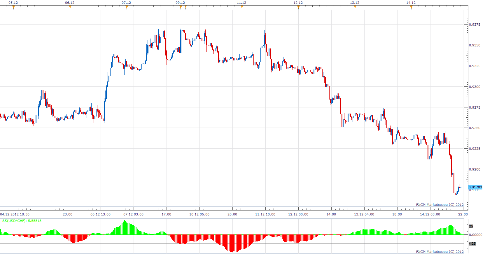

# Stochastic Stack

> Source: https://fxcodebase.com/code/viewtopic.php?f=17&t=27709  
> Forum: 17 · Topic 27709 · 3 post(s)

---

## Stochastic Stack

**Apprentice** · Fri Dec 14, 2012 3:17 pm

SS = ( STO1-STO2) + ( STO3-STO4) + ( STO5-STO6) + ( STO7-STO8)

 [SS.lua](files/48500/SS.lua)

 [SSS.lua](files/48500/SSS.lua)

The indicator was revised and updated

---

## Re: Stochastic Stack

**Alexander.Gettinger** · Thu Sep 25, 2014 9:26 am

MQL4 version of Stochastic Stack oscillator: [viewtopic.php?f=38&t=61249](https://fxcodebase.com/code/viewtopic.php?f=38&t=61249).

---

## Re: Stochastic Stack

**Apprentice** · Fri Jun 23, 2017 6:57 am

The indicator was revised and updated.
