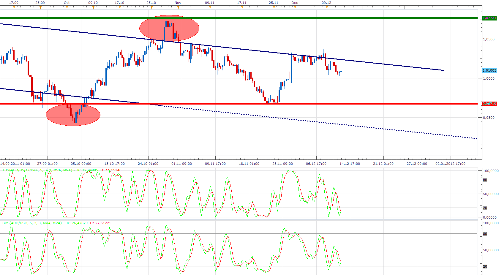

# Stochastic

> Source: https://fxcodebase.com/code/viewtopic.php?f=17&t=9566  
> Forum: 17 · Topic 9566 · 20 post(s)

---

## Stochastic

**Apprentice** · Tue Dec 13, 2011 4:58 am

Bar Based Stochastic

 [BBS.lua](files/20510/BBS.lua)

Tick Based Stochastic

 [TBS.lua](files/20510/TBS.lua)

These versions have added additional smoothing methods.

 

In every aspect, this is identical to the standard Stochastic Indicator.
Differences.
All values ​​are reduced, shifted by 50
The histogram is introduced
The histogram is the difference between K and D line,
As seen in MACD.

 [Tick Based Stochastic with Histogram.lua](files/20510/Tick%20Based%20Stochastic%20with%20Histogram.lua)

 [Bar Based Stochastic with Histogram.lua](files/20510/Bar%20Based%20Stochastic%20with%20Histogram.lua)

The indicator was revised and updated

---

## Re: Stochastic

**Blackcat2** · Tue Dec 13, 2011 6:15 pm

This indicator seems to fulfill my request, you can close the thread requesting for custom stochastic..

Thanks Apprentice

---

## Re: Stochastic

**Blackcat2** · Tue Dec 13, 2011 6:56 pm

Oh.. could you please add line style option?

Thanks

---

## Re: Stochastic

**Apprentice** · Fri Dec 16, 2011 4:38 am

Style Option is added.

---

## Re: Stochastic

**Panther** · Mon Feb 18, 2013 9:18 am

Could you add Line Levels with Width, Style ,Color options? 80, 20 defaults
Thank you.

---

## Re: Stochastic

**Apprentice** · Wed Feb 20, 2013 5:22 am

OB/OS Zone Style Option Added.

---

## Re: Stochastic

**Panther** · Wed Feb 20, 2013 10:07 pm

Apprentice, I want to add a Stochastic indicator to a TBS window, like when you add a
MVA, etc to a Stochastic, RSI, etc window. The result is you have 2 overlapping stochastic
indicators.
How can I do this, or do you have to program the Stochastic indicator? Thanks.

---

## Re: Stochastic

**Apprentice** · Thu Feb 21, 2013 7:26 pm

Standard Stochastics, is Bar, based, Indicator.
U can use Tick Based Stochastic (TBS) for that.
Add TBS to TBS.

---

## Re: Stochastic

**roy_navarrete** · Fri Jun 13, 2014 10:13 am

APPRENTICE, is indicative solves my problem, THANKS

I see only has errors,
and hope you can help me fix it

SHOW option brings K / D / BOTH LINES

if one selects K, which is my case
then disappear OB / OS LEVELS

ie if you select D or BOTH, if you leave the lines,
but by putting K, removes

Might you help me to correct this small error

THANKS

---

## Re: Stochastic

**Apprentice** · Fri Jun 13, 2014 10:41 am

Fixed.

---

## Re: Stochastic

**Apprentice** · Sun Jul 20, 2014 5:15 am

Tick Based Stochastic with Histogram.lua & Bar Based Stochastic with Histogram.lua Added.

---

## Re: Stochastic

**roy_navarrete** · Tue Jul 29, 2014 2:29 am

> **Apprentice wrote:**
> Tick Based Stochastic with Histogram.lua & Bar Based Stochastic with Histogram.lua Added.

thank you for correcting my petitions, GREETINGS

---

## Re: Stochastic

**roy_navarrete** · Tue Jul 29, 2014 12:05 pm

if not someone else will pass is the same as my

I have 3 or 4 TBS, in a graph, and at some point I will freeze the image, and sometimes just go back and others do not have to shut down your pc, I commit that has to be optimized

anyone know I have to do to optimize it? or someone who can help me to do this

I'm a little desperate because I can not work 100% with this little problem, GREETINGS from Mexico remember that I do not speak English, sorry if I can not explain well

---

## Re: Stochastic

**Apprentice** · Wed Jul 30, 2014 4:34 am

Hmm, we use simple logic.
should not be CPU challenging.
Will make some minor changes.

---

## Re: Stochastic

**Apprentice** · Wed Jul 30, 2014 5:08 am

Please re-download.
I have made ​​some modifications.
This will only provide minor improvements.

---

## Re: Stochastic

**roy_navarrete** · Wed Jul 30, 2014 11:19 pm

thank you very much, I installed and I'll try when I have an answer you the will comment, GREETINGS

---

## Re: Stochastic

**roy_navarrete** · Thu Jul 31, 2014 11:09 am

> **Apprentice wrote:**
> Please re-download.
> I have made ​​some modifications.
> This will only provide minor improvements.

mmm, I commented that I have installed the new one, and still the problem, the pc freezes and I have to restart

I have a couple of queries, which in my head, maybe they could affect what was happening, so that the screens freeze.

can be caused by that install in the same space 3 or 4 indicators TBS? this may affect or not?

other serious, 1 of the 4 indicators that I have installed so I set it up

OB / OS Levels
Overbought Level = 50
Oversold Level = 49

?????? could this be?

I put the other NORMAL, has
100
0

and

80
20

I just wanted to talk to you about this, maybe you can be here by my mistakes, GREETINGS
you and I thank you much for your attention

---

## Re: Stochastic

**roy_navarrete** · Thu Jul 31, 2014 11:35 am

> **Apprentice wrote:**
> Please re-download.
> I have made ​​some modifications.
> This will only provide minor improvements.

when looking for a pair to another, freezes, and I open the task manager and the memory starts to go up and up and up, and when one fell swoop low thawed

exists within the computer mo some file you can send and see that this is what happened??

 

 

---

## Re: Stochastic

**Alexander.Gettinger** · Wed Apr 08, 2015 10:44 am

MQL4 version of oscillators: [viewtopic.php?f=38&t=62082](https://fxcodebase.com/code/viewtopic.php?f=38&t=62082).

---

## Re: Stochastic

**Apprentice** · Tue Aug 08, 2017 5:42 am

The indicator was revised and updated.
