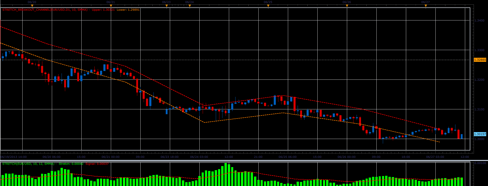

# Stretch Breakout Channel

> Source: https://fxcodebase.com/code/viewtopic.php?f=17&t=42262  
> Forum: 17 · Topic 42262 · 2 post(s)

---

## Stretch Breakout Channel

**Alexander.Gettinger** · Thu Jun 27, 2013 11:08 am

The indicators are based on free MT4 indicators made by Arturo López, founder of [Point Zero Trading Solutions](http://www.pointzero-trading.com) and are based on ideas of Toby Crabel, the author of Day Trading with Short-term Price Patterns.

 

Download:

 [Stretch.lua](files/68727/Stretch.lua)

 [Stretch_Breakout_Channel.lua](files/68727/Stretch_Breakout_Channel.lua)

For this indicators must be installed Averages indicator ([viewtopic.php?f=17&t=2430](https://fxcodebase.com/code/viewtopic.php?f=17&t=2430)).

The indicator was revised and updated

---

## Re: Stretch Breakout Channel

**Apprentice** · Thu Jun 01, 2017 10:04 am

Indicator was revised and updated.
