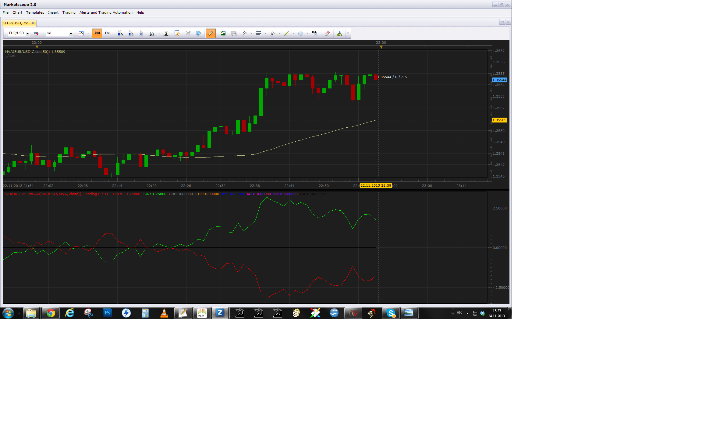

# Strong vs. Weak

> Source: https://fxcodebase.com/code/viewtopic.php?f=17&t=26193  
> Forum: 17 · Topic 26193 · 48 post(s)

---

## Strong vs. Weak

**Apprentice** · Sat Nov 17, 2012 2:33 pm

Indicator calculates the strength of all 8 major currencies.
The basis is the position of price in relation to the moving average.
For each currency, we take into account, all currency pairs,
containing this currency.

We have two modes.

Pip
The sum of all positive and negative indications.
Measured as a distance from a moving average (in pips)

Count
The sum of the positive and negative indications.

 [Strong vs. Weak.bin](files/44954/Strong%20vs.%20Weak.bin)

 

 [Strong vs. Weak Indices.bin](files/44954/Strong%20vs.%20Weak%20Indices.bin)

Smoothed Price Source version.

 [Smoothed Strong vs. Weak.bin](files/44954/Smoothed%20Strong%20vs.%20Weak.bin)

 [Smoothed Strong vs. Weak Indices.bin](files/44954/Smoothed%20Strong%20vs.%20Weak%20Indices.bin)

Calculated as MA of Source - MA of MA of Price

---

## Re: Strong vs. Weak

**Thumper** · Sat Nov 17, 2012 4:19 pm

Can not get it to work. comes back with **[string "Strong vs Weak.bin"] 155: Cannot recognize host command**
Regards
Rob Marshall
Australia

---

## Re: Strong vs. Weak

**Apprentice** · Sat Nov 17, 2012 5:46 pm

This indicator is written for the current beta version of TS.
Beta Version can be found here.
[viewtopic.php?f=30&t=20383](https://fxcodebase.com/code/viewtopic.php?f=30&t=20383)

---

## Re: Strong vs. Weak

**NicolaeZ** · Sun Nov 25, 2012 5:42 am

Thank you very much
Nicolae

---

## Re: Strong vs. Weak

**Apprentice** · Sun Nov 25, 2012 6:37 am

Minor Bug Fix.

---

## Re: Strong vs. Weak

**NicolaeZ** · Wed Dec 26, 2012 1:30 pm

I get this message for almost any thing I try to post
This message was flagged as spam and has been denied

---

## Re: Strong vs. Weak

**dtb71fx** · Sun Jan 06, 2013 8:31 pm

> This indicator is written for the current beta version of TS.

When is the new TS coming out ?? I'd really like this indicator but I'm on the current TS version

---

## Re: Strong vs. Weak

**dtb71fx** · Sun Jan 20, 2013 7:07 pm

Or any chance of getting this indicator for the current release of TS ?

---

## Re: Strong vs. Weak

**Apprentice** · Mon Jan 21, 2013 4:49 am

I did not plan it.
The development team expects TS update within a month.

---

## Re: Strong vs. Weak

**dtb71fx** · Mon Jan 21, 2013 6:15 pm

OK, thanks for the info! No problem if the new TS is coming soon

---

## Re: Strong vs. Weak

**kingshillpips** · Tue Jun 04, 2013 8:48 am

This is a great indicator and I'd like to include it in one of my custom strategies but it is .bin format.

Is there a .lua version available?

Keep up the good work.

Best regards

Dimitris

---

## Re: Strong vs. Weak

**Apprentice** · Wed Jun 05, 2013 2:47 am

Unfortunately not, Bin is intentional, to hide some proprietary elements.
You can use Strong Vs. Weak, as an external indicator,
from your strategy or contact me privately for more info.

---

## Re: Strong vs. Weak

**dwrench** · Wed Sep 11, 2013 1:36 pm

would it be possible to add the currency name to the end of the line
a signal when one or more started moving rapidly would be good too
and a piece of berry pie with hot coffee while i am at it
this is a phenomenal piece of work

---

## Re: Strong vs. Weak

**jay1994** · Thu Sep 12, 2013 12:44 pm

Is there a MT4 version of this indicator? Thanks.

---

## Re: Strong vs. Weak

**Apprentice** · Fri Sep 13, 2013 12:41 am

Your request is added to the development list.

---

## Re: Strong vs. Weak

**dwrench** · Mon Oct 07, 2013 8:16 pm

is there a signal or alert that would notify when one or more of the currency's made a quick move out of the group?

---

## Re: Strong vs. Weak

**Apprentice** · Tue Oct 08, 2013 2:02 am

Hm "quick move"?
Can you suggest an algorithm.
Your request is added to the development list.

---

## Re: Strong vs. Weak

**dwrench** · Tue Oct 08, 2013 12:38 pm

thank you for your quick response.
i am using the pip counter because the other screen runs together and i can't make out the lines without the currency being labeled.
would it be possible to get an alert when a currency moves 5 pips in a 5 minute time frame.
it would be best if the scale of the move (5,10,15, etc of number of pips) and time frame (1, 5,15, 30, etc minutes) was a programmable figure and not preset, to adjust for different trade sessions and periods of volatility
of course the next step would be a strategy but, must crawl before walking or running

---

## Re: Strong vs. Weak

**NicolaeZ** · Sun Nov 24, 2013 7:58 am

Hello,

I've checked the values provided by the indicator and I've found important differences deemed to invalidate any analysis on this indicator.

Indicator Properties:
Data source: Period 4H
Selector: All currencies YES
Calculation Mode: Pips
MA Parameters:
Price Source: CLOSE
MA Method: MVA
Period: 200

For the 4H candle opened at 13.00 on 22.11.2013 (TSII - NY time)
The indicator provides the following values (decimals not relevant):

USD 3.368 EUR: 497 GBP: 2303 CHF: 390 JPY: -793 AUD: -1.129 NZD: -416 CAD: -98

The manual counting gives the following values:

USD 624 EUR: 996 GBP: 2476 CHF: 781 JPY: -1587 AUD: -2260 NZD: -833 CAD: -197

As we can see, is not about small differences caused by spreads.
USD gives us a difference of about 2800 pips, EUR diff: 500; GBP diff: 150; CHF diff. 400 pips;
JPY diff.: 800; AUD diff. 1200; NZD diff. 400; CAD diff. 100

As we can see, there is no identifiable rule for the deviation (such as a multiplicative factor).
We get also different ranking:
On indicator ranking is USD GBP EUR CHF CAD NZD JPY AUD
On manual counting ranking is GBP EUR CHF USD CAD NZD JPY AUD

Please can you check the algorithm?
Thank you in advance,

Nicolae

---

## Re: Strong vs. Weak

**Apprentice** · Sun Nov 24, 2013 10:01 am

Let's do a little test.
Unsubscribe from all currency pairs except Eur/Usd
The difference (in pips) between the moving average and closing price.
It should be the sum of the absolute values ​​for EUR and USD.
EUR strength is calculated on the basis of all the currency pairs that contain the EUR.
Perhaps you are using smaller or different sample of.

---

## Re: Strong vs. Weak

**NicolaeZ** · Sun Nov 24, 2013 11:16 am

Thank you, you are right.
I was subscribed to USDMXN too, that gave me unusual values.

Nicolae

---

## Re: Strong vs. Weak

**NicolaeZ** · Sun Nov 24, 2013 11:51 am

Hello,

I wonder if we can develop RSI, CCI, Stochastic & Ichimoku indicators currency (not pair) oriented based on the same methodology used to determine the strength values as used by this Strong vs. Weak indicator already developed (sum in pips of the difference between MA and price for all subscribed pairs containing that currency) .

Let me explain myself.
Basically, we can determine RSI over any series of data.
The classic RSI indicator loads as entry data the close rate for each candle of the specific pair at a determined time frame (if we set the Close price as reference). Based on this entry data it determines moving averages and do all the maths requested by the algorithm to determine RSI.

If we take as entry data the values given by the Strong vs. Weak indicator for a particular currency (which is another series of data), we can determine and plot the RSI for that specific currency.

Supposing that the strength values determined by the current Strong vs. Weak indicator are consistent with the actual strength of a currency, we can get a consistent RSI value for that specific currency.

In my opinion, the SW RSI indicator should allow user to select one currency and the application will do the maths using only subscribed pairs that includes the selected currency.

The same idea with all other indicators (CCI, Stochastic & Ichimoku).

Thank you in advance,
Nicolae

---

## Re: Strong vs. Weak

**Apprentice** · Sun Nov 24, 2013 12:36 pm

You're still a bit vague.

U can use the currency indexes.
We have few on the on forum.
One of them is.
[viewtopic.php?f=17&t=970&p=89981&hilit=Kiwi#p89981](https://fxcodebase.com/code/viewtopic.php?f=17&t=970&p=89981&hilit=Kiwi#p89981)
Add the RSI on this indicator to get RSI, for USD.

---

## Re: Strong vs. Weak

**NicolaeZ** · Sun Nov 24, 2013 1:09 pm

Thank you, it is all I need.
I didn't know that has been added indexes for all majors.
Best regards,

Nicolae

---

## Re: Strong vs. Weak

**mykkee** · Mon Nov 25, 2013 11:42 am

Is there a way that you can add an alert to this....say you have the EUR/USD chart up and you also have the E/U strong/weak lines below as an oscillator....and when the eur and usd lines cross it creates an alert.....and any other pairs that you may be following as well with just their strong/weak lines? Thank you for your time and consideration.

---

## Re: Strong vs. Weak

**Apprentice** · Tue Nov 26, 2013 4:32 am

Your request is added to the development list.

---

## Re: Strong vs. Weak

**dwrench** · Wed Aug 27, 2014 11:13 am

I have to agree with mykkee.
If an alert could be built into this indicator it would absolutely rock.
If you could turn the alert on/off similar to the way that you select the currency would work great.
I use it constantly now, but an alert would really help to wake me up.

---

## Re: Strong vs. Weak

**pdjtman66** · Fri Sep 02, 2016 12:47 pm

Hi Apprentice, thank you so much for this indicator. I learned a manual method for calculating, and I know this will help me a save a LOT of work. But I am a newbie, and I need just a little clarification to be properly oriented. Your explanation note at the top says: "Count: The sum of the positive and negative indications." Today the numbers are in wholes and .5's, but I don't know if positive is weak or strong, etc. My guess is that this is measuring whether a currency in each pair is below or above the MA (negative or positive indication), with below giving a negative and above being a positive? How much is each pair worth? 1.0? .5? (totally making a guess but may be wayyy off). e.g. today GBP is +3.0, so is it the strongest, with 6 positive indications of .5 each, adding up to 3.0? Thanks for an orientation.

---

## Re: Strong vs. Weak

**pdjtman66** · Fri Sep 02, 2016 12:51 pm

Also, in Trading Station, I do have all 28 pairs unlocked, but do I have to have them all selected somehow? *Note from previous post: I noted 6 pairs, but it should be 7.

---

## Re: Strong vs. Weak

**Apprentice** · Sun Sep 04, 2016 6:34 am

Wil only provide output for the majors.
Majors = {"USD","EUR","GBP","CHF","JPY" ,"AUD" ,"NZD","CAD"}

---

## Re: Strong vs. Weak

**pdjtman66** · Tue Sep 06, 2016 4:36 pm

> **Apprentice wrote:**
> Wil only provide output for the majors.
> Majors = {"USD","EUR","GBP","CHF","JPY" ,"AUD" ,"NZD","CAD"}

Yes, I got that already (majors), but am wondering how it works with the majors. Say GBP has a reading of 3.0 - what does that tell me and how?

First, is a positive number strong and negative weak or vice-versa?

Second, how is the number derived mathematically; say GBP is stronger than 6 out of the 7 other currencies, what value is a strong comparison worth and what value is a weak comparison worth? (Assuming I am positioning the question accurately as compared to how the formula works.)

That will help me. Thanks, so grateful!

---

## Re: Strong vs. Weak

**Apprentice** · Wed Sep 07, 2016 4:20 am

> is a positive number strong and negative weak or vice-versa?

Exactly

We have two modes.

For the observed currency,
we will sum up all the individual indications for observed currencie pairs.

Pip
USD = Ma of xxx / USD - xxx / USD + Ma of yyy / USD - yyy / USD + ...

Count
If Ma of xxx / USD <xxx / USD Vote 1 = 1
If Ma of xxx / USD> xxx / USD Vote 1 = -1

USD = Vote 1 Vote 2 + ....

For the currency pairs, we have two currencies,
therefore All indications are cut by half.

---

## Re: Strong vs. Weak

**giopo67** · Wed Sep 07, 2016 7:21 am

Hi Apprentice, can you add to this indicator the indices DAX and CAC?

---

## Re: Strong vs. Weak

**pdjtman66** · Wed Sep 07, 2016 11:39 am

Perfect. Thank you so much for giving me this understanding!

---

## Re: Strong vs. Weak

**giopo67** · Fri Sep 09, 2016 5:13 am

Hi Apprentice, in addition to this very useful, can YOU create an indicator that compares the strength of the indices higher, Dax, Cac, Mib etc.?
Thank you

---

## Re: Strong vs. Weak

**Apprentice** · Fri Sep 09, 2016 10:20 am

Each major is tested against 7 rivals.
Indexes can only be compared kontra dollar.

Will not provide the same level of accuracy.
Will this be ok?

---

## Re: Strong vs. Weak

**giopo67** · Fri Sep 09, 2016 10:45 am

Yes, it would be very useful for the spread trading between Dax and Cac for example, buy an index and sell the other correlated by following the power level ...buy the strong and sell the weak ...

---

## Re: Strong vs. Weak

**Apprentice** · Mon Sep 12, 2016 9:42 am

Your request is added to the development list, Under Id Number 3625
 If someone is interested to do this task, please contact me.

---

## Re: Strong vs. Weak

**giopo67** · Thu Oct 06, 2016 4:26 am

Hi Apprentice, nothing about this? Thanks in advance for your valuable work.

---

## Re: Strong vs. Weak

**giopo67** · Mon Dec 05, 2016 11:48 am

UP .... Please Apprentice, I need it really .... Thanks and best regards

---

## Re: Strong vs. Weak

**giopo67** · Mon Feb 06, 2017 8:33 pm

Bump .... please .....

---

## Re: Strong vs. Weak

**Apprentice** · Tue Feb 07, 2017 8:08 am

Strong vs. Weak.bin revised.
Strong vs. Weak Indices.bin added.

---

## Re: Strong vs. Weak

**giopo67** · Tue Feb 07, 2017 9:25 am

Thank you Apprentice, is just what I was looking for, can you add GER30 (Dax) please? Thanks for the good work.

---

## Re: Strong vs. Weak

**Apprentice** · Thu Feb 09, 2017 3:21 pm

Added.

---

## Re: Strong vs. Weak

**jaricarr** · Sat Jun 10, 2017 12:59 pm

Hi Apprentice,

is there a possibility to add the option of using a "Data Source" (smoothing) please ?

---

## Re: Strong vs. Weak

**Apprentice** · Mon Jun 12, 2017 4:44 am

> The basis is the position of price in relation to the moving average.

Source - MA of Source
Do you want to define the indicator as, a difference between the two moving averages?

Which of this two versions will be used?
A
MA of Source - MA of MA of Price

B
 1. MA of Source - 2. MA of Source

---

## Re: Strong vs. Weak

**jaricarr** · Tue Jun 13, 2017 10:27 pm

Hi Apprentice,

Lets go with version A, MA of Source - MA of MA of Price please.

---

## Re: Strong vs. Weak

**Apprentice** · Wed Jun 14, 2017 5:54 am

Smoothed Strong vs. Weak.bin / Smoothed Strong vs. Weak Indices.bin added.
