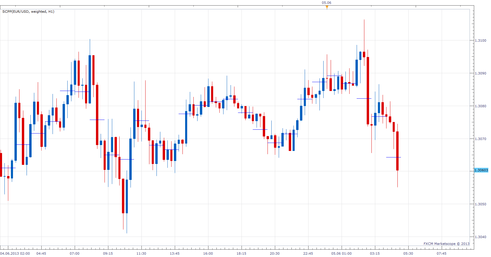

# Sub Candle Price Points

> Source: https://fxcodebase.com/code/viewtopic.php?f=17&t=39870  
> Forum: 17 · Topic 39870 · 5 post(s)

---

## Sub Candle Price Points

**Apprentice** · Wed Jun 05, 2013 5:19 am

Will show median, typical or weighted price Levels for selected time frame.

 [SCPP.lua](files/65417/SCPP.lua)

The indicator was revised and updated

---

## Re: Sub Candle Price Points

**easytrading** · Mon Dec 08, 2014 2:46 am

hello Apprentice,
is it posible to add horizontal lines that divide the previous bar range by 1/3 & by 1/4 in the indicator parameters with options of line style and color please? your help is much appreciated.

---

## Re: Sub Candle Price Points

**Apprentice** · Mon Dec 08, 2014 7:18 am

Will add horizontal lines that divide the previous bar range by 1/3 & by 1/4

 [Sub Candle Pivot Points.lua](files/97581/Sub%20Candle%20Pivot%20Points.lua)

---

## Re: Sub Candle Price Points

**easytrading** · Mon Dec 08, 2014 12:28 pm

perfect job Apprentice thank you.

---

## Re: Sub Candle Price Points

**Apprentice** · Mon Jun 26, 2017 10:06 am

The indicator was revised and updated.
