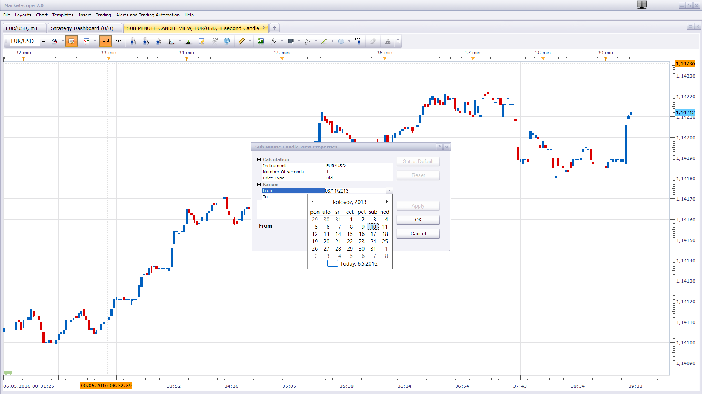

# Sub Minute Candle View

> Source: https://fxcodebase.com/code/viewtopic.php?f=17&t=63442  
> Forum: 17 · Topic 63442 · 10 post(s)

---

## Sub Minute Candle View

**Apprentice** · Thu May 05, 2016 4:56 am

Candle duration is specified in seconds.
If set to 10 seconds candle it will draw new candle every 10 second

 [Sub Minute Candle View.lua](files/106099/Sub%20Minute%20Candle%20View.lua)

Custom Time Frame Candle View version for higher time frames can be found here.
[viewtopic.php?f=17&t=60537](https://fxcodebase.com/code/viewtopic.php?f=17&t=60537)

The indicator was revised and updated

---

## Re: Sub Minute Candle View

**veyron89890** · Thu May 05, 2016 10:28 am

how can i load more data ?

---

## Re: Sub Minute Candle View

**speakinmymind** · Thu May 05, 2016 3:49 pm

Could you make a candle view for larger timeframes?

1 year

3 year

5 year

10 year

Thank you

---

## Re: Sub Minute Candle View

**Apprentice** · Fri May 06, 2016 3:10 am

Custom Time Frame Candle View version for higher time frames can be found here.
[viewtopic.php?f=17&t=60537](https://fxcodebase.com/code/viewtopic.php?f=17&t=60537)

1 year = 12* 1M
3 year = 36* 1M
...

 

Available tick data is somewhat limited.

---

## Re: Sub Minute Candle View

**veyron89890** · Fri May 06, 2016 7:44 am

> **Apprentice wrote:**
> Custom Time Frame Candle View version for higher time frames can be found
>
>
>
> Untitled.png
>
>
> Available tick data is somewhat limited.

i try to select an older date but the indicator just load the present day.

---

## Re: Sub Minute Candle View

**daveb1058** · Sun May 22, 2016 5:50 am

Would it be possible to use these sub min timeframes with renko? so as to create renko that actually unfolds with rapid price action? as a 1 min renko update often lags price.

---

## Re: Sub Minute Candle View

**Apprentice** · Mon May 23, 2016 7:02 am

Try this version.
[viewtopic.php?f=17&t=63511](https://fxcodebase.com/code/viewtopic.php?f=17&t=63511)

---

## Re: Sub Minute Candle View

**mutoudage** · Wed Oct 05, 2016 12:09 am

Hi,

Could you double check the indicator? I tried with 4 seconds as sub-minute base. I only get 5 candles for 1 minute (which should be 15 candles). And it also did not work with 10 seconds base.

The candle duration is very random, not fixed; and the number of candles for each minute is not fixed as well.

---

## Re: Sub Minute Candle View

**Apprentice** · Fri Oct 07, 2016 3:47 am

Try it now.

---

## Re: Sub Minute Candle View

**Apprentice** · Tue Mar 13, 2018 10:59 am

The indicator was revised and updated
