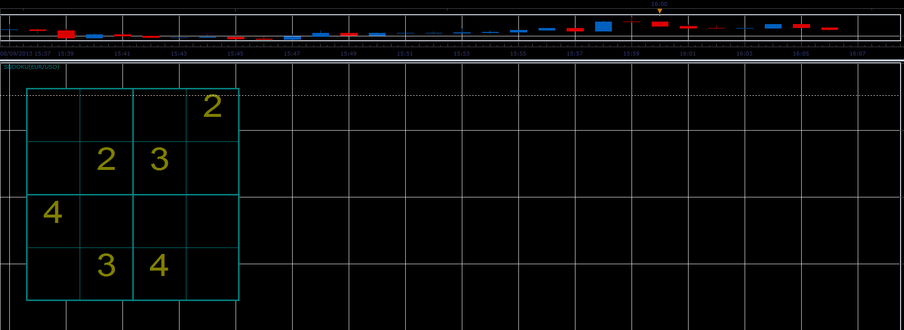
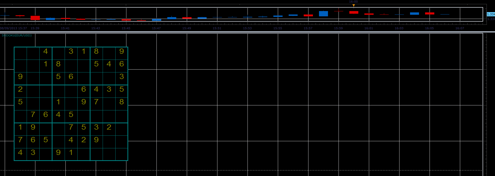

# Sudoku game

> Source: https://fxcodebase.com/code/viewtopic.php?f=17&t=58831  
> Forum: 17 · Topic 58831 · 4 post(s)

---

## Sudoku game

**Alexander.Gettinger** · Fri Aug 09, 2013 3:11 pm

The indicator is just a sudoku game ([http://en.wikipedia.org/wiki/Sudoku](https://en.wikipedia.org/wiki/Sudoku)). Right-click and use context menu to make a turn and restart the game.

 

 

Download:

 [Sudoku.lua](files/88195/Sudoku.lua)

The indicator was revised and updated

---

## Re: Sudoku game

**Apprentice** · Sat Jun 17, 2017 3:43 am

The indicator was revised and updated.

---

## Re: Sudoku game

**ColinSmith** · Wed Oct 30, 2019 6:03 am

Excellent job as I am always a fan of the game. keep going. Already I am following you on twitter also. thanks for sharing.

---

## Re: Sudoku game

**Strela_999** · Thu Jan 30, 2020 4:17 pm

I'm downloading that, thanks! There's always a need for a quick game when you're working and monitoring...
