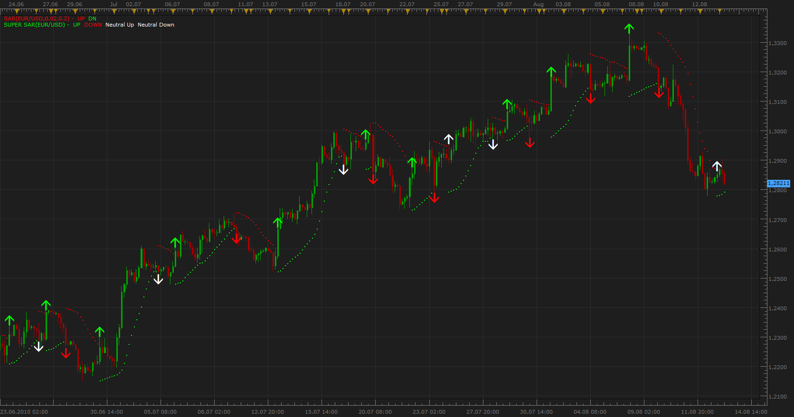

# Super SAR

> Source: https://fxcodebase.com/code/viewtopic.php?f=17&t=1769  
> Forum: 17 · Topic 1769 · 13 post(s)

---

## Super SAR

**Apprentice** · Fri Aug 13, 2010 5:18 am

Green / Red Arrows **(enter the trade)**are generated after the change of SAR indication, only if it is confirmed by SuperTrend indicators.

White Arrows **(miss the trade)** are generated after the change of SAR indication, only if it is not confirmed by SuperTrend indicators.

If you use wider definition options, the Arrows is generated when both conditions are positive, regardless of the sequence of positive indications.

 [Super SAR.lua](files/3559/Super%20SAR.lua)

If you do not have it, you need the following indicator.

SUPERTREND INDICATOR:
 [viewtopic.php?f=17&t=605](https://fxcodebase.com/code/viewtopic.php?f=17&t=605)

---

## Re: Super SAR

**bjmerkel** · Fri Aug 13, 2010 9:44 am

I am excited to test this indicator out but It doesn't load properly. When I try to normally load it it comes up [string "Super Sar.lua"]:68. The indicator with the requested id is not found. Please let me know if I am doing something wrong. Thanks!

---

## Re: Super SAR

**Apprentice** · Fri Aug 13, 2010 9:50 am

I am guilty, I have post the wrong indicator to be installed.
Just install the next indicator.

SUPERTREND INDICATOR:
 [viewtopic.php?f=17&t=605](https://fxcodebase.com/code/viewtopic.php?f=17&t=605)

---

## Re: Super SAR

**Alexander.Gettinger** · Thu Jan 08, 2015 5:02 pm

MQL4 version of Super SAR indicator: [viewtopic.php?f=38&t=61692](https://fxcodebase.com/code/viewtopic.php?f=38&t=61692).

---

## Re: Super SAR

**md2324** · Tue Jan 13, 2015 2:30 pm

What please, is the correct SuperTrend indicator needed, in order to have the Super SAR plot correctly ?

I have tried all of the SuperTrend links that are posted on this thread, and am still unable to get the Super SAR to " show " / plot on my chart when I go to open the super SAR

Thanks as always, really appreciate all of the help - Michael

---

## Re: Super SAR

**Apprentice** · Wed Jan 14, 2015 2:37 am

Yes, SuperTrend.lua is required.
[download/file.php?id=2466](https://fxcodebase.com/code/download/file.php?id=2466)

---

## Re: Super SAR

**md2324** · Wed Jan 14, 2015 3:00 pm

Thank you Apprentice for the link

---

## Re: Super SAR

**zigzag** · Thu May 12, 2016 2:11 pm

Hi there!

I was wondering if there is a strategy to this indicator? Would be perfect for backtesting

Also I (think I) found some wrong signals.

12.05.16 - 05/12/16
DAX / GER30
m5

Setup is:
Supertrend 8; 1,5
SAR 0,2; 0,2

In the first two yellow circles you see, there are arrows missing. The third circle on top shows that there is a signal given but but to early. ST was not in downtrend at that time. What happened there?

Maybe you can help me.
Thank you very much

 

*Missing Arrows?*

---

## Re: Super SAR

**Apprentice** · Fri May 13, 2016 1:32 pm

Try updated version.
If everything will be ok.
Will write strategy.

---

## Re: Super SAR

**zigzag** · Fri May 13, 2016 7:30 pm

Got the same problem
Is it the same download link?

Thanks for help!

---

## Re: Super SAR

**Apprentice** · Sun May 15, 2016 6:19 am

Yes, first/topmost post in this topic.

---

## Re: Super SAR

**Apprentice** · Sun Sep 02, 2018 5:47 am

The indicator was revised and updated.

---

## Re: Super SAR

**ahmedalhosenyy** · Thu Oct 09, 2025 7:07 pm

Thanks for the indicator
