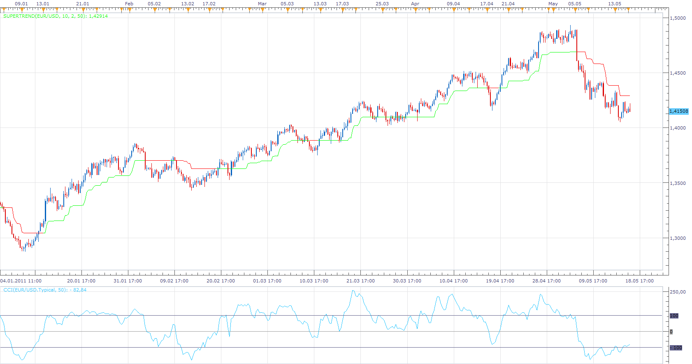

# Super Trend (CCI Version)

> Source: https://fxcodebase.com/code/viewtopic.php?f=17&t=4306  
> Forum: 17 · Topic 4306 · 8 post(s)

---

## Super Trend (CCI Version)

**Apprentice** · Tue May 17, 2011 7:55 am

Up Trend
 Trend = High+ ATR * Multiplier;
Down Trend
 Trend = Low - ATR * Multiplier;

CCI Zero Line CossOver - UpTrend
CCI Zero Line CossUnder - Down Trend

The original implementation do not use ATR Multiplier
My version gives you a choice.
You can set ATR Multiplier parameter to zero.

In my opinion this is better.

 [CCI_SuperTrend.lua](files/10736/CCI_SuperTrend.lua)

 

 [MFT CCI Supertrend.lua](files/10736/MFT%20CCI%20Supertrend.lua)

MT4 version.
[https://fxcodebase.com/code/viewtopic.p ... 48#p160848](https://fxcodebase.com/code/viewtopic.php?f=38&t=76366&p=160848#p160848)

---

## Re: Super Trend (CCI Version)

**johnwattcorp** · Tue May 17, 2011 1:09 pm

thank you

---

## Re: Super Trend (CCI Version)

**Apprentice** · Thu Jun 05, 2014 6:47 am

MFT CCI Supertrend.lua Added.

---

## Re: Super Trend (CCI Version)

**Apprentice** · Mon Jun 19, 2017 8:12 am

The indicator was revised and updated.

---

## Re: Super Trend (CCI Version)

**SerifKocdemir** · Fri Jan 10, 2020 3:36 pm

It has been almost 9 yearr and
First time I see this verison of Supertrend and I like it.
Thank you so much whoever made and want this.

---

## Re: Super Trend (CCI Version)

**khanatd** · Wed Oct 01, 2025 10:48 pm

hi sir mt4 version with NRP ARROWS TOO ,thanks sir

---

## Re: Super Trend (CCI Version)

**Apprentice** · Sat Oct 04, 2025 2:52 pm

We have added your request to the development list.
Development reference 637

---

## Re: Super Trend (CCI Version)

**Apprentice** · Sun Oct 12, 2025 1:53 am

MT4 version.
[https://fxcodebase.com/code/viewtopic.p ... 48#p160848](https://fxcodebase.com/code/viewtopic.php?f=38&t=76366&p=160848#p160848)
