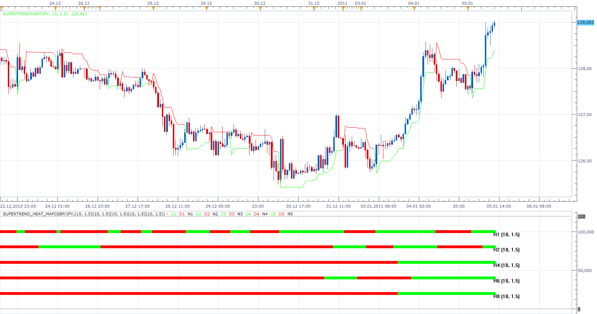

# Super Trend (New Version)

> Source: https://fxcodebase.com/code/viewtopic.php?f=17&t=3102  
> Forum: 17 · Topic 3102 · 80 post(s)

---

## Super Trend (New Version)

**Apprentice** · Wed Jan 05, 2011 12:48 pm

note: old version of the indicator is available here:
[viewtopic.php?t=605&f=17](https://fxcodebase.com/code/viewtopic.php?t=605&f=17)

The indicator is adapted to the new version of platform,
is not compatible with older versions of the indicator.

 [SuperTrend.lua](files/7227/SuperTrend.lua)

 [SuperTrend Bar.lua](files/7227/SuperTrend%20Bar.lua)

To use SuperTrend Heat Map requires New Vesrion of Supertrend Indicator.

 [SuperTrend_Heat_Map.lua](files/7227/SuperTrend_Heat_Map.lua)

 [SuperTrend with Alert.lua](files/7227/SuperTrend%20with%20Alert.lua)

This indicator will provide Audio / Email Alerts if and when Super Trend indication is changed.

MT4/MQ4 version.
[viewtopic.php?f=38&t=69405](https://fxcodebase.com/code/viewtopic.php?f=38&t=69405)

---

## Re: Super Trend (New Version)

**khaled1** · Fri Apr 01, 2011 3:16 pm

first of all i really liked u'r work but i need some help after running the indicator for about 5 h the indicator crushed down and only gives 1 h signal and the others disappear can u fix that please .
thanks allot .
attatched ascrenshot will helpe to clear what i mean and sorry for my bad english .

---

## Re: Super Trend (New Version)

**Apprentice** · Sat Apr 02, 2011 5:29 am

Thank you for reporting this issue.

---

## Re: Super Trend (New Version)

**khaled1** · Sat Apr 02, 2011 5:16 pm

thank u for u'r fast reply and i wonder if u can add alarm when sequence of the color changes from red to gren and vice versa (only when they r all red or all gren and h2 or h4 or h6 or h8 changed its color h1 not important for me).
i'm sorry if i ask to much .
thanks for advance.
best regards,,

---

## Re: Super Trend (New Version)

**virgilio** · Tue Apr 05, 2011 4:49 pm

Hello dear, I noticed that sometimes the bars might change colors after some time. For example, if the 1-Hour bar shows to be red at 11:00am, it could be that if I check the 1-Hour tomorrow that red colored bar frame disappears and it never went red. Or maybe, it shows that it went red at a different time other than 11:00. The same thing can happen to the 2-hour, 4-hour. Why is this and is there anything that the colors don't change?
Thank you for your help!

---

## Re: Super Trend (New Version)

**nookie** · Tue Sep 13, 2011 5:08 am

I found some weird thing here.. when changing between timeframes the chart - lets say from 5min. to 1H there is some error message and this indicator is not displayed. when changing back to 5min. the indicator is displayed but its in different area.. either in MACD or RSI area and manually I have to click change indicator and "location" and "show indicator in a new area below the following".. is this some bug that can by fixed by making this indicator staying always in the bottom of the charts ?

Cheers

Nookie

---

## Re: Super Trend (New Version)

**rretch** · Tue Sep 13, 2011 9:23 am

Unfortunately, I think the quantity of work is degrading the quality of indicators being released.

I've run into this (painting/updating) problem a few times, but I'm too frustrated to even waste my time posting the problem. I'm left w/trading without any indicators due to the fact that I don't trust the indicators.

The 'RB_Clear' indicator is the only indicator I use because I know the rules of the indicator and I can see when the painting is wrong (it will show a buy & sell simultaneously). I know it's render is incorrect and just hit the refresh button to have it correct itself. I know it corrects itself 'correctly' due to, as I mentioned, knowing how the indicator works.

I feel we should start testing the droves of released indicators before they are released.

Other than that, I do appreciate the hard work and the endless help of the indicator developers.

This post is not meant to be any sort of 'bash', just a heads up to how 'some' released indicators are not rendering correctly.

thanks

---

## Re: Super Trend Heat Map Alarm Request

**fxhokie** · Thu Dec 29, 2011 10:17 pm

Hello,

 Two questions 1) Could an alarm(and email be sent) occur if all the timeframes become the same color (not every time one changes or if they are all the same just the first time the become all red/all yellow) and then another alarm when any of the timeframes change to the opposite color and

2) a previous question asked you guys "Hello dear, I noticed that sometimes the bars might change colors after some time. For example, if the 1-Hour bar shows to be red at 11:00am, it could be that if I check the 1-Hour tomorrow that red colored bar frame disappears and it never went red."-- has this been fixed. No one responded to this persons concern?
(I personally marked when every timeframe turned from red to green (after the completion of the candle) on a 15min chart and then later a few candles some of the timeframes switched back. I have attached a screenshot and where the vertical line is on the chart is the candle where all timeframes turned green a then a couple timeframes later H6 and H8 switched back. How is this possible??? Can it be fixed? One can't trust an indicator that rewrites itself.

 Thanks!!

 fxhokie

---

## Re: Super Trend (New Version)

**Apprentice** · Mon Jan 02, 2012 4:38 am

Your request is added to the developmental cue.

---

## Re: Super Trend (New Version)

**fxhokie** · Tue Jan 03, 2012 12:56 am

Thanks for adding it to the development queue.

In the mean time can you answer the question about the indicator changing values as I showed in my post??

thanks!

---

## Re: Super Trend (New Version)

**fxhokie** · Tue Jan 03, 2012 12:56 am

Thanks for adding it to the development queue.

In the mean time can you answer the question about the indicator changing values as I showed in my post??

thanks!

---

## Super Trend New Version

**Anariamic** · Tue Jan 03, 2012 7:50 pm

Seat mast topper is different too... ENVE vs. Thomson, correct?

Let us know if the 09 rides any differently compared to the 08. Personally, I prefer the aesthetics of the 08, but you cant really go wrong either way Congrats

---

## Re: Super Trend (New Version)

**nazaar** · Fri Feb 10, 2012 4:59 pm

Hello,

could you please post what is a super trend? what formula is used to generate a signal? how is a buy sell signal determined?

thanks

---

## Re: Super Trend (New Version)

**Apprentice** · Sun Feb 12, 2012 4:19 am

The indicator is similar to SSL
[viewtopic.php?f=17&t=139](https://fxcodebase.com/code/viewtopic.php?f=17&t=139)

But instead of MVA High / Low,
We use
 median + ATR * Multiplier
and
 median + ATR * Multiplier.

---

## Re: Super Trend (New Version)

**nazaar** · Sun Feb 12, 2012 6:46 pm

> **Apprentice wrote:**
> The indicator is similar to SSL
> [viewtopic.php?f=17&t=139](https://fxcodebase.com/code/viewtopic.php?f=17&t=139)
>
> But instead of MVA High / Low,
> We use
> median + ATR * Multiplier
> **and
> median + ATR * Multiplier.**

 ? The bold part, is that a typo?

thanks for the response. so to be clear the supertrend line is calculated using the look back period median (the median of the medians?) + the look back period ATR then multiplying by a multiplier.

Is this correct?

thank you!

---

## Re: Super Trend (New Version)

**Apprentice** · Mon Feb 13, 2012 6:07 am

Yes this is correct.
And switch algo is the same as with SSL / GHLA.

---

## Re: Super Trend (New Version)

**chriswant** · Mon Feb 13, 2012 6:25 pm

any way this can be made for the mirrortrading platform or tradency platform?

---

## Re: Super Trend (New Version)

**Apprentice** · Tue Feb 14, 2012 7:13 am

As you know, this forum is dedicated to TS2/Marketscope.
Try to contact our Premium service team, they would be able to help you.
But I think this effort is quite expensive.
If they will not be able to help, contact me, I'll try to find a programmer for you.

---

## Re: Super Trend (New Version)

**thibapanam** · Tue Nov 06, 2012 6:58 am

Hello Apprentice,

Would it be possible to create a strategy as follow:
- order when price touches MVA
- filter with indicator supertrend_heat_map
- add stop loss and take profit

Thanks a lot for your great work!

Best regards

thibapanam

---

## Re: Super Trend (New Version)

**Apprentice** · Tue Nov 06, 2012 7:26 am

Your request is added to the development list.

---

## Re: Super Trend (New Version)

**Outside_The_Box** · Sun Oct 06, 2013 4:19 pm

Would it be possible to modify this indicator so that the user can choose not to use all 5 time frames? For instance, if I'm using it on an 8 hour chart but I only want it to display values for 8 hour, daily, and weekly.

---

## Re: Super Trend (New Version)

**jay1994** · Sun Oct 06, 2013 10:02 pm

Is there a MQ4L version of this indicator? Thanks.

---

## Re: Super Trend (New Version)

**Apprentice** · Mon Oct 07, 2013 2:39 am

Time Frame Selector Added.
Negative on MQ4.

jay1994 Do you need Heat_Map SuperTrend or Standard Line version of Super Trend for MT4.
Add to task to development list.

---

## Re: Super Trend (New Version)

**Apprentice** · Mon Oct 07, 2013 3:24 am

SuperTrend_Heat_Map - Updated.
 MTF MCP SuperTrend_Heat_Map - Added.

---

## Re: Super Trend (New Version)

**nowaishy** · Thu Mar 20, 2014 8:39 am

Hello everyone,

I have tried the MTF MCP Supertrend heat Map and unfortunately as u have mentioned in this thread it repaints & updates, but I wondered does the Supertrend_heat_Map does repaint also or not, and it does, is anyone willing to fix this in the near future.

thanks

Nowaishy

---

## Re: Super Trend (New Version)

**Apprentice** · Sat Mar 22, 2014 3:03 am

Heat_Map will, should give the same signals as the original indicator.

---

## Re: Super Trend (New Version)

**nowaishy** · Sun Mar 23, 2014 4:37 am

Thanks Apprentice for your response!

Nowaishy

---

## Re: Super Trend (New Version)

**nowaishy** · Sun Mar 23, 2014 9:56 pm

I would like to ask the development team to add the alert feature to the supertrend indicator, when the color of the supertrend changes an alert is triggered.

Thanks

Nowaishy

---

## Re: Super Trend (New Version)

**Apprentice** · Mon Mar 24, 2014 3:27 am

SuperTrend with Alert.lua Added

---

## Re: Super Trend (New Version)

**nowaishy** · Mon Mar 24, 2014 9:02 am

Thank you apprentice for your immediate response.

Thanks

Nowaishy

---

## Re: Super Trend (New Version)

**cave76** · Sun Mar 30, 2014 3:48 pm

hi could you please make this indicator so It will not repaint once the candle is closed

thanks

---

## Re: Super Trend (New Version)

**Apprentice** · Mon Mar 31, 2014 2:36 am

Can provide the formula, implementation or solution how we can achieve this.

---

## Re: Super Trend (New Version)

**cave76** · Mon Mar 31, 2014 6:36 am

not sure I am not a coder nor do I know anything about it
I think in forex factory they have one for mt4
just need it to keep color after candles have closed

[http://www.forexfactory.com/showthread.php?t=329399](http://www.forexfactory.com/showthread.php?t=329399)

---

## Re: Super Trend (New Version)

**colajam1979** · Thu Sep 15, 2016 6:03 am

Hello all
is there a strategy for this?

thanks in advance

James

---

## Re: Super Trend (New Version)

**Apprentice** · Fri Sep 16, 2016 5:23 am

One is available, based on the old version of indicator.
[viewtopic.php?f=31&t=24274&p=41761&hilit=SuperTrend#p41761](https://fxcodebase.com/code/viewtopic.php?f=31&t=24274&p=41761&hilit=SuperTrend#p41761)

---

## Re: Super Trend (New Version)

**colajam1979** · Fri Sep 16, 2016 11:39 am

> **Apprentice wrote:**
> One is available, based on the old version of indicator.
> [viewtopic.php?f=31&t=24274&p=41761&hilit=SuperTrend#p41761](https://fxcodebase.com/code/viewtopic.php?f=31&t=24274&p=41761&hilit=SuperTrend#p41761)

Thanks for the Link Apprentice.
I will take a look this afternoon.

---

## Re: Super Trend (New Version)

**colajam1979** · Sat Sep 17, 2016 8:51 pm

Hello again Apprentice.
I tried out the old strategy you posted the link for but it is not as efficient at this updated version.

Will there be a strategy available based on this (new version)?

When trend line is green = close short and open long
when trend line is red = close long and open short

all other options available as usual ie,
time frame, m1, m5, m15.........
allow to trade yes, no
buy, sell or both
limit, stop, trailing stop
trading hours

thanks in advance

---

## Re: Super Trend (New Version)

**Apprentice** · Mon Sep 19, 2016 3:27 am

Both the old and the new indicator will have the same result.
Strategy is updated, old version is still used.

---

## Re: Super Trend (New Version)

**colajam1979** · Mon Sep 19, 2016 5:34 am

So it does... Thanks for this.

---

## Re: Super Trend (New Version)

**colajam1979** · Thu Sep 22, 2016 10:18 am

Can i make a request to this strategy?

Can you add a second time line to be used as the trend direction?

for example...
time line 1 for opening/closing positions = 1minute / number of periods 7 / multiplier 2.5
(all existing strategy parameters remain the same )

time line 2 for trend direction = 1minute / number of periods 7 / multiplier 2.5
(The only use for time line 2 is trend direction)

---

## Re: Super Trend (New Version)

**Apprentice** · Fri Sep 23, 2016 4:38 am

Try this version.
[viewtopic.php?f=31&t=63891](https://fxcodebase.com/code/viewtopic.php?f=31&t=63891)

---

## Re: Super Trend (New Version)

**Apprentice** · Mon Aug 28, 2017 4:12 am

The indicator was revised and updated.

---

## Re: Super Trend (New Version)

**ChrisM** · Thu Oct 19, 2017 8:15 am

Hello Apprentice,

it is the same as "Precision Trend Histogramm 2"
[https://www.mql5.com/en/code/17927](https://www.mql5.com/en/code/17927)

and is it possible to make a STF(Single Time Frame Version)-Version for the Heat Map?

thank you in advance!

---

## Re: Super Trend (New Version)

**Apprentice** · Thu Oct 19, 2017 8:33 am

> it is the same as "Precision Trend Histogramm 2"

These are two different indicators.

---

## Re: Super Trend (New Version)

**Apprentice** · Thu Oct 19, 2017 8:40 am

> is it possible to make a STF(Single Time Frame Version)-Version for the Heat Map?

SuperTrend Bar added.

---

## Re: Super Trend (New Version)

**ChrisM** · Thu Oct 19, 2017 9:26 am

Thank you very much for your quick work!

Is the above indicator here? I have found nothing.
Is it possible to develop it?

---

## Re: Super Trend (New Version)

**Apprentice** · Thu Oct 19, 2017 10:01 am

Try this version of Precision Trend
[viewtopic.php?f=17&t=65185&p=115509#p115509](https://fxcodebase.com/code/viewtopic.php?f=17&t=65185&p=115509#p115509)

---

## Re: Super Trend (New Version)

**Apprentice** · Tue Aug 07, 2018 4:59 am

The indicator was revised and updated.

---

## Re: Super Trend (New Version)

**Alexander.Gettinger** · Tue Dec 11, 2018 1:43 pm

> **jay1994 wrote:**
> Is there a MQ4L version of this indicator? Thanks.

Please, try this MQL4 version of super trend indicator:

 [SuperTrend.mq4](files/122689/SuperTrend.mq4)

---

## Re: Super Trend (New Version)

**steveped** · Wed May 08, 2019 12:54 pm

Hi Apprentice, about SuperTrend Heat Map. I'm used to have the indicator drawn on a low time frame chart (ie 15 min) showing its value for higher time frames (ie H1). In this example, ST will show 4 bars within the hour, and the color of the bar will depend on last close price of the H1 bar. So, while the H1 bar develops, the bar color can change. I would like to have the bar color of the selected time frame (ie 15 min) reflecting the value of the indicator for a higher time frame (ie H1; is this possible? Thanks.

---

## Re: Super Trend (New Version)

**Apprentice** · Wed May 08, 2019 1:49 pm

 

Indicator works as expected.

---

## Re: Super Trend (New Version)

**steveped** · Thu May 09, 2019 5:50 am

I need something different. I'll try to explain myself in a better way. Let's suppose I'm on a 15m chart and I have SuperTrend Heat Map drawn using m15 and h1 time frame. All 4 bars about ST h1 will be green or red depending on the close value of the 4th bar (which corresponds with the close value of the h1 bar). I would like to have each 15min bar reflecting the value of ST h1 in that particular bar. At the moment the indicator shows its value (green/red) based on the close value of the H1 bar. I would like to have each 15min bar showing what was the h1 value in that particular moment. Let me make an example. Let's assume that ST m15 and STh1 have the same value and Heat Map shows an uptrend at the beginning of the 15min candle (ie 11:00); let's assume at 11:45 ST changes trend to downtrend. Currently the indicator would show 2 green bars and 2 red bars on m15 line and 4 red lines for h1 line. I would like to have the h1 line showing 2 green bars and 2 red bars.

---

## Re: Super Trend (New Version)

**Apprentice** · Thu May 09, 2019 1:27 pm

I do not see any added value.
As this information is already shown by a higher time frame line.
Will have to refuse your request.

---

## Re: Super Trend (New Version)

**Sospool** · Tue Jun 25, 2019 5:01 am

Hello, is it possible to have the option of "live or end of turn" on the SuperTrend Heat Map indicator ?

Thank you

---

## Re: Super Trend (New Version)

**Apprentice** · Wed Jun 26, 2019 4:27 am

sure. how it will affect higher time frames?
If on,
A) will NOT give any signal for the current candle
B) current candle will have the previous candle signal (higher time frame)
C) current candle will have the previous candle signal (chart time frame)

For example, if we use the previous candle signal for W1 or M1,
the signal will be delayed up to one week or one month...

---

## Re: Super Trend (New Version)

**Sospool** · Wed Jun 26, 2019 6:54 am

Hello Apprentice,

you're right I thought of a confirmation of signals but completely delay that would be shifted, I think now that my request is not suitable for this indicator.

Thank you for taking the time.

---

## Re: Super Trend (New Version)

**steveped** · Mon Sep 07, 2020 9:47 am

Hi Apprentice,
is it possible to create a new Indicator which calculates the difference between 2 Supertrends? I.e. ST(m15, 10, 3) and ST (h1, 10, 3) for a certain TF?

---

## Re: Super Trend (New Version)

**Apprentice** · Tue Sep 08, 2020 8:22 am

Try this version.
[viewtopic.php?f=17&t=70402](https://fxcodebase.com/code/viewtopic.php?f=17&t=70402)

---

## Re: Super Trend (New Version)

**steveped** · Mon Mar 15, 2021 4:30 am

Hi Apprentice,
is it possible to add an alert to Supertrend Heat Map? I would like to have an alert when at least X out of the active slots are on the same side (buy/sell). Thanks

---

## Re: Super Trend (New Version)

**Apprentice** · Tue Mar 16, 2021 12:25 pm

Your request is added to the development list.
Development reference 277.

---

## Re: Super Trend (New Version)

**Apprentice** · Wed Mar 17, 2021 1:56 pm

[SuperTrend_Heat_Map with Alert.lua](files/141235/SuperTrend_Heat_Map%20with%20Alert.lua)

Try this version.

---

## Re: Super Trend (New Version)

**steveped** · Mon May 10, 2021 2:17 am

Many thanks, Apprentice! Is it possible to add 2 lines to the price chart based on the min and max value of the active SuperTrend values? Thanks.

---

## Re: Super Trend (New Version)

**Apprentice** · Tue May 11, 2021 3:14 am

Can you show it on chart example?

---

## Re: Super Trend (New Version)

**steveped** · Tue May 11, 2021 6:26 am

Let me explain myself better.
I use SuperTrend Heat Map on the same chart instrument, with the same Period and Multiplier values (10, 1.5) but on different TF.
So I may have something like:
SuperTrend(EURUSD, 10, 1.5) on m1 => 1,2150
SuperTrend(EURUSD, 10, 1.5) on m5 => 1,2165
SuperTrend(EURUSD, 10, 1.5) on m15 => 1,2190
SuperTrend(EURUSD, 10, 1.5) on H1 => 1,2200
Over than the heat map already available, I would like to see on the price chart 2 lines: one which shows the min value of the active SuperTrends (so, in the example above 1,2150), the other the max value of active SuperTrends (so, in the example above 1,2200).

---

## Re: Super Trend (New Version)

**Apprentice** · Wed May 12, 2021 4:51 am

Your request is added to the development list.
Development reference 468.

---

## Re: Super Trend (New Version)

**Apprentice** · Sun May 16, 2021 4:34 am

Try this version.
[https://fxcodebase.com/code/viewtopic.php?f=17&t=71196](https://fxcodebase.com/code/viewtopic.php?f=17&t=71196)

---

## Re: Super Trend (New Version)

**Xtian56** · Thu May 05, 2022 2:39 pm

[quote="Apprentice"]

The attachment **SuperTrend.png** is no longer available

note: old version of the indicator is available here:
[viewtopic.php?t=605&f=1](https://fxcodebase.com/code/viewtopic.php?t=605&f=1)

The attachment **SuperTrend.png** is no longer available

Thank you for your work.
Would it be possible to add on the "SuperTrend with Alert.lua" colored areas like in this example please?

Thanks very much

---

## Re: Super Trend (New Version)

**Apprentice** · Fri May 06, 2022 5:21 am

We have added your request to the development list.
Development reference 276.

---

## Re: Super Trend (New Version)

**Apprentice** · Fri May 06, 2022 6:16 am

Try this version.

 [SuperTrend with Alert.lua](files/145914/SuperTrend%20with%20Alert.lua)

---

## Re: Super Trend (New Version)

**Xtian56** · Fri May 06, 2022 5:31 pm

> **Apprentice wrote:**
>
>
> USDJPY m30 (05-06-2022 1313).png
>
>
> Try this version.
>
>
> SuperTrend with Alert.lua

thank you very much it's great and perfect...

---

## Re: Super Trend (New Version)

**tuhadfe** · Wed Mar 19, 2025 6:21 am

Hi

Can a strategy be created with the supertrend heatmap, when you select multiple timeframes and it goes green in that direction then it makes a trade.

Thanks

---

## Re: Super Trend (New Version)

**tuhadfe** · Wed Mar 19, 2025 6:45 am

Hi can supertrend heatmap strategy be added to trade in direction of multiple timeframes

---

## Re: Super Trend (New Version)

**Apprentice** · Fri Mar 21, 2025 6:09 am

We have added your request to the development list.
Development reference 217

---

## Re: Super Trend (New Version)

**ahmedalhosenyy** · Fri Mar 21, 2025 7:20 pm

Nice indicator

I noticed the repaint issue in previous posts , And I think the one bar shift will solve that issue " i.e after candle close ".

May we have that option ?

thanks

---

## Re: Super Trend (New Version)

**tuhadfe** · Thu Apr 03, 2025 1:01 pm

Hi for the supertrend heatmap indicator can you produce an arrow on the chart when all the select timeframes match in the same direction

---

## Re: Super Trend (New Version)

**Apprentice** · Tue Apr 08, 2025 3:04 am

We have added your request to the development list.
Development reference 257

---

## Re: Super Trend (New Version)

**tuhadfe** · Sat Apr 12, 2025 4:15 pm

Hi any update on this.

Is there a link to see the development list?

---

## Re: Super Trend (New Version)

**Apprentice** · Thu Jun 05, 2025 7:21 am

Try this version.
[https://fxcodebase.com/code/viewtopic.p ... 73#p159473](https://fxcodebase.com/code/viewtopic.php?f=31&t=75997&p=159473#p159473)

---

## Re: Super Trend (New Version)

**Apprentice** · Thu Jun 05, 2025 2:46 pm

> I noticed the repaint issue in previous posts , And I think the one bar shift will solve that issue " i.e after candle close ".
>
> May we have that option ?

Task 257
There is a parameter for that already added: End of Turn / Live

---

## Re: Super Trend (New Version)

**ahmedalhosenyy** · Tue Aug 05, 2025 1:21 pm

> **Apprentice wrote:**
>
>
> > I noticed the repaint issue in previous posts , And I think the one bar shift will solve that issue " i.e after candle close ".
> >
> > May we have that option ?
>
>
>
> Task 257
> There is a parameter for that already added: End of Turn / Live

hello , I tested it on 1 minute time frame But it still repaint
