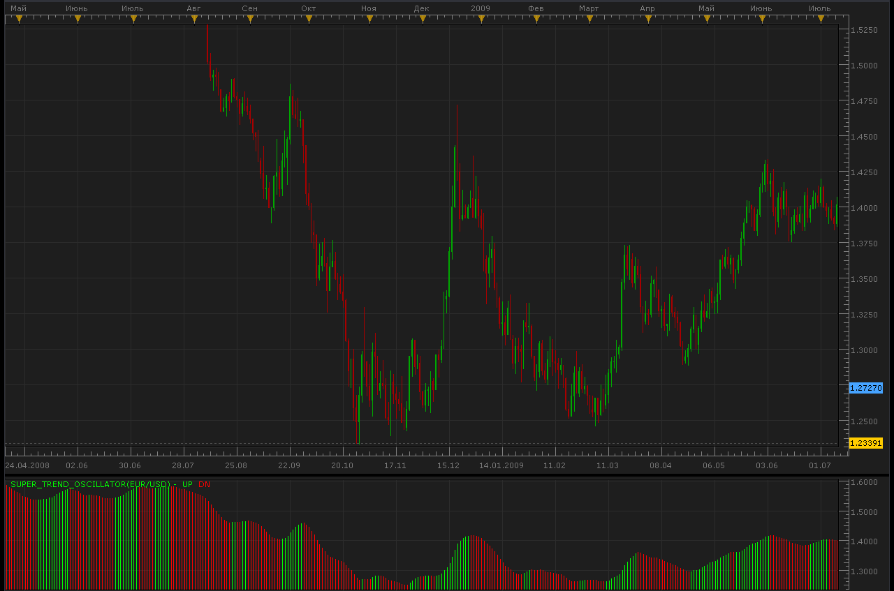
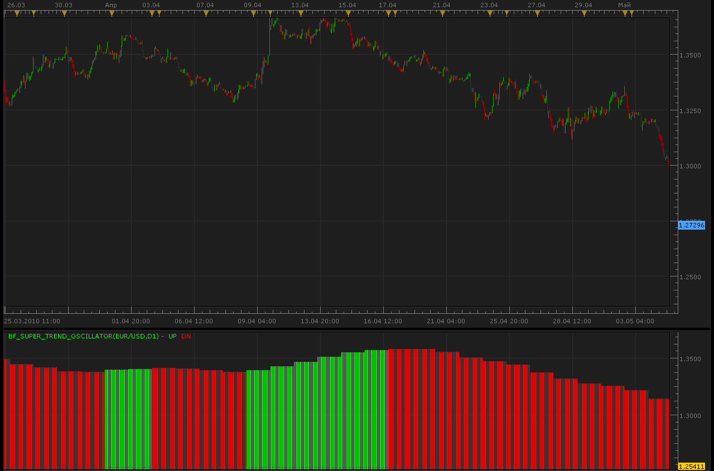

# Super Trend Oscillator

> Source: https://fxcodebase.com/code/viewtopic.php?f=17&t=973  
> Forum: 17 · Topic 973 · 12 post(s)

---

## Super Trend Oscillator

**Alexander.Gettinger** · Thu May 06, 2010 9:33 am

Code: [Select all](https://fxcodebase.com/code/)
`function Init()
    indicator:name("Super Trend oscillator");
    indicator:description("");
    indicator:requiredSource(core.Bar);
    indicator:type(core.Oscillator);
   
    indicator.parameters:addColor("UP_color", "Color of UP", "Color of UP", core.rgb(0, 255, 0));
    indicator.parameters:addColor("DN_color", "Color of DN", "Color of DN", core.rgb(255, 0, 0));
end

local first;
local source = nil;
local Alpha;
local Buff1=nil;
local Buff4=nil;
local bufferUp=nil;
local bufferDn=nil;
local var4=0.;

function Prepare()
    source = instance.source;
    first = source:first();
    local name = profile:id() .. "(" .. source:name() .. ")";
    instance:name(name);
    bufferUp = instance:addStream("UP", core.Bar, name .. ".UP", "UP", instance.parameters.UP_color, first);
    bufferDn = instance:addStream("DN", core.Bar, name .. ".DN", "DN", instance.parameters.DN_color, first);
    Alpha=core.makeArray(100);
   
    Buff1 = instance:addInternalStream(0, 0);
    Buff4 = instance:addInternalStream(0, 0);
   
    local var1;
    local var2;
    local var3;
    for i1=0,97,1 do
     if i1<=18 then
      var1=i1/18.;
     else
      var1=(i1-18.)*7./79.+1.;
     end
     var2=math.cos(math.pi*var1);
     var3=1./(3.+math.pi*var1+1.);
     if var1<=0.5 then
      var3=1.;
     end
     Alpha[i1]=var3*var2;
     var4=var4+Alpha[i1];
    end
   
end

function Update(period, mode)
    if (period>=first+100) then
     local var5=0.;
     local var6;
     for i3=0,98,1 do
      var6=source.close[period-i3];
      var5=var5+Alpha[i3]*var6;
     end
     if var4>0. then
      Buff1[period]=var5/var4;
     end
     Buff4[period]=Buff4[period-1];
     if Buff1[period]>Buff1[period-1] then
      Buff4[period]=1;
     end
     if Buff1[period]<Buff1[period-1] then
      Buff4[period]=-1;
     end
     if Buff4[period]>0 then
      bufferUp[period]=Buff1[period];
      if Buff4[period-1]<0 then
       bufferUp[period-1]=Buff1[period-1];
      end
      bufferDn[period]=nil;
     end
     if Buff4[period]<0 then
      bufferDn[period]=Buff1[period];
      if Buff4[period-1]>0 then
       bufferDn[period-1]=Buff1[period-1];
      end
      bufferUp[period]=nil;
     end
   
    else
     Buff1[period]=0.;
     Buff4[period]=0.;
     bufferUp[period]=0.; 
     bufferDn[period]=0.; 
         
    end
end`

 [Super_Trend_Oscillator.lua](files/1803/Super_Trend_Oscillator.lua)

 [SuperTrendOscillator.lua](files/1803/SuperTrendOscillator.lua)

Single Output Stream Version

The indicator was revised and updated

---

## Re: Super Trend Oscillator

**Hybrid** · Fri May 07, 2010 6:38 pm

Hi,

Thank you for this Oscillator.

Can a bigger time frame version be done ?

---

## Re: Super Trend Oscillator

**WWMMACAU** · Fri May 07, 2010 7:27 pm

Thanks a lot Alexander.Gettinger.

---

## Re: Super Trend Oscillator

**Alexander.Gettinger** · Sun May 09, 2010 10:28 am

> **Hybrid wrote:**
> Hi,
>
> Thank you for this Oscillator.
>
> Can a bigger time frame version be done ?

 

Code: [Select all](https://fxcodebase.com/code/)
`-- todo: support week offset

function Init()
    indicator:name("Bigger timeframe Bollinger Bands");
    indicator:description("");
    indicator:requiredSource(core.Bar);
    indicator:type(core.Oscillator);

    indicator.parameters:addGroup("Calculation");
    indicator.parameters:addString("BS", "Time frame to calculate stochastic", "", "D1");
    indicator.parameters:setFlag("BS", core.FLAG_PERIODS);
    indicator.parameters:addGroup("Display");
    indicator.parameters:addColor("UP_color", "Color of UP", "Color of UP", core.rgb(0, 255, 0));
    indicator.parameters:addColor("DN_color", "Color of DN", "Color of DN", core.rgb(255, 0, 0));
end

local source;                   -- the source
local bf_data = nil;          -- the high/low data
local N;
local Dev;
local HideAve;
local BS;
local bf_length;                 -- length of the bigger frame in seconds
local dates;                    -- candle dates
local host;
local BB;
local day_offset;
local week_offset;
local extent;
local Alpha;
local var4=0.;
local Buff1=nil;
local Buff4=nil;
local bufferUp=nil;
local bufferDn=nil;

function Prepare()
    source = instance.source;
    host = core.host;

    day_offset = host:execute("getTradingDayOffset");
    week_offset = host:execute("getTradingWeekOffset");

    BS = instance.parameters.BS;

    local s, e, s1, e1;

    s, e = core.getcandle(source:barSize(), core.now(), 0, 0);
    s1, e1 = core.getcandle(BS, core.now(), 0, 0);
    assert ((e - s) <= (e1 - s1), "The chosen time frame must be bigger than the chart time frame!");
    bf_length = math.floor((e1 - s1) * 86400 + 0.5);

    local name = profile:id() .. "(" .. source:name() .. "," .. BS .. ")";
    instance:name(name);
    bufferUp = instance:addStream("UP", core.Bar, name .. ".UP", "UP", instance.parameters.UP_color, 0);
    bufferDn = instance:addStream("DN", core.Bar, name .. ".DN", "DN", instance.parameters.DN_color, 0);
    Alpha=core.makeArray(100);
   
    Buff1 = instance:addInternalStream(0, 0);
    Buff4 = instance:addInternalStream(0, 0);
   
    local var1;
    local var2;
    local var3;
    for i1=0,97,1 do
     if i1<=18 then
      var1=i1/18.;
     else
      var1=(i1-18.)*7./79.+1.;
     end
     var2=math.cos(math.pi*var1);
     var3=1./(3.+math.pi*var1+1.);
     if var1<=0.5 then
      var3=1.;
     end
     Alpha[i1]=var3*var2;
     var4=var4+Alpha[i1];
    end

end

local loading = false;
local loadingFrom, loadingTo;
local pday = nil;

-- the function which is called to calculate the period
function Update(period, mode)
    -- get date and time of the hi/lo candle in the reference data
    local bf_candle;
    bf_candle = core.getcandle(BS, source:date(period), day_offset, week_offset);

    -- if data for the specific candle are still loading
    -- then do nothing
    if loading and bf_candle >= loadingFrom and (loadingTo == 0 or bf_candle <= loadingTo) then
        return ;
    end

    -- if the period is before the source start
    -- the do nothing
    if period < source:first() then
        return ;
    end
   
    local extent=100.;

    -- if data is not loaded yet at all
    -- load the data
    if bf_data == nil then
        -- there is no data at all, load initial data
        local to, t;
        local from;

        if (source:isAlive()) then
            -- if the source is subscribed for updates
            -- then subscribe the current collection as well
            to = 0;
        else
            -- else load up to the last currently available date
            t, to = core.getcandle(BS, source:date(period), day_offset, week_offset);
        end

        from = core.getcandle(BS, source:date(source:first()), day_offset, week_offset);
        bufferUp:setBookmark(1, period);
        -- shift so the bigger frame data is able to provide us with the stoch data at the first period
        from = math.floor(from * 86400 - (bf_length * extent) + 0.5) / 86400;
        local nontrading, nontradingend;
        nontrading, nontradingend = core.isnontrading(from, day_offset);
        if nontrading then
            -- if it is non-trading, shift for two days to skip the non-trading periods
            from = math.floor((from - 2) * 86400 - (bf_length * extent) + 0.5) / 86400;
        end
        loading = true;
        loadingFrom = from;
        loadingTo = to;
        bf_data = host:execute("getHistory", 1, source:instrument(), BS, loadingFrom, to, source:isBid());
        BB = core.indicators:create("SUPER_TREND_OSCILLATOR", bf_data);
        return ;
    end

    -- check whether the requested candle is before
    -- the reference collection start
    if (bf_candle < bf_data:date(0)) then
        bufferUp:setBookmark(1, period);
        if loading then
            return ;
        end
        -- shift so the bigger frame data is able to provide us with the stoch data at the first period
        from = math.floor(bf_candle * 86400 - (bf_length * extent) + 0.5) / 86400;
        local nontrading, nontradingend;
        nontrading, nontradingend = core.isnontrading(from, day_offset);
        if nontrading then
            -- if it is non-trading, shift for two days to skip the non-trading periods
            from = math.floor((from - 2) * 86400 - (bf_length * extent) + 0.5) / 86400;
        end
        loading = true;
        loadingFrom = from;
        loadingTo = bf_data:date(0);
        host:execute("extendHistory", 1, bf_data, loadingFrom, loadingTo);
        return ;
    end

    -- check whether the requested candle is after
    -- the reference collection end
    if (not(source:isAlive()) and bf_candle > bf_data:date(bf_data:size() - 1)) then
        bufferUp:setBookmark(1, period);
        if loading then
            return ;
        end
        loading = true;
        loadingFrom = bf_data:date(bf_data:size() - 1);
        loadingTo = bf_candle;
        host:execute("extendHistory", 1, bf_data, loadingFrom, loadingTo);
        return ;
    end

    BB:update(mode);
    local p;
    p = findDateFast(bf_data, bf_candle, true);
    if p == -1 then
        return ;
    end
    if BB:getStream(0):hasData(p) then
        bufferUp[period] = BB:getStream(0)[p];
    end
    if BB:getStream(1):hasData(p) then
        bufferDn[period] = BB:getStream(1)[p];
    end
end

-- the function is called when the async operation is finished
function AsyncOperationFinished(cookie)
    local period;

    pday = nil;
    period = bufferUp:getBookmark(1);

    if (period < 0) then
        period = 0;
    end
    loading = false;
    instance:updateFrom(period);
end

function findDateFast(stream, date, precise)
    local datesec = nil;
    local periodsec = nil;
    local min, max, mid;

    datesec = math.floor(date * 86400 + 0.5)

    min = 0;
    max = stream:size() - 1;

    while true do
        mid = math.floor((min + max) / 2);
        periodsec = math.floor(stream:date(mid) * 86400 + 0.5);
        if datesec == periodsec then
            return mid;
        elseif datesec > periodsec then
            min = mid + 1;
        else
            max = mid - 1;
        end
        if min > max then
            if precise then
                return -1;
            else
                return min - 1;
            end
        end
    end
end`

---

## Re: Super Trend Oscillator

**Hybrid** · Sun May 09, 2010 12:50 pm

Thank you very much, Alexander!

---

## Re: Super Trend Oscillator

**one2share** · Fri Jun 11, 2010 11:49 am

can I simply get a signal that sound when the supertrend changes colors from red to green and vice versa?

---

## Re: Super Trend Oscillator

**fxhokie** · Sat Dec 31, 2011 2:16 am

Hello,

 Was this request from June ever fulfilled? (And could it send an email/text message?)

 thanks!

 fxhokie

---

## Re: Super Trend Oscillator

**Apprentice** · Wed Jan 04, 2012 7:11 am

It appears that the request was never entered.

---

## Re: Super Trend Oscillator

**Apprentice** · Wed Jan 04, 2012 8:22 am

Requested can be found here.
[viewtopic.php?f=31&t=10946&p=22412#p22412](https://fxcodebase.com/code/viewtopic.php?f=31&t=10946&p=22412#p22412)

---

## Re: Super Trend Oscillator

**briansummy** · Tue Mar 06, 2012 10:56 pm

Does the BF Supertrend ever repaint? Great work!

---

## Re: Super Trend Oscillator

**Apprentice** · Thu Mar 08, 2012 6:26 am

For last period this is possible.

---

## Re: Super Trend Oscillator

**Apprentice** · Mon Mar 27, 2017 4:08 pm

Indicator was revised and updated.
