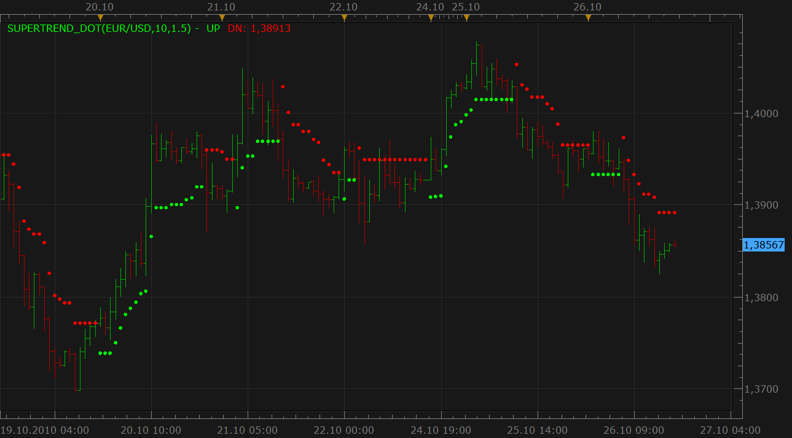

# SuperTrend indicator (new version)

> Source: https://fxcodebase.com/code/viewtopic.php?f=17&t=2527  
> Forum: 17 · Topic 2527 · 15 post(s)

---

## SuperTrend indicator (new version)

**Nikolay.Gekht** · Tue Oct 26, 2010 4:58 pm

Modified version of the Olivier Seban Supertrend indicator

On fxcodebase the indicator was initially published here: [viewtopic.php?f=17&t=605](https://fxcodebase.com/code/viewtopic.php?f=17&t=605)

The indicator is just another trend detector.

This version has the following advantages:

1) The display style is changed from lines to dots, so now the indicator does not "hide" 1-bar switches between red and green as it was in the previous version.

2) The indicator now works correctly on "alive" data, not on historical data only.

Download:

 [SuperTrend_dot.lua](files/5585/SuperTrend_dot.lua)

 [SuperTrend symbols.lua](files/5585/SuperTrend%20symbols.lua)

---

## Re: SuperTrend indicator (new version)

**rretch** · Wed Aug 31, 2011 8:38 am

Hello,

I have briefly looked for a supertrend signal/strategy and found 'ssl supertrend'. I suppose supertrend dot and ssl supertrend are different?

If so, and if one does not exist, would it be possible to get a 'supertrend dot' strategy?

thanks for work w/this indicator...

rob

---

## Re: SuperTrend indicator (new version)

**rretch** · Fri Sep 02, 2011 9:49 pm

sorry to keep buggin',

but still curious if their was a strategy made for the new version of SuperTrend?

thanks

---

## Re: SuperTrend indicator (new version)

**Nikolay.Gekht** · Mon Sep 05, 2011 7:28 am

Do you mean this signal?
[viewtopic.php?f=29&t=1752&p=8556&hilit=ssl+supertrend#p8556](https://fxcodebase.com/code/viewtopic.php?f=29&t=1752&p=8556&hilit=ssl+supertrend#p8556)

---

## Re: SuperTrend indicator (new version)

**rretch** · Mon Sep 05, 2011 6:58 pm

Yep, that's the one I found.

The question is if whether or not they are both the same indicator?

'SuperTrend Dot' sounds like it's different than any previous SuperTrend indicator. I'm just wondering if the SSL strategy is using an older SuperTrend, or if the SSL strategy has been updated and is now using the new 'SuperTrend Dot' indicator.

---

## Re: SuperTrend indicator (new version)

**Alexander.Gettinger** · Fri Nov 21, 2014 4:51 pm

MQL4 version of SuperTrend indicator: [viewtopic.php?f=38&t=61513](https://fxcodebase.com/code/viewtopic.php?f=38&t=61513).

---

## Re: SuperTrend indicator (new version)

**baccicin** · Fri Aug 28, 2015 10:04 am

Hello Alexander, would it be possible a dashborad for SUpertrend? I mean, is possible to show all the pairs/index etc etc in a vertical column and show an arrow (up or down) when and only when the "dot" changes colour, leaving the arrow visible for a specific period? (for example choosing to leave the arrow visible only for 10 or 15 or 30 minutes)
something similar:
 4H D1
EUR/USD up
USD/CAD down
EUR/GBP
AUD/USD up
GER30 down
ITA40
etc etc

Many thanks, have a nice day. Bac.

---

## Re: SuperTrend indicator (new version)

**Apprentice** · Sat Aug 29, 2015 6:39 am

Sent: Thu Aug 27, 2015 8:50 pm
by johnnyrocket

Hello Apprentice,

I am having a hard time with the colors of the dots due to my poor eyesight.. is there anyway to change the dot to a different shape for up dots and down dots instead of just color showing the direction... thank you!

---

## Re: SuperTrend indicator (new version)

**Apprentice** · Fri Sep 11, 2015 2:02 am

johnnyrocket: Have you try to use line version instead.
[http://fxcodebase.com/code/viewtopic.php?f=17&t=605](https://fxcodebase.com/code/viewtopic.php?f=17&t=605)

---

## Re: SuperTrend indicator (new version)

**fxcrust** · Tue Aug 15, 2017 4:44 am

Can you please replace the dots with instance:createTextOutput and webdings. i am color blind and it would be alot easier for me if i could pick one webding for a buy instead of a colored dot and a seperate wingding for sell or a red dots..thank you!

---

## Re: SuperTrend indicator (new version)

**Apprentice** · Wed Aug 16, 2017 3:57 pm

Try SuperTrend symbols.lua

---

## Re: SuperTrend indicator (new version)

**Trader** · Wed Sep 13, 2017 3:59 am

Hello Nikolay.Gekht
1] reference the SuperTrend indicator [dot version]
2] can you please amend this to give the option to show the dots only on the active candle
3] meaning 'Show Historical = Yes/No'
Thank you; and
Regards
Trader

---

## Re: SuperTrend indicator (new version)

**Apprentice** · Wed Sep 13, 2017 5:58 am

"Show Historical" option added.

---

## Re: SuperTrend indicator (new version)

**Trader** · Wed Sep 13, 2017 6:12 am

Hello Apprentice
1] that was fast and very much appreciated
2] thank you; and
Regards
Trader

---

## Re: SuperTrend indicator (new version)

**Apprentice** · Sun Sep 23, 2018 7:19 am

The Indicator was revised and updated.
