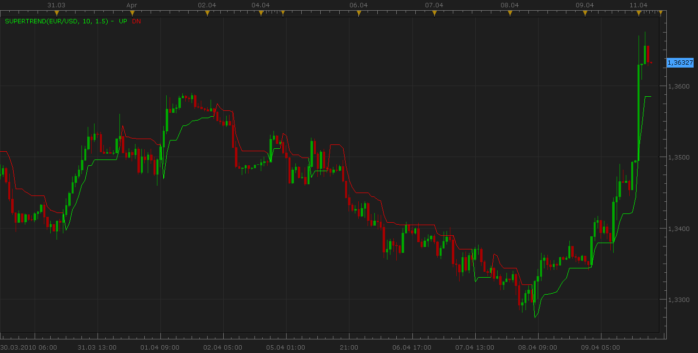

# SuperTrend Indicator

> Source: https://fxcodebase.com/code/viewtopic.php?f=17&t=605  
> Forum: 17 · Topic 605 · 17 post(s)

---

## SuperTrend Indicator

**Nikolay.Gekht** · Sun Apr 11, 2010 8:06 pm

**note: new version of the indicator is available here: [viewtopic.php?f=17&t=2527](https://fxcodebase.com/code/viewtopic.php?f=17&t=2527)**

This is the implementation of Olivier Seban's Supertrend indicator.

 

Code: [Select all](https://fxcodebase.com/code/)
`-- Indicator profile initialization routine
-- Defines indicator profile properties and indicator parameters
function Init()
    indicator:name("SuperTrend Indicator");
    indicator:description("The indicator displays the buying and selling with the colors. The indicator is initially developed by Jason Robinson for MT4");
    indicator:requiredSource(core.Bar);
    indicator:type(core.Indicator);

    indicator.parameters:addInteger("N", "Number of periods", "No description", 10);
    indicator.parameters:addDouble("M", "Multiplier", "No description", 1.5);
    indicator.parameters:addColor("UP_color", "Color of UP", "Color of UP", core.rgb(0, 255, 0));
    indicator.parameters:addColor("DN_color", "Color of DN", "Color of DN", core.rgb(255, 0, 0));
end

-- Indicator instance initialization routine
-- Processes indicator parameters and creates output streams
-- Parameters block
local N;
local M;

local first;
local source = nil;
local ATR = nil;

-- Streams block
local TrUP = nil;
local TrDN = nil;
local UP = nil;
local DN = nil;
local TR = nil;

-- Routine
function Prepare()
    N = instance.parameters.N;
    M = instance.parameters.M;
    source = instance.source;
    ATR = core.indicators:create("ATR", source, N);
    first = ATR.DATA:first();
    local name = profile:id() .. "(" .. source:name() .. ", " .. N .. ", " .. M .. ")";
    instance:name(name);
    UP = instance:addInternalStream(first, 0);
    DN = instance:addInternalStream(first, 0);
    TR = instance:addInternalStream(first, 0);
    TrUP = instance:addStream("UP", core.Line, name .. ".UP", "UP", instance.parameters.UP_color, first);
    TrDN = instance:addStream("DN", core.Line, name .. ".DN", "DN", instance.parameters.DN_color, first);
end

-- Indicator calculation routine
function Update(period, mode)
    ATR:update(mode);
    TR[period] = 1;
    if period >= first then
        local median, atr, change;
        atr = ATR.DATA[period];
        median = (source.high[period] + source.low[period]) / 2;
        UP[period] = median + atr * M;
        DN[period] = median - atr * M;

        if period >= first + 1 then
            change = false;
            if source.close[period] > UP[period - 1] then
                TR[period] = 1;
                if TR[period - 1] == -1 then
                    change = true;
                end
            elseif source.close[period] < DN[period - 1] then
                TR[period] = -1;
                if TR[period - 1] == 1 then
                    change = true;
                end
            else
                TR[period] = TR[period - 1];
            end

            local flag, flagh;

            if TR[period] < 0 and TR[period - 1] > 0 then
               flag = 1;
            else
               flag = 0;
            end

            if TR[period] > 0 and TR[period - 1] < 0 then
               flagh = 1;
            else
               flagh = 0;
            end

            if TR[period] > 0 and DN[period] < DN[period - 1] then
                DN[period] = DN[period - 1];
            end

            if TR[period] < 0 and UP[period] > UP[period - 1] then
                UP[period] = UP[period - 1];
            end

            if flag == 1 then
                UP[period] = median + atr * M;
            end

            if flagh == 1 then
                DN[period] = median - atr * M;
            end

            if TR[period] == 1 then
                TrUP[period] = DN[period];
                if change then
                    TrUP[period - 1] = TrDN[period - 1];
                end
            end

            if TR[period] == -1 then
                TrDN[period] = UP[period];
                if change then
                    TrDN[period - 1] = TrUP[period - 1];
                end
            end
        end
    end
end`

 [SuperTrend.lua](files/1074/SuperTrend.lua)

Single Stream Version

 [ST.lua](files/1074/ST.lua)

 

 [SuperTrend Overlay.lua](files/1074/SuperTrend%20Overlay.lua)

Indicator-based strategy.
[https://fxcodebase.com/code/viewtopic.php?f=31&t=75138](https://fxcodebase.com/code/viewtopic.php?f=31&t=75138)

---

## Re: SuperTrend Indicator

**duzhaoping** · Wed Feb 16, 2011 1:35 am

Would you provide a detailed formula?Thanks a lot.

---

## Re: SuperTrend Indicator

**Apprentice** · Tue Feb 22, 2011 3:11 pm

Single Stream Version for Use within Signals and Strategys.

 [SuperTrend.lua](files/8361/SuperTrend.lua)

---

## Re: SuperTrend Indicator

**ak_nomiss** · Fri Feb 25, 2011 10:52 pm

> **Apprentice wrote:**
> Single Stream Version for Use within Signals and Strategys.
>
>
> SuperTrend.lua

do you mean this one have signal and strategy inside ? or it just an update indicator

---

## Re: SuperTrend Indicator

**Apprentice** · Sat Feb 26, 2011 5:59 am

However, only this version using some strategies and signals.
The two versions differ, it is the question of compatibility.

---

## Re: SuperTrend Indicator

**numa-numa** · Tue Aug 16, 2011 6:31 am

Hi,

a systematic large-scale analysis of Super-Trend parameter influence and recommendations for the best parameters for all major FOREX pairs is given here:

[http://tradingresearch.wordpress.com/2011/08/15/evaluation-of-super-trend-indicator's-parameters-for-all-major-forex-pairs-over-12-years/](http://wp.me/p1M1iZ-6)

(tiny url: [http://wp.me/p1M1iZ-6](http://wp.me/p1M1iZ-6))

The analysis is based on >12 years back testing for each currency pair.

Hope this helps in selecting your best parameters

With Best Regards

---

## Re: SuperTrend Indicator

**Apprentice** · Sat Jan 21, 2017 6:12 am

Indicator was revised and updated.

---

## Re: SuperTrend Indicator

**Apprentice** · Sat Jan 21, 2017 6:28 am

Two Super Trend Line Cross Strategy is available here.
[viewtopic.php?f=31&t=64320&p=110640#p110640](https://fxcodebase.com/code/viewtopic.php?f=31&t=64320&p=110640#p110640)

---

## Re: SuperTrend Indicator

**Apprentice** · Mon Feb 05, 2018 8:36 am

The Indicator was revised and updated.

---

## Re: SuperTrend Indicator

**easytrading** · Tue Jun 12, 2018 8:23 pm

Hello Apprentice,
if you please, could we have price overlay for SuperTrend.lua (the first post) with my appreciation.

---

## Re: SuperTrend Indicator

**Apprentice** · Wed Jun 13, 2018 6:25 am

SuperTrend Overlay.lua added.

---

## Re: SuperTrend Indicator

**harshal5sajane** · Wed Apr 06, 2022 3:52 pm

hello ,
its great to see people help with the passion to everybody

can **super trend strategy** be available in 2 parts ---

1.**only for buy** = when we consider only to buy and not sell in up trending market it should only take buy position
2. **only for short**=when we consider only to sell and not buy in down trend market it should only take short position with simple super trend indicator and no complication of other indicator

thank you
really appreciate if you can provide this
Harshal

---

## Re: SuperTrend Indicator

**Apprentice** · Sat Apr 09, 2022 11:57 am

Your request is added to the development list.
Development reference 213.

---

## Re: SuperTrend Indicator

**harshal5sajane** · Mon Apr 11, 2022 2:39 pm

Thanks for the development

And really appreciate the work

Harshal

---

## Re: SuperTrend Indicator

**Xtian56** · Fri Apr 22, 2022 6:03 am

> **Nikolay.Gekht wrote:**
> **note: new version of the indicator is available here: [viewtopic.php?f=17&t=2527](https://fxcodebase.com/code/viewtopic.php?f=17&t=2527)**
>
> This is the implementation of Olivier Seban's Supertrend indicator.
>
>
>
> supertrend.png
>
>
>
>
> Single Stream Version
>
>
>
> SuperTrend Overlay.lua

**My Question please**

Thanks for the development,

Would it be possible to change the color of the **heikin ashi** candles by the color of the candles **SuperTrend Overlay** Candles indicator please ?
Thanks very much ...

---

## Re: SuperTrend Indicator

**Apprentice** · Mon Apr 25, 2022 7:57 am

Try this version.
[https://fxcodebase.com/code/viewtopic.php?f=17&t=72120](https://fxcodebase.com/code/viewtopic.php?f=17&t=72120)

---

## Re: SuperTrend Indicator

**Xtian56** · Mon Apr 25, 2022 3:32 pm

> **Apprentice wrote:**
> Try this version.
> [https://fxcodebase.com/code/viewtopic.php?f=17&t=72120](https://fxcodebase.com/code/viewtopic.php?f=17&t=72120)

Hello,
Thank you very much for your answer
