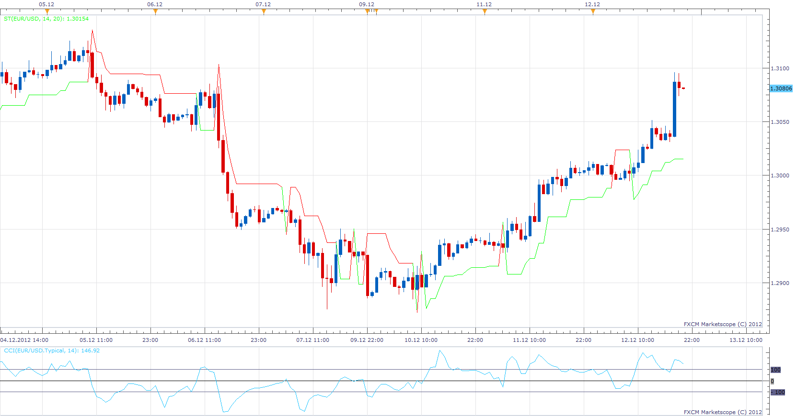

# SuperTrend

> Source: https://fxcodebase.com/code/viewtopic.php?f=17&t=27663  
> Forum: 17 · Topic 27663 · 15 post(s)

---

## SuperTrend

**Apprentice** · Wed Dec 12, 2012 2:01 pm



CCI will trigger SuperTrend switch.
The user can specifies the distance from High / Low (in pips) after switch.
SuperTrend moves only in the direction of the trend.
If Price Filter is On.
And the price goes in the other direction, the Super Trend will hold its position.
Shift Values proposed by the author,
based on Chart Time Frame length in minutes.

 case 1: Shift = 3;
 case 5: Shift = 5;
 case 15: Shift = 7;
 case 30: Shift = 9;
 case 60: Shift = 20;
 case 240: Shift = 35;
 case 1440: Shift = 40;
 case 10080: Shift = 100;
 case 43200: Shift = 120;

 [ST.lua](files/48377/ST.lua)

---

## Re: SuperTrend

**dtb71fx** · Wed Dec 12, 2012 6:19 pm

I'm a little confused since there's so many "SuperTrend" indicators on this site... how is this one different from this SuperTrend:
[http://fxcodebase.com/code/viewtopic.php?f=17&t=3102&hilit=supertrend](https://fxcodebase.com/code/viewtopic.php?f=17&t=3102&hilit=supertrend)

Is it fundamentally that this new one is based on CCI while the older was based on ATR? Or is there other crucial differences?

---

## Re: SuperTrend

**Apprentice** · Thu Dec 13, 2012 3:55 am

This is an unfortunate coincidence.
Unfortunately I did not gave their names.
One thing is certain, their algorithms are completely different.
It his case, CCI is the trigger.
Line is higher / lower from High / Low, for X Pips set by user.

Your (the second) example.
The trend is determined, by Midian + / - ATR

---

## Re: SuperTrend

**elliotwave5** · Thu Dec 13, 2012 10:03 pm

is the st.lua file posted above in the response the same code as the following mt4 code that i seek a conversion for?

```
#property indicator_chart_window
#property indicator_buffers 2
#property indicator_color1 MediumSpringGreen
#property indicator_color2 Red

double TrendUp[];
double TrendDown[];
double NonTrend[];

int st = 0;

int UpDownShift;

extern int TrendCCI_Period = 14;
extern bool Automatic_Timeframe_setting;
extern int M1_CCI_Period = 14;
extern int M5_CCI_Period = 14;
extern int M15_CCI_Period = 14;
extern int M30_CCI_Period = 14;
extern int H1_CCI_Period = 14;
extern int H4_CCI_Period = 14;
extern int D1_CCI_Period = 14;
extern int W1_CCI_Period = 14;
extern int MN_CCI_Period = 14;

//+------------------------------------------------------------------+
//| Custom indicator initialization function                         |
//+------------------------------------------------------------------+
int init()
  {
//---- indicators

   SetIndexStyle(0, DRAW_LINE, 0, 2);
   SetIndexBuffer(0, TrendUp);
   SetIndexStyle(1, DRAW_LINE, 0, 2);
   SetIndexBuffer(1, TrendDown);
     
   switch(Period()) {
      case 1:     UpDownShift = 3; break;
      case 5:     UpDownShift = 5; break;
      case 15:    UpDownShift = 7; break;
      case 30:    UpDownShift = 9; break;
      case 60:    UpDownShift = 20; break;
      case 240:   UpDownShift = 35; break;
      case 1440:  UpDownShift = 40; break;
      case 10080: UpDownShift = 100; break;
      case 43200: UpDownShift = 120; break;
   }
//----
   return(0);
  }
//+------------------------------------------------------------------+
//| Custor indicator deinitialization function                       |
//+------------------------------------------------------------------+
int deinit()
  {
//----
   
//----
   return(0);
  }
//+------------------------------------------------------------------+
//| Custom indicator iteration function                              |
//+------------------------------------------------------------------+
int start()
  {
   int limit, i, cciPeriod;
   double cciTrendNow14, cciTrendPrevious14, cciTrendNow, cciTrendPrevious;

   int counted_bars = IndicatorCounted();
//---- check for possible errors
   if(counted_bars < 0) return(-1);
//---- last counted bar will be recounted
   if(counted_bars > 0) counted_bars--;

   limit=Bars-counted_bars;
   
   if (Automatic_Timeframe_setting == true) {
      switch(Period()) {
         case 1:     cciPeriod = M1_CCI_Period; break;
         case 5:     cciPeriod = M5_CCI_Period; break;
         case 15:    cciPeriod = M15_CCI_Period; break;
         case 30:    cciPeriod = M30_CCI_Period; break;
         case 60:    cciPeriod = H1_CCI_Period; break;
         case 240:   cciPeriod = H4_CCI_Period; break;
         case 1440:  cciPeriod = D1_CCI_Period; break;
         case 10080: cciPeriod = W1_CCI_Period; break;
         case 43200: cciPeriod = MN_CCI_Period; break;
      }
   }
   else {   
      cciPeriod = TrendCCI_Period;
   }
   /*switch(cciPeriod) {
      case 14:  break;
   }*/
   //cciPeriod = TrendCCI_Period;
   SetIndexLabel(0, ("TrendUp " + cciPeriod));
   SetIndexLabel(1, ("TrendDown " + cciPeriod));
   for(i = limit; i >= 0; i--) {
   
      cciTrendNow = iCCI(NULL, 0, cciPeriod, PRICE_TYPICAL, i) + 70;
      cciTrendPrevious = iCCI(NULL, 0, cciPeriod, PRICE_TYPICAL, i+1) + 70;
      //cciTrendNow50 = iCCI(NULL, 0, 50, PRICE_TYPICAL, i) + 70;
      //cciTrendPrevious50 = iCCI(NULL, 0, 50, PRICE_TYPICAL, i+1) + 70;
     
      if (cciTrendNow > st && cciTrendPrevious < st) {
         TrendUp[i+1] = TrendDown[i+1];
         //TrendDown[i] = EMPTY_VALUE;
      }
     
      if (cciTrendNow < st && cciTrendPrevious > st) {
         TrendDown[i+1] = TrendUp[i+1];
         //TrendUp[i] = EMPTY_VALUE;
      }
     
      if (cciTrendNow > 0) {
         TrendUp[i] = Low[i] - Point*UpDownShift;
         TrendDown[i] = EMPTY_VALUE;
         if (Close[i] < Open[i] && TrendDown[i+1] != TrendUp[i+1]) {
            TrendUp[i] = TrendUp[i+1];
         }       
         if (TrendUp[i] < TrendUp[i+1] && TrendDown[i+1] != TrendUp[i+1]) {
            TrendUp[i] = TrendUp[i+1];
         }
         if (High[i] < High[i+1] && TrendDown[i+1] != TrendUp[i+1]) {
            TrendUp[i] = TrendUp[i+1];
         }
      }
      else if (cciTrendNow < 0) {
         TrendDown[i] = High[i] + Point*UpDownShift;
         TrendUp[i] = EMPTY_VALUE;
         if (Close[i] > Open[i] && TrendDown[i+1] != TrendUp[i+1]) {
            TrendDown[i] = TrendDown[i+1];
         }
         if (TrendDown[i] > TrendDown[i+1] && TrendDown[i+1] != TrendUp[i+1]) {
            TrendDown[i] = TrendDown[i+1];
         }
         if (Low[i] > Low[i+1] && TrendUp[i+1] != TrendDown[i+1]) {
            TrendDown[i] = TrendDown[i+1];
         }
      }
   }
         
//----
   
//----
   return(0);
  }
//+------------------------------------------------------------------+
```

---

## Re: SuperTrend

**elliotwave5** · Sun Dec 16, 2012 6:36 am

Would it be possible to create an alert for the ST indicator - ie audio, visual, email alert when colour changes?

---

## Re: SuperTrend

**Apprentice** · Mon Dec 17, 2012 3:40 am

Your request is added to the development list.

---

## Re: SuperTrend

**elliotwave5** · Mon Dec 17, 2012 8:22 am

thank you

---

## Re: SuperTrend

**Apprentice** · Tue Dec 18, 2012 3:57 pm

required can be found here.
[viewtopic.php?f=31&t=27809](https://fxcodebase.com/code/viewtopic.php?f=31&t=27809)

---

## Re: SuperTrend

**Apprentice** · Fri Sep 16, 2016 5:25 am

Minor Update.

---

## Re: SuperTrend

**Apprentice** · Mon Aug 28, 2017 3:42 am

The indicator was revised and updated.

---

## Re: SuperTrend

**Apprentice** · Mon Sep 24, 2018 10:28 am

The indicator was revised and updated.

---

## Re: SuperTrend

**conjure** · Mon Oct 29, 2018 11:03 am

Can you make the ST.lua working on FXCM metatrader4 platform?

---

## Re: SuperTrend

**Apprentice** · Tue Oct 30, 2018 4:21 pm

Your request is added to the development list under Id Number 4289

---

## Re: SuperTrend

**Apprentice** · Wed Oct 31, 2018 5:19 am

Already converted
 [viewtopic.php?f=38&t=63520&p=106451](https://fxcodebase.com/code/viewtopic.php?f=38&t=63520&p=106451)

---

## Re: SuperTrend

**Apprentice** · Fri Nov 02, 2018 12:07 pm

A similar indicator.
[viewtopic.php?f=38&t=66882](https://fxcodebase.com/code/viewtopic.php?f=38&t=66882)
