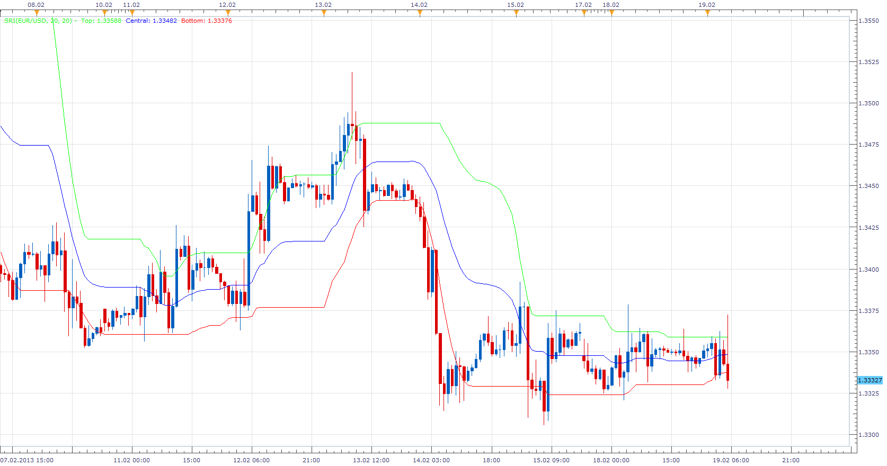

# Support-Resistance Indicator

> Source: https://fxcodebase.com/code/viewtopic.php?f=17&t=32209  
> Forum: 17 · Topic 32209 · 2 post(s)

---

## Support-Resistance Indicator

**Apprentice** · Tue Feb 19, 2013 7:13 am

 [SRI.lua](files/54905/SRI.lua)

Please Install Gaussian smoothing. You can find it here.
[viewtopic.php?f=17&t=32208](https://fxcodebase.com/code/viewtopic.php?f=17&t=32208)

The indicator was revised and updated

---

## Re: Support-Resistance Indicator

**Apprentice** · Wed May 03, 2017 2:03 pm

Indicator was revised and updated.
