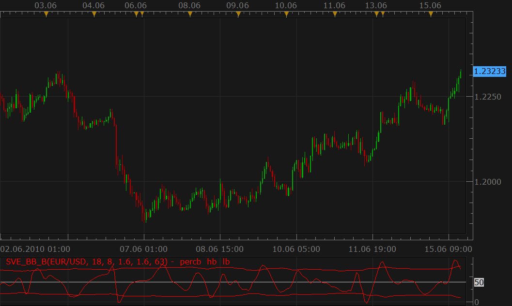

# SVE_BB% indicator from May 2010 issue of S&C

> Source: https://fxcodebase.com/code/viewtopic.php?f=17&t=1342  
> Forum: 17 · Topic 1342 · 12 post(s)

---

## SVE_BB% indicator from May 2010 issue of S&C

**Nikolay.Gekht** · Tue Jun 15, 2010 10:27 am

The indicator shows smoothed the bollinger %b value. This indicator is published in the May 2010 issue of the "Stock and commodities". The SVE_BB% indicator is a variant of the Bollinger %b indicator with greatly diminished choppiness and, according to the article, will provide improved identification of price entry/exit points within Bollinger bands.

The Metastock version of the indicator is below:

```
period:=Input("%b period: ",1,100,period);
TeAv:=Input("Tema average: ",1,30,8);
afwh:= Input("Standard deviation high ",.1,5,1.6);
afwl:= Input("Standard deviation Low ",.1,5,1.6);
afwper:= Input("Standard deviation period ",1,200,63);

haOpen:=(Ref((O+H+L+C)/4,-1) + PREV)/2;
haC:=((O+H+L+C)/4+haOpen+Max(H,haOpen)+Min(L,haOpen))/4;
TMA1:= Tema(haC,TeAv);
TMA2:= Tema(TMA1,TeAv);
Diff:= TMA1 - TMA2;
ZlHA:= TMA1 + Diff;
percb:=(Tema(ZLHA,TeAv)+2*Stdev(Tema(ZLHA,TeAv),period)-Mov(Tema(ZLHA,TeAv),period,WEIGHTED))
       /(4*Stdev(Tema(ZLHA,TeAv),period))*100;
percb;
50+afwh*Stdev(percb,afwper);
50-afwl*Stdev(percb,afwper);
50
```

 



Download:

 [SVE_BB_B.lua](files/2568/SVE_BB_B.lua)

The indicator uses TEMA1 indicator, so, please download and install TEMA1 indicator too:
[viewtopic.php?f=17&t=1052&p=2357#p2357](https://fxcodebase.com/code/viewtopic.php?f=17&t=1052&p=2357#p2357)

```lua
-- Indicator profile initialization routine
-- Defines indicator profile properties and indicator parameters
function Init()
    indicator:name("'Smoothing The Bollinger %b' by Sylvain Vervoort");
    indicator:description("The indicator is described in the May 2010 issue of Stocks & Commodities");
    indicator:requiredSource(core.Bar);
    indicator:type(core.Oscillator);

    indicator.parameters:addInteger("period", "%b period", "No description", 18, 1, 100);
    indicator.parameters:addInteger("TeAv", "TEMA Average", "No description", 8, 1, 100);
    indicator.parameters:addDouble("afwh", "Standard deviation high", "No description", 1.6, 0.1, 5);
    indicator.parameters:addDouble("afwl", "Standard deviation Low", "No description", 1.6, 0.1, 5);
    indicator.parameters:addInteger("afwper", "Standard deviation period", "No description", 63, 1, 200);
    indicator.parameters:addColor("percb_color", "Color of percb", "Color of percb", core.rgb(255, 0, 0));
    indicator.parameters:addColor("hb_color", "Color of hb", "Color of hb", core.rgb(255, 0, 0));
    indicator.parameters:addColor("lb_color", "Color of lb", "Color of lb", core.rgb(255, 0, 0));
end

-- Indicator instance initialization routine
-- Processes indicator parameters and creates output streams
-- Parameters block
local period;
local TeAv;
local afwh;
local afwl;
local afwper;

local source = nil;

-- Streams block
local percb = nil;
local percb_first;
local hb = nil;
local lb = nil;
local b_first;
local haO;
local haC;
local haC_first;
local TMA1, TMA2, ZHLA;
local ZHLA_first;
local TMA_ZHLA;
local LWMA_TMA_ZHLA;

-- Routine
function Prepare()
    period = instance.parameters.period;
    TeAv = instance.parameters.TeAv;
    afwh = instance.parameters.afwh;
    afwl = instance.parameters.afwl;
    afwper = instance.parameters.afwper;
    source = instance.source;

    haC_first = source:first() + 1;
    haO = instance:addInternalStream(haC_first, 0);
    haC = instance:addInternalStream(haC_first, 0);
    TMA1 = core.indicators:create("TEMA1", haC, TeAv);
    TMA2 = core.indicators:create("TEMA1", TMA1.DATA, TeAv);
    ZHLA_first = TMA2.DATA:first() + TeAv * 3;
    ZHLA = instance:addInternalStream(ZHLA_first, 0);
    TMA_ZHLA = core.indicators:create("TEMA1", ZHLA, TeAv);
    LWMA_TMA_ZHLA = core.indicators:create("TEMA1", TMA_ZHLA.DATA, period);
    percb_first = math.max(LWMA_TMA_ZHLA.DATA:first(), TMA_ZHLA.DATA:first() + period * 2);
    b_first = percb_first + afwper;
    pip = source:pipSize();

    local name = profile:id() .. "(" .. source:name() .. ", " .. period .. ", " .. TeAv .. ", " .. afwh .. ", " .. afwl .. ", " .. afwper .. ")";
    instance:name(name);
    percb = instance:addStream("percb", core.Line, name .. ".percb", "percb", instance.parameters.percb_color, percb_first);
    percb:addLevel(50);
    hb = instance:addStream("hb", core.Line, name .. ".hb", "hb", instance.parameters.hb_color, b_first);
    lb = instance:addStream("lb", core.Line, name .. ".lb", "lb", instance.parameters.lb_color, b_first);
end

-- Indicator calculation routine
function Update(p, mode)
    if p >= haC_first then
        local open, close;
        -- haOpen:=(Ref((O+H+L+C)/4,-1) + PREV)/2;
        open = (source.open[p - 1] + source.high[p - 1] +
                source.low[p - 1] + source.close[p - 1]) / 4;
        if p > haC_first then
            open = (open + haO[p - 1]) / 2;
        end
        haO[p] = open;
        -- haC:=((O+H+L+C)/4+haOpen+Max(H,haOpen)+Min(L,haOpen))/4;
        close = ((source.open[p] + source.high[p] +
                  source.low[p] + source.close[p]) / 4 +
                 open +
                 math.max(source.high[p], open) +
                 math.min(source.low[p], open)) / 4;
        haC[p] = close;
    end
    -- TMA1:= Tema(haC,TeAv);
    -- TMA2:= Tema(TMA1,TeAv);
    TMA1:update(mode);
    TMA2:update(mode);
    -- Diff:= TMA1 - TMA2;
    -- ZlHA:= TMA1 + Diff;
    -- equal to ZlHA:= TMA1 + TMA1 - TMA2;
    -- equal to ZlHA:= 2 * TMA1 - TMA2;
    if p >= ZHLA_first then
        ZHLA[p] = 2 * TMA1.DATA[p] - TMA2.DATA[p];
    end
    -- update Tema(ZLHA,TeAv) and Mov(Tema(ZLHA,TeAv),period,WEIGHTED)
    TMA_ZHLA:update(mode);
    LWMA_TMA_ZHLA:update(mode);
    -- percb:=(Tema(ZLHA,TeAv)+2*Stdev(Tema(ZLHA,TeAv),period)-Mov(Tema(ZLHA,TeAv),period,WEIGHTED)) /(4*Stdev(Tema(ZLHA,TeAv),period))*100;
    -- get stdev(Stdev(Tema(ZLHA,TeAv),period)
    if p >= percb_first then
        local stdev = core.stdev(TMA_ZHLA.DATA, core.rangeTo(p, period));
        percb[p] = (TMA_ZHLA.DATA[p] + 2 * stdev - LWMA_TMA_ZHLA.DATA[p]) / (4 * stdev) * 100;
    end

    --50+afwh*Stdev(percb,afwper);
    --50-afwl*Stdev(percb,afwper);
    if p >= b_first then
        local stdev = core.stdev(percb, core.rangeTo(p, afwper));
        hb[p] = 50 + afwh * stdev;
        lb[p] = 50 - afwl * stdev;
    end
end
```

MT5 version
[https://fxcodebase.com/code/viewtopic.p ... 69#p157869](https://fxcodebase.com/code/viewtopic.php?f=38&t=75514&p=157869#p157869)

---

## Re: SVE_BB% indicator from May 2010 issue of S&C

**smartfx** · Thu Jun 24, 2010 1:25 pm

Thank you Nikolay! It's really very useful indicator! And as you know, there are also other indicators, developed by Sylvian Vervoort - their formulas are on [http://stocata.org/metastock/formulas.html](http://stocata.org/metastock/formulas.html) . It would be great if those indicators could be available for Marketscope. I'm sure this will benefit everyone who decides to use one or more of those tools of analysis. THANK YOU IN ADVANCE!!!

---

## Re: SVE_BB% indicator from May 2010 issue of S&C

**Nikolay.Gekht** · Fri Jun 25, 2010 11:36 am

Thank you for the link. I've added these indicators to the queue.

---

## Re: SVE_BB% indicator from May 2010 issue of S&C

**Apprentice** · Wed Jun 30, 2010 6:04 am

Two versions of Trailing Stop indikator you can find here.
[http://fxcodebase.com/code/viewtopic.php?f=17&t=1434&start=0](https://fxcodebase.com/code/viewtopic.php?f=17&t=1434&start=0)

---

## Re: SVE_BB% indicator from May 2010 issue of S&C

**smartfx** · Thu Jul 01, 2010 1:24 pm

Thank you! It's highly appreciated!

---

## Re: SVE_BB% indicator from May 2010 issue of S&C

**Apprentice** · Mon Feb 05, 2018 7:51 am

The Indicator was revised and updated.

---

## Re: SVE_BB% indicator from May 2010 issue of S&C

**Jailsonms** · Wed Oct 05, 2022 10:26 pm

> **Apprentice wrote:**
> The Indicator was revised and updated.

Does the SVE BB indicator have it in the MT5 version?

---

## Re: SVE_BB% indicator from May 2010 issue of S&C

**Apprentice** · Thu Oct 06, 2022 2:19 pm

We have added your request to the development list.
Development reference 619.

---

## Re: SVE_BB% indicator from May 2010 issue of S&C

**Jailsonms** · Sun Jan 01, 2023 8:23 am

Happy New Year my friend may your dreams come true.

---

## Re: SVE_BB% indicator from May 2010 issue of S&C

**Jailsonms** · Sun Feb 26, 2023 8:25 pm

> **Apprentice wrote:**
> We have added your request to the development list.
> Development reference 619.

Hello Apprentice, could you create this indicator for MT5, add arrows when the average returns inside leaving the overbought and oversold zone and when there is divergence in the price with the average?

---

## Re: SVE_BB% indicator from May 2010 issue of S&C

**Apprentice** · Tue Feb 28, 2023 3:56 am

We have added your request to the development list.
Development reference 180.

---

## Re: SVE_BB% indicator from May 2010 issue of S&C

**Apprentice** · Thu Jan 16, 2025 7:11 am

MT5 version.
[https://fxcodebase.com/code/viewtopic.php?f=38&t=75514](https://fxcodebase.com/code/viewtopic.php?f=38&t=75514)
