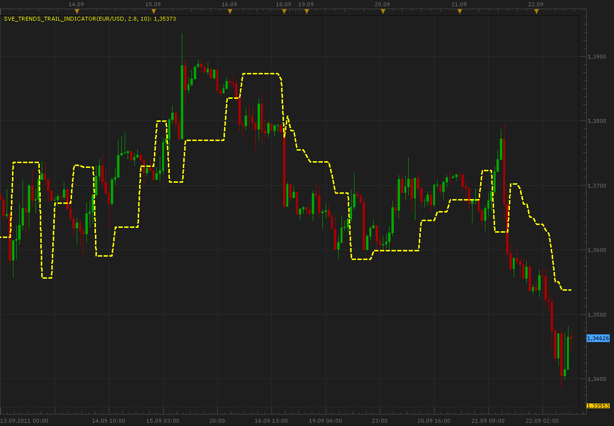

# SVE_Trends_trail indicator

> Source: https://fxcodebase.com/code/viewtopic.php?f=17&t=6717  
> Forum: 17 · Topic 6717 · 2 post(s)

---

## SVE_Trends_trail indicator

**Alexander.Gettinger** · Thu Sep 22, 2011 10:30 am

This indicator is a ported MetaStock indicator from [http://stocata.org/metastock/stop_trail_trends.html](http://stocata.org/metastock/stop_trail_trends.html)

 

Download:

 [SVE_Trends_Trail_Indicator.lua](files/15291/SVE_Trends_Trail_Indicator.lua)

The indicator was revised and updated

---

## Re: SVE_Trends_trail indicator

**Apprentice** · Thu Mar 16, 2017 2:08 pm

Indicator was revised and updated.
