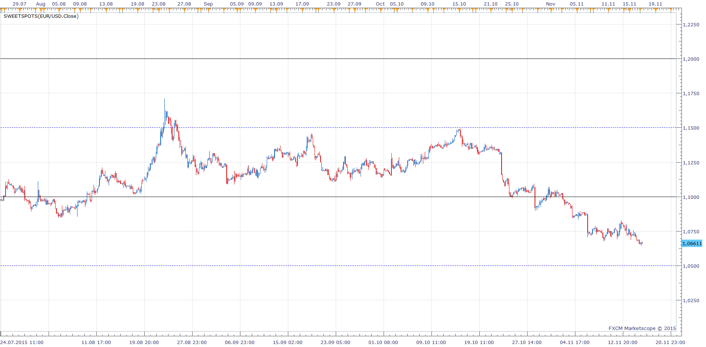
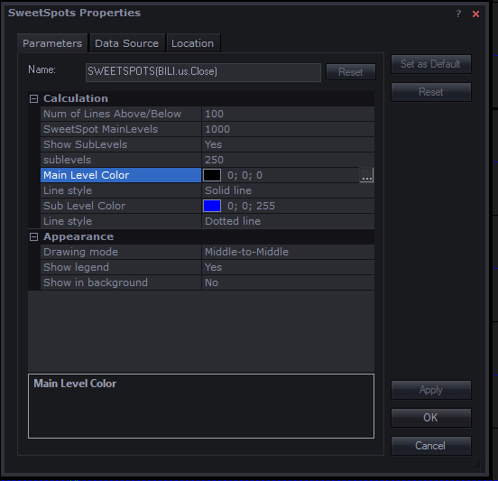

# SweetSpots

> Source: https://fxcodebase.com/code/viewtopic.php?f=17&t=62894  
> Forum: 17 · Topic 62894 · 6 post(s)

---

## SweetSpots

**Apprentice** · Tue Nov 17, 2015 7:34 am

Based on request.
[viewtopic.php?f=27&t=62836#p103078](https://fxcodebase.com/code/viewtopic.php?f=27&t=62836#p103078)

 [SweetSpots.lua](files/103407/SweetSpots.lua)

---

## Re: SweetSpots

**jrichardson83** · Fri Nov 20, 2015 8:27 am

Thanks, Apprentice

---

## Re: SweetSpots

**Apprentice** · Thu Sep 27, 2018 6:03 am

The indicator was revised and updated.

---

## Re: SweetSpots

**Mountaintrader** · Wed Jan 13, 2021 10:01 pm

Hi Apprentice,

If possible please could the facility to highlight or change color/size of the sweet spot indicator price level value be incorporated, this would help distinguish SweetSpots indicator levels from other horizontal levels ?

Regards

Mountain Trader

---

## Re: SweetSpots

**Apprentice** · Thu Jan 14, 2021 3:52 am

Your request is added to the development list.
Development reference 78.

---

## Re: SweetSpots

**Apprentice** · Mon Jan 25, 2021 4:34 am

You can change the SweetSpots line's color already.
