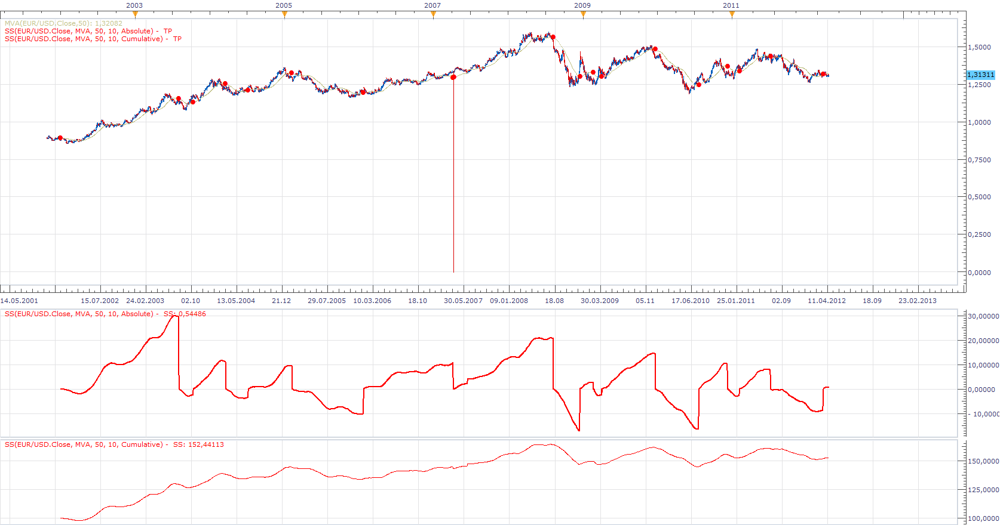

# Swing Shift

> Source: https://fxcodebase.com/code/viewtopic.php?f=17&t=16214  
> Forum: 17 · Topic 16214 · 6 post(s)

---

## Swing Shift

**Apprentice** · Tue Apr 17, 2012 2:29 pm

This indicator shows the percentage change from Swing, High / Low.
There are two modes.
Cumulative-sum of all percentage changes.
Absolute - Change from last Swong Low / High.

 [SS.lua](files/30254/SS.lua)

---

## Re: Swing Shift

**Alexander.Gettinger** · Tue Nov 18, 2014 12:23 pm

MQL4 version of Swing Shift oscillator: [viewtopic.php?f=38&t=61471](https://fxcodebase.com/code/viewtopic.php?f=38&t=61471).

---

## Re: Swing Shift

**Apprentice** · Wed Jun 28, 2017 5:28 am

The indicator was revised and updated.

---

## Re: Swing Shift

**Cactus** · Wed Feb 28, 2018 7:36 pm

Hello
Can you make this indicator compatible for tick charts? You can apply it to tick charts, but...
I see it repaints if you refresh the indicator (F5 or double click label and click ok)
And throws an error ocassionally causing it to crash (error on line 102 if absolute calculation or line 104 if cumulative)

---

## Re: Swing Shift

**Apprentice** · Thu Mar 01, 2018 11:43 am

Fixed.
Additional checks should prevent error messages.

---

## Re: Swing Shift

**Cactus** · Thu Mar 01, 2018 7:45 pm

Thanks but I am still getting

Code: [Select all](https://fxcodebase.com/code/)
`Symbol   Strategy/Indicator   Message   Time
USD/JPY   SS(USD/JPY.Close, MVA, 100, 0.01, Absolute)   An error occurred during the calculation of the indicator 'SS(USD/JPY.Close, MVA, 100, 0.01, Absolute)'. The error details: C:/Program Files (x86)/Candleworks/FXTS2/Indicators/Custom/SS.lua:128:  Specified index is out of range.   02/03/2018 03:45:06`

**@Edit:** I think that might have been because I was still using the old version of the indicator... I see the new one has these lines in it:

Code: [Select all](https://fxcodebase.com/code/)
`or not MA.DATA:hasData(period)
   or not MA.DATA:hasData(Anchor)`
