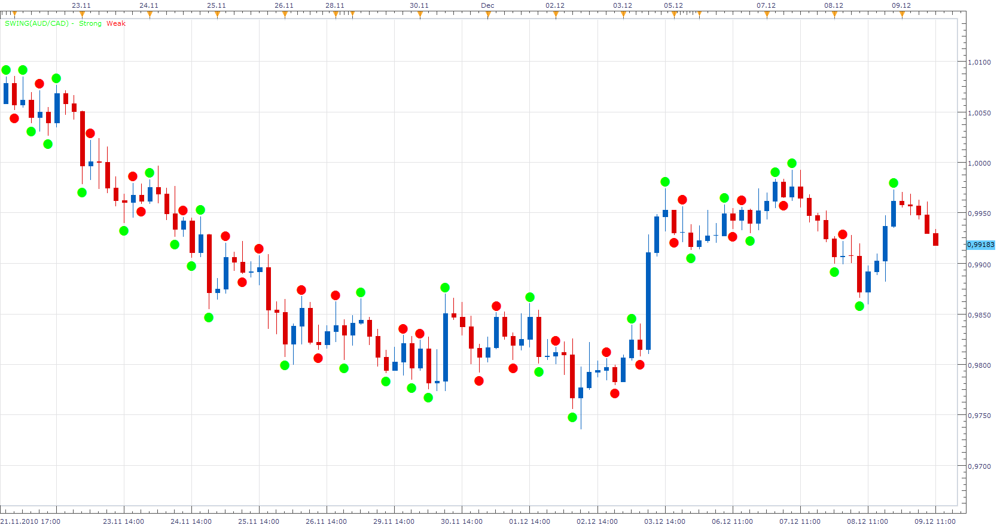

# Swing

> Source: https://fxcodebase.com/code/viewtopic.php?f=17&t=2920  
> Forum: 17 · Topic 2920 · 6 post(s)

---

## Swing

**Apprentice** · Thu Dec 09, 2010 12:04 pm

This indicator draw circle on the top / bottom of each swing,
If you should ignore the Swing the circle is red,
If you should Respect the Swing the color is green.

During evaluation, the indicator compares the length of current Swing and the length of Swing which precedes him.

 [SWING.lua](files/6670/SWING.lua)

 [Swing Oscillator.lua](files/6670/Swing%20Oscillator.lua)

This is the algorithm that I developed.
As a basis for a complex evaluation.

The indicator was revised and updated

---

## Re: Swing

**thetruth** · Fri Dec 10, 2010 11:07 am

apprentice,
Great work!!
I do some modification, in the last version, the color can not change. in this version, can change the color.
I am thinking in a more detailed tutorial to develop, or change or modify some things in the indicators, signals or strategies.
Can you suggest that some document like a more detailed tutorial (than the help of lua) can be made? like the mlq4 tutorial.

---

## Re: Swing

**Apprentice** · Fri Dec 10, 2010 12:16 pm

Oops,
I have not noticed this error.
I intend to publish detailed instructions in the form of a blog.
But could not find the time.

---

## Re: Swing

**Apprentice** · Wed Feb 01, 2017 7:45 am

Indicator was revised and updated.

---

## Re: Swing

**Cactus** · Thu Feb 02, 2017 12:41 pm

Can you turn this into an oscillator (1 for green, -1 for red) or similar

---

## Re: Swing

**Apprentice** · Thu Feb 02, 2017 1:19 pm

Swing Oscillator.lua added
