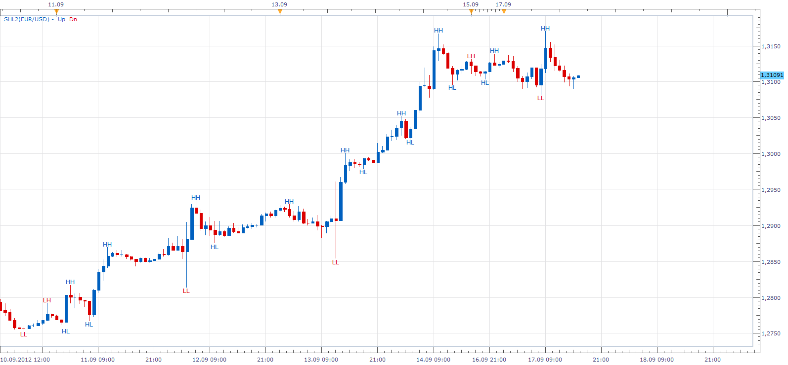

# SwingHighLow

> Source: https://fxcodebase.com/code/viewtopic.php?f=17&t=23506  
> Forum: 17 · Topic 23506 · 10 post(s)

---

## SwingHighLow

**Apprentice** · Mon Sep 17, 2012 3:01 pm

This indicator provides an indication each time we have,
Higer or Lower the peak.
Currently uses a modified Fractal Algorithm,
different algorithms can be used, if provided.

 [SwingHighLow.lua](files/40444/SwingHighLow.lua)

 [SwingHighLow With Alert.lua](files/40444/SwingHighLow%20With%20Alert.lua)

For novices, just to clarify notation.
HH - High High
HL - Higher Low
LH - Lower High
LL - Lower Low

 

 [SwingHighLow Lines.lua](files/40444/SwingHighLow%20Lines.lua)

---

## Re: SwingHighLow

**blessing** · Mon Sep 17, 2012 6:03 pm

hi,

thank for this nice indicator.
can you create swing high low based on zig zag(depth 34,deviation 5, back up3)

---

## Re: SwingHighLow

**Apprentice** · Tue Sep 18, 2012 1:48 am

Your request is added to the development list.

---

## Re: SwingHighLow

**glenville** · Wed Oct 03, 2012 12:10 pm

Hello can you add the alarm to this indicator
also that a high be two candles to the left and two candles to the right of the higher candle in the middle and a low visa versa

---

## Re: SwingHighLow

**Apprentice** · Thu Oct 04, 2012 5:42 am

Your request is added to the development list.

---

## Re: SwingHighLow

**Apprentice** · Thu Apr 13, 2017 7:51 am

Indicator was revised and updated.

---

## Re: SwingHighLow

**positif85** · Sun Aug 20, 2017 7:32 am

Hello can you add the alarm\email to this indicator, thanks.

---

## Re: SwingHighLow

**Apprentice** · Tue Dec 05, 2017 7:58 am

SwingHighLow With Alert.lua

---

## Re: SwingHighLow

**colajam1979** · Sun Feb 11, 2018 1:52 pm

Hello
Can you add the following to the indicator?

Add line to most recent signals ‘Yes/No’
If yes then
Amount of previous signals ‘1 to 10’ (this applies to each signal ie HH HL LH LL)

Line style for HH
Line style for LH
Line style for HL
Line style for LL

Line style to include
type of line = dashed, dot, solid dashed and dots
Colour of line = usual options.

The line will be top of HH and LH
The line will be at the bottom of LL and HL

Thanks

---

## Re: SwingHighLow

**Apprentice** · Mon Feb 12, 2018 6:06 am

SwingHighLow Lines.lua added.
