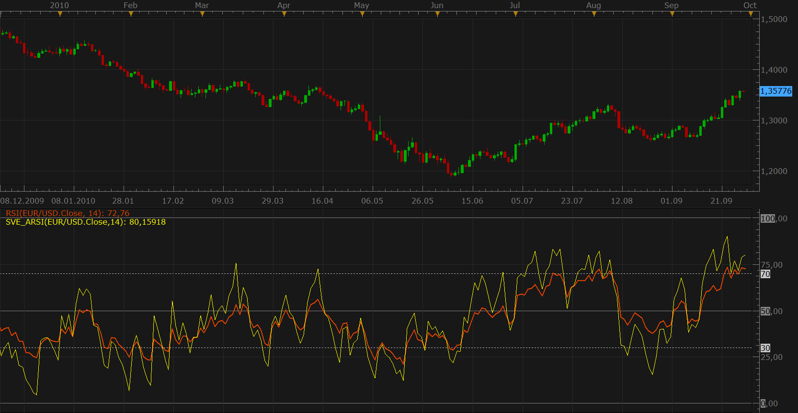

# Sylvain Vervoort's Asymertical RSI (S&C Oct 2008)

> Source: https://fxcodebase.com/code/viewtopic.php?f=17&t=2298  
> Forum: 17 · Topic 2298 · 3 post(s)

---

## Sylvain Vervoort's Asymertical RSI (S&C Oct 2008)

**Nikolay.Gekht** · Tue Sep 28, 2010 5:15 pm

Sylvain Vervoort's Asymertical RSI indicator is described in October 2008 issue of Stocks & Commodities.

The formula of this implementation is taken from VT Trader implementation described here:
[http://forum.vtsystems.com/index.php?showtopic=9941](http://forum.vtsystems.com/index.php?showtopic=9941)

Compare ARSI and RSI indicators on the snapshot below:

 

Download the indicator:

 [SVE_ARSI.lua](files/4876/SVE_ARSI.lua)

The indicator requires Wilders moving average indicore, so, please, download it using the link below and then install before using SVE_ARSI indicator. [Wilders Moving Average](https://fxcodebase.com/code/viewtopic.php?f=17&t=248)

---

## Re: Sylvain Vervoort's Asymertical RSI (S&C Oct 2008)

**smartfx** · Sun Oct 10, 2010 4:02 am

Thank you so much for adding this indicator!Recommended for everyone, who needs better results!

---

## Re: Sylvain Vervoort's Asymertical RSI (S&C Oct 2008)

**Apprentice** · Mon Feb 05, 2018 8:17 am

The Indicator was revised and updated.
