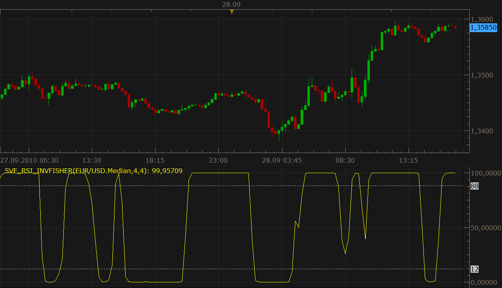

# Sylvain Vervoort's Smoothed RSI Inverse Fisher Transform

> Source: https://fxcodebase.com/code/viewtopic.php?f=17&t=2297  
> Forum: 17 · Topic 2297 · 19 post(s)

---

## Sylvain Vervoort's Smoothed RSI Inverse Fisher Transform

**Nikolay.Gekht** · Tue Sep 28, 2010 3:57 pm

Sylvain Vervoort's Smoothed RSI Inverse Fisher Transform indicator is described in October 2010 issue of Stocks & Commodities.

The formula of the indicator is:

InverseFisherTransform(ZeroLagEMA(RSI(SVE_RainbowAverage(price)))).

The usage of the indicator recommended in the article is the following

The indicator shows an opportunity to:
- buy when indicator breaks the 12 level up
- sell when indicator breaks the 88 level down

These opportunities then must be studied using Slow Stochastic or [SVE_ARSI](https://fxcodebase.com/code/viewtopic.php?f=17&t=2298) indicators.

 

Download the indicator:

 [SVE_RSI_InvFisher.lua](files/4873/SVE_RSI_InvFisher.lua)

The indicator uses another Sylvain Vervoort's indicator: Rainbow Average, so, please download and install Rainbow Average indicator too. Please find this indicator below:

Download Sylvain Vervoort's Rainbow Average indicator for Marketscope:

 [SVE_RainbowAverage.lua](files/4873/SVE_RainbowAverage.lua)

The formula of this indicator is:

Code: [Select all](https://fxcodebase.com/code/)
`SVE_RainbowAverage = ( 5 * WAverage( Close, 2 )
 + 4 * WAverage( WAverage( Close, 2 ), 2 )
 + 3 * WAverage( WAverage( WAverage( Close, 2 ), 2 ), 2 )
 + 2 * WAverage( WAverage( WAverage( WAverage( Close, 2 ), 2 ) , 2 ), 2 )
 + WAverage( WAverage( WAverage( WAverage( WAverage( Close, 2 ),  2 ), 2 ), 2 ), 2 )
 + WAverage( WAverage( WAverage( WAverage( WAverage(
    WAverage( Close, 2 ), 2 ), 2 ), 2 ), 2 ), 2 )
 + WAverage( WAverage( WAverage( WAverage( WAverage( WAverage( WAverage(
    Close, 2 ), 2 ), 2 ), 2 ), 2 ), 2 ), 2 )
 + WAverage( WAverage( WAverage( WAverage( WAverage( WAverage( WAverage(
    WAverage( Close, 2 ), 2 ), 2 ), 2 ), 2 ), 2 ), 2 ), 2 )
 + WAverage( WAverage( WAverage( WAverage( WAverage( WAverage( WAverage(
    WAverage( WAverage( Close, 2 ), 2 ), 2 ), 2 ), 2 ), 2 ), 2 ), 2 ), 2 )
 + WAverage( WAverage( WAverage( WAverage( WAverage( WAverage( WAverage(
    WAverage( WAverage( WAverage( Close, 2 ), 2 ), 2 ), 2 ), 2 ), 2 ), 2 ), 2 ), 2 ), 2 ) ) / 20 ;`

 

Avereges indicator is available here.
[viewtopic.php?f=17&t=2430&hilit=averages](https://fxcodebase.com/code/viewtopic.php?f=17&t=2430&hilit=averages)

 [SVE_RainbowAverage Averages.lua](files/4873/SVE_RainbowAverage%20Averages.lua)

 [SVE_RSI_InvFisher Averages.lua](files/4873/SVE_RSI_InvFisher%20Averages.lua)

MT4 version is available here.
[viewtopic.php?f=38&t=63454](https://fxcodebase.com/code/viewtopic.php?f=38&t=63454)

---

## Re: Sylvain Vervoort's Smoothed RSI Inverse Fisher Transform

**Blackcat2** · Wed Sep 29, 2010 1:57 am

Could you please the link where we can study the complete strategy? If possible, recommended settings for 15M chart..

Thanks..
BC

---

## Re: Sylvain Vervoort's Smoothed RSI Inverse Fisher Transform

**Nikolay.Gekht** · Wed Sep 29, 2010 9:13 am

The last issue of Stock & Commodities. There is a big article there about this method.

---

## Re: Sylvain Vervoort's Smoothed RSI Inverse Fisher Transform

**smartfx** · Sun Oct 10, 2010 4:01 am

Thank you so much for adding this indicator! It could improve our trading!

---

## Re: Sylvain Vervoort's Smoothed RSI Inverse Fisher Transform

**gigi emas** · Wed Apr 13, 2011 7:45 pm

may i know what trading platform is this indicator for?

---

## Re: Sylvain Vervoort's Smoothed RSI Inverse Fisher Transform

**Apprentice** · Thu Apr 14, 2011 3:12 am

This forum is primarily dedicated to providing programming support to users of FXTS 2, and Marketscope Charting Platform.

And unless otherwise indicated refers to this platform.
Files that end with lua File Extension.

We have the know-how for development on other platforms, this service is available through our premium service.

---

## Re: Sylvain Vervoort's Smoothed RSI Inverse Fisher Transform

**BabyBull** · Tue Oct 16, 2012 3:30 pm

Any chance of getting this indicator programmed as a strategy with selectable time frames?
Thank you

---

## Re: Sylvain Vervoort's Smoothed RSI Inverse Fisher Transform

**mykkee** · Wed Apr 27, 2016 10:34 am

Can other options for the "number of periods for EMA" be made available to use like LWMA, MVA and other averages.....thanks

---

## Re: Sylvain Vervoort's Smoothed RSI Inverse Fisher Transform

**Apprentice** · Sun May 01, 2016 6:40 am

SVE_RainbowAverage Averages.lua & SVE_RSI_InvFisher Averages.lua Added.

---

## Re: Sylvain Vervoort's Smoothed RSI Inverse Fisher Transform

**Apprentice** · Sun May 01, 2016 6:55 am

Strategy is available here.
[viewtopic.php?f=31&t=63429&p=106011#p106011](https://fxcodebase.com/code/viewtopic.php?f=31&t=63429&p=106011#p106011)

---

## Re: Sylvain Vervoort's Smoothed RSI Inverse Fisher Transform

**6-sycamor** · Sun May 08, 2016 7:56 am

Hi,

looks great

You have MT4 version ?

Regards,

S.

---

## Re: Sylvain Vervoort's Smoothed RSI Inverse Fisher Transform

**Apprentice** · Sun May 08, 2016 11:30 am

Your request is added to the development list.

---

## Re: Sylvain Vervoort's Smoothed RSI Inverse Fisher Transform

**Apprentice** · Sun May 08, 2016 12:18 pm

Try this version.
[viewtopic.php?f=38&t=63454](https://fxcodebase.com/code/viewtopic.php?f=38&t=63454)

---

## Re: Sylvain Vervoort's Smoothed RSI Inverse Fisher Transform

**Fafountrader** · Wed Sep 21, 2016 12:44 pm

hi,

is it possible to create a strategy based on this indicator : SVE_RSI_InvFisher.lua

Thanks a lot.

---

## Re: Sylvain Vervoort's Smoothed RSI Inverse Fisher Transform

**Apprentice** · Thu Sep 22, 2016 3:20 am

Can you define entry / exit rules?

---

## Re: Sylvain Vervoort's Smoothed RSI Inverse Fisher Transform

**Fafountrader** · Thu Sep 22, 2016 11:22 am

Of course, apprentice

-Open long if indicator line (number of periods for rsi=4 and number of periods for ema=4)
cross above level 12 (end of candle).

-Open short if indicator line cross below level 88 (end of candle).

-Close on opposite.

-Time frame : m15

-Allowed side : both, buy or shell (depends on the trend)

-Multiple position in one direction (yes or no)

Thank you for your attention.

---

## Re: Sylvain Vervoort's Smoothed RSI Inverse Fisher Transform

**Apprentice** · Fri Sep 23, 2016 5:31 am

Try this version.
[viewtopic.php?f=31&t=63892](https://fxcodebase.com/code/viewtopic.php?f=31&t=63892)

---

## Re: Sylvain Vervoort's Smoothed RSI Inverse Fisher Transform

**Fafountrader** · Fri Sep 23, 2016 5:54 am

Great, thank you very very much , Mister Apprentice

pleasure,

Fafountrader

---

## Re: Sylvain Vervoort's Smoothed RSI Inverse Fisher Transform

**Apprentice** · Tue Sep 18, 2018 6:45 am

The indicator was revised and updated.
