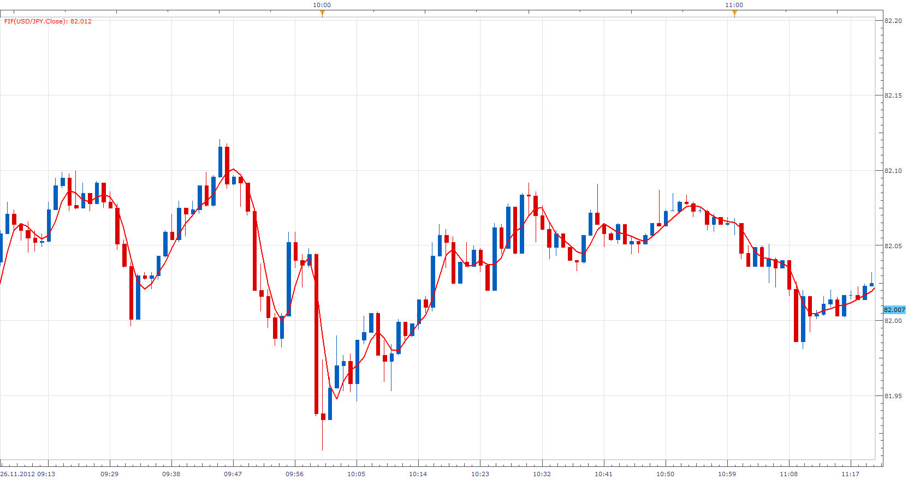

# Symmetrically weighted FIR filter

> Source: https://fxcodebase.com/code/viewtopic.php?f=17&t=26681  
> Forum: 17 · Topic 26681 · 3 post(s)

---

## Symmetrically weighted FIR filter

**Apprentice** · Mon Nov 26, 2012 5:22 am

FIR = (source[period] + 2*source[period-1] + 2*source[period-2] + source[period-3])/6

 [Fif.lua](files/46504/Fif.lua)

The indicator was revised and updated

---

## Re: Symmetrically weighted FIR filter

**Alexander.Gettinger** · Thu Sep 25, 2014 9:53 am

MQL4 version of Symmetrically weighted FIR filter: [viewtopic.php?f=38&t=61257](https://fxcodebase.com/code/viewtopic.php?f=38&t=61257).

---

## Re: Symmetrically weighted FIR filter

**Apprentice** · Mon Jun 26, 2017 4:27 am

The indicator was revised and updated.
