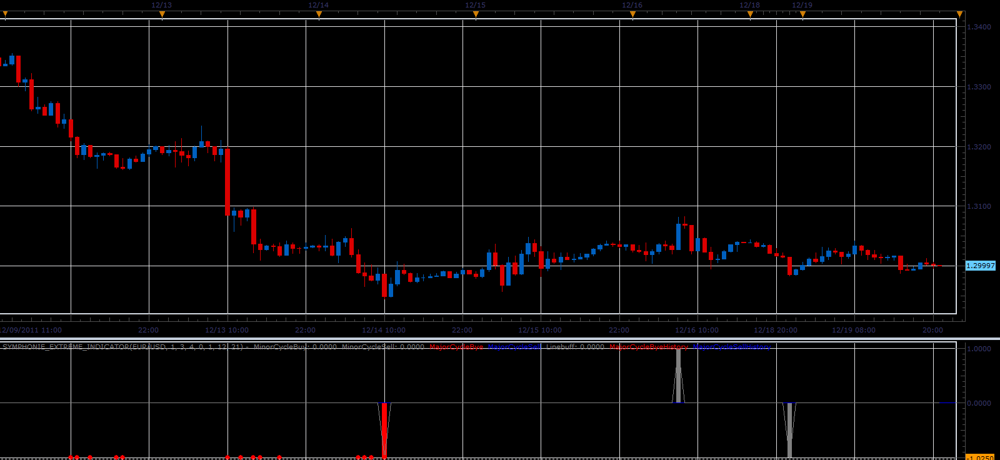

# Symphonie extreme indicator

> Source: https://fxcodebase.com/code/viewtopic.php?f=17&t=10152  
> Forum: 17 · Topic 10152 · 19 post(s)

---

## Symphonie extreme indicator

**Alexander.Gettinger** · Mon Dec 19, 2011 9:00 pm

This indicator is a ported MQL4 indicator from request [viewtopic.php?f=27&t=9597&p=20601#p20601](https://fxcodebase.com/code/viewtopic.php?f=27&t=9597&p=20601#p20601)

 

Download:

 [Symphonie_Extreme_Indicator.lua](files/21253/Symphonie_Extreme_Indicator.lua)

The indicator was revised and updated

---

## Re: Symphonie extreme indicator

**maweno** · Tue Dec 20, 2011 2:37 am

Hi!

This is a good indicator, but I have found yet another variant.
Goldminer + Symphonie-Sentiment indicators.
Am not a programmer, it can unfortunately not translate into lua.
Perhaps that is interesting.
Mql-Code and websites in the appendix...

Thanks...

[http://www.tradingsystemforex.com/showt ... 700&p=4526](http://www.tradingsystemforex.com/showthread.php?t=700&p=4526)
[http://www.forexstrategiesresources.com ... er-system/](http://www.forexstrategiesresources.com/metatrader-trading-system-ii/215-symphonie-trader-system/)

---

## Re: Symphonie extreme indicator

**Alexander.Gettinger** · Tue Dec 20, 2011 6:45 am

OK.
I will work with it.

---

## Re: Symphonie extreme indicator

**Moneyless** · Wed Dec 21, 2011 8:51 am

This is a great indicator, but I get a lot of times this error message:

GER30	SYMPHONIE_EXTREME_INDICATOR	An error occurred during the calculation of the indicator 'SYMPHONIE_EXTREME_INDICATOR'. The error details: [string "Symphonie_Extreme_Indicator.lua"]:160: Index is out of range.	21.12.2011 14:44:18

it happens always when I scroll a bit the chart to see how it worked in the history. than I need to restart the indicator. can you fix it? Would be very nice! Thanks and happy christmas.

---

## Re: Symphonie extreme indicator

**Alexander.Gettinger** · Thu Dec 22, 2011 10:34 am

Error is fixed.
Please, download indicator again.

---

## Re: Symphonie extreme indicator

**Moneyless** · Thu Dec 22, 2011 12:09 pm

Wow, this was quick! Thanks a lot, great job!

Greetings from Austria.

---

## Re: Symphonie extreme indicator

**cruiser** · Thu Dec 22, 2011 1:35 pm

Great indicator.Please can we have a signal/strategy for this indicator such that we get an alert when a minor cycle/major cycle is detected.

---

## Re: Symphonie extreme indicator

**sinbad** · Thu Dec 22, 2011 7:13 pm

Thank you very much !

---

## Re: Symphonie extreme indicator

**Moneyless** · Fri Dec 23, 2011 3:11 am

I would welcome as well a signal / strategy for this indicator. Would it be possible to even dectect stronger signals by combining different timeframes for this indicator? E.g. a 5M majorCycleSell is even bigger if it takes place, after a major cycle Sell is also active in 15M, 30M, 1H, 4H, 1D, 1W. What is your experience to work with the signal? It seems to me that very tight stops work best on 5M, but even better it seems to close the position immideatly if the signal disappears, in order to prevent losses and wait for another signal to appear. But this could be only effectively done with a strategy, wher dynamic stopp loss could be set. Would be great fun to experiment with it! Thanks!

---

## Re: Symphonie extreme indicator

**Apprentice** · Mon Dec 26, 2011 4:52 am

Your request is added to the developmental cue.

---

## Re: Symphonie extreme indicator

**nsaale** · Fri Apr 20, 2012 11:44 am

Please help out; exactly how does this indicator work; the dots and recolouring, appearance and disappearance; it is confusing me, please shed some light on this,

thank you..

---

## Re: Symphonie extreme indicator

**spinemaligna** · Mon Apr 23, 2012 8:20 am

If you have the patience, this is the link to the theory and practice. As you will discover it has evolved over a period of time, but page one explains the theory and how to trade.

[http://www.forexfactory.com/showthread. ... +trendline](http://www.forexfactory.com/showthread.php?t=315572&highlight=cci+trendline)

Version 3.01 is the one that has been ported from MT4 to Marketscope. It gives good entry signals, the difficulty is getting the exit sorted out.

Worth following up in my modest opinion.

Ross

---

## Re: Symphonie extreme indicator

**mfoste1** · Fri May 11, 2012 1:39 pm

The version posted here on from the MQL port seems to be repainting. Is there any way that someone could get this to paint on the close of a candle rather than the tick? It seems to be giving false signals due to the repainting. I'm using this on an 8h chart for reference.

Thanks,
Mfoste1

---

## Re: Symphonie extreme indicator

**Alexander.Gettinger** · Tue May 15, 2012 4:41 pm

The indicator can be redrawn as well as it's MT4 original.

---

## Re: Symphonie extreme indicator

**Jasmin** · Fri Sep 28, 2012 10:24 am

good indicataor but it is not usefull can you guys made that he can not repaint it will be beter if indicator stay where he apperes

---

## Re: Symphonie extreme indicator

**mulligan** · Wed Nov 28, 2012 2:20 pm

Just wanted to add my voice to the requests for a signal or strategy for this indicator. One that would allow a filter for major cycle buy or sell would be fantastic. I don't mind the repainting, but a static or dynamic option would solve the problem for those that object to repainting. Your work on our behalf is greatly appreciated.

---

## Re: Symphonie extreme indicator

**Apprentice** · Mon Apr 17, 2017 6:55 am

Indicator was revised and updated.

---

## Re: Symphonie extreme indicator

**trdheat** · Mon Apr 24, 2017 3:43 pm

Apprentice,

I have a question about repainting of indicator. How many candles repaint as function of parameters? Specialy with all parameters to 1 for example.

---

## Re: Symphonie extreme indicator

**Apprentice** · Tue Apr 25, 2017 3:41 am

For all available data/candles.
