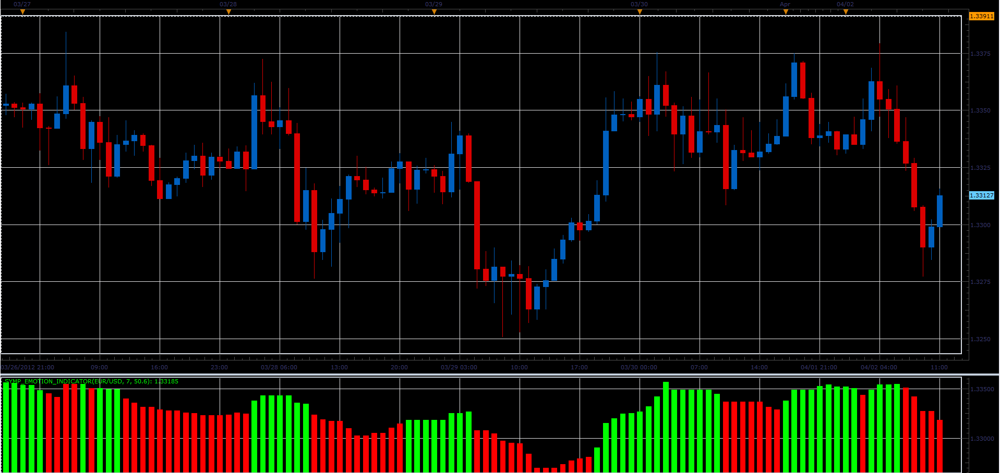
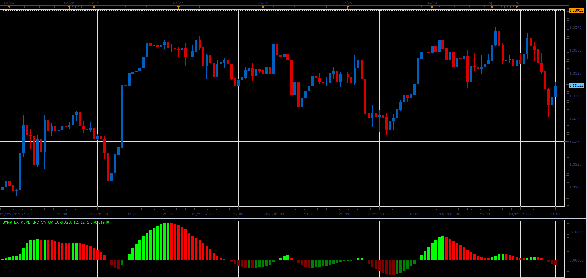
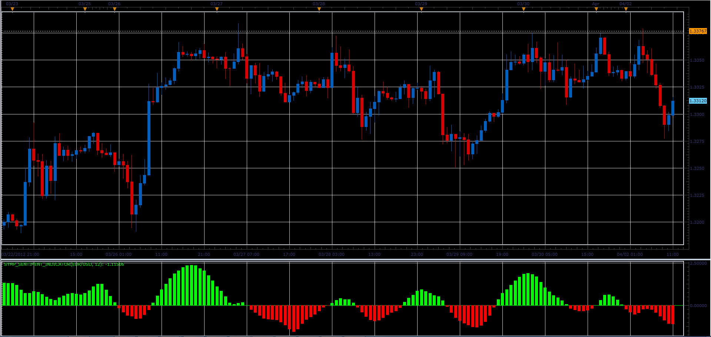
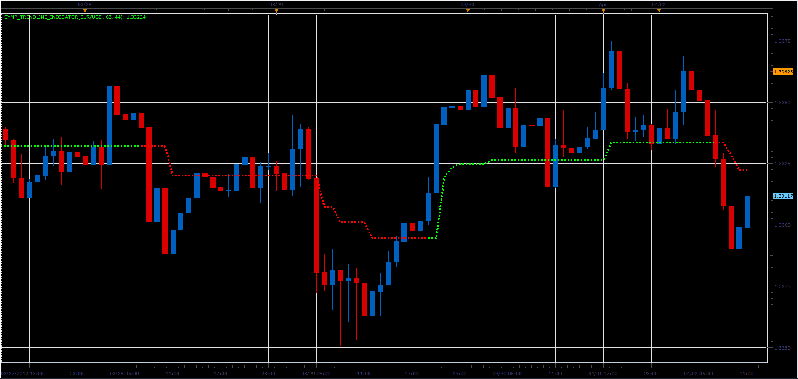
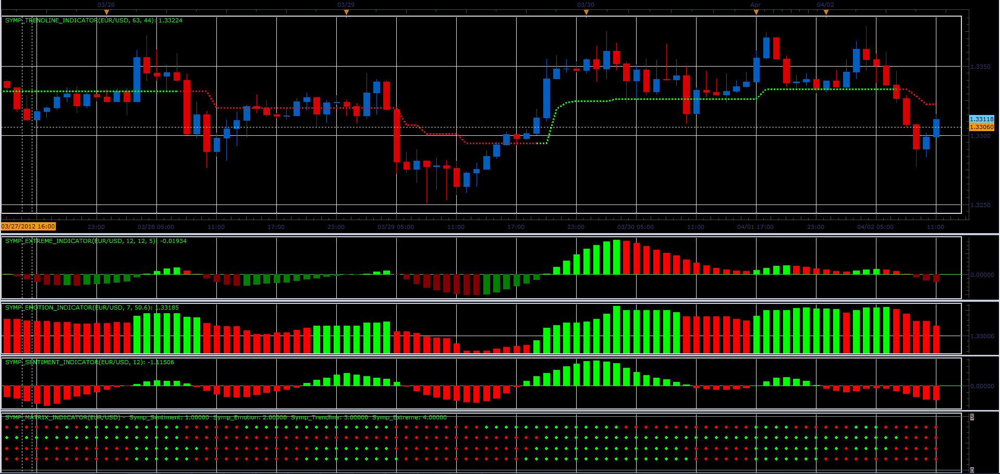

# "Symphonie" - family of indicators

> Source: https://fxcodebase.com/code/viewtopic.php?f=17&t=15511  
> Forum: 17 · Topic 15511 · 20 post(s)

---

## "Symphonie" - family of indicators

**Alexander.Gettinger** · Mon Apr 02, 2012 12:25 pm

"Symphonie" are a port of indicators from request [viewtopic.php?f=27&t=15366](https://fxcodebase.com/code/viewtopic.php?f=27&t=15366)

1. Symphonie Emotion indicator.

Formulas:
Symp_Emotion[i]=Max-(Max-Min)*Kmax/100, where
Max and Min are a maximum and minimum prices at range from [i-SSP] to [i].
If Symp_Emotion[i]>=Symp_Emotion[i-SSP], indicator is green, otherwise red.

 

Download:

 [Symp_Emotion_Indicator.lua](files/29225/Symp_Emotion_Indicator.lua)

The indicator was revised and updated

---

## Re: "Symphonie" - family of indicators

**Alexander.Gettinger** · Mon Apr 02, 2012 12:36 pm

2. Symphonie Extreme indicator.

Formulas:
Symp_Extreme=EMA(TVI) with [Period of EMA]=[u], where
TVI=100*(UpDEMA-DnDEMA)/(UpDEMA+DnDEMA),
UpDEMA=EMA(UpEMA) with [Period of EMA]=[s],
DnDEMA=EMA(DnEMA) with [Period of EMA]=[s],
UpEMA=EMA(UpTicks) with [Period of EMA]=[r],
DnEMA=EMA(DnTicks) with [Period of EMA]=[r],
UpTicks=Volume-(Close-Open)/[Size of pip],
DnTicks=Volume-UpTicks.

 

Download:

 [Symp_Extreme_Indicator.lua](files/29226/Symp_Extreme_Indicator.lua)

---

## Re: "Symphonie" - family of indicators

**Alexander.Gettinger** · Mon Apr 02, 2012 12:50 pm

3. Symphonie Sentiment indicator.

Formulas:
Symp_Sentiment[i]=(Ln((1+St[i])/(1-St[i]))+Symp_Sentiment[i-1])/2, where
Ln() - natural logarithm,
St[i]=0.66*((Median[i]-Min)/(Max-Min)-0.5)+0.67*St[i-1],
Max and Min are a maximum and minimum prices at range from [i-Period] to [i].

 

Download:

 [Symp_Sentiment_Indicator.lua](files/29227/Symp_Sentiment_Indicator.lua)

---

## Re: "Symphonie" - family of indicators

**Alexander.Gettinger** · Mon Apr 02, 2012 12:53 pm

4. Symphonie Trendline indicator.

Formulas:
Symp_Trendline=Low-ATR, if CCI>=0,
Symp_Trendline=High+ATR, if CCI<0.

 

Download:

 [Symp_Trendline_Indicator.lua](files/29228/Symp_Trendline_Indicator.lua)

---

## Re: "Symphonie" - family of indicators

**Alexander.Gettinger** · Mon Apr 02, 2012 12:59 pm

5. Symphonie Matrix indicator.

Heatmap of the Symphonie indicators.

 

Download:

 [Symp_Matrix_Indicator.lua](files/29230/Symp_Matrix_Indicator.lua)

For heatmap all previous indicators should be installed.

---

## Re: "Symphonie" - family of indicators

**Alexander.Gettinger** · Mon Apr 02, 2012 1:06 pm

Strategy based on Symphonie indicators: [viewtopic.php?f=31&t=15512](https://fxcodebase.com/code/viewtopic.php?f=31&t=15512)

---

## Re: "Symphonie" - family of indicators

**TheEdge** · Tue Apr 03, 2012 5:13 am

Hello,

Thanks for putting this all together I have some questions/comments/concerns.

Can you verify these Variables in relation to the MT4 indicator:

Symp_Extreme_Indicator
MT4 Value TS2 Value
UseFilterSMAorRSI 1 u 5
FilterStrengthSMA 12 s 12
FilterStrengthRSI 21 r 12

Is this the correct interpretation?

Which values determine the Filter SMA or RSI?

Also what happened to the other settings for the Extreme Indicator this ported version ([viewtopic.php?f=17&t=10152&p=21486&hilit=symphonie#p21486](https://fxcodebase.com/code/viewtopic.php?f=17&t=10152&p=21486&hilit=symphonie#p21486)) has all the settings but the new version here does not?

Symp_Matrix_Indicator

This indicator seems to be missing the Trendline Variables for ATR? Also, is missing the additional variables for the Extreme Indicator.

Although not posted here the SYMP_MATRIX_STRATEGY is also missing the additional variables.

The rules for trading this strategy are very dependent on all the indicators working together and "pointing" in the right direction. My only concern is that with so many variables missing or variables preset in the code I'm not sure of their settings.

Thanks Again

---

## Re: "Symphonie" - family of indicators

**Alexander.Gettinger** · Fri Apr 06, 2012 2:27 pm

Parameter "Period of ATR" does not affect the color of the indicator. Therefore, this parameter is not present in Matrix indicator and strategy.

---

## Re: "Symphonie" - family of indicators

**Alexander.Gettinger** · Fri Apr 06, 2012 2:31 pm

Symp_Extreme indicator and Symphonie extreme indicator ([viewtopic.php?f=17&t=10152&p=21486](https://fxcodebase.com/code/viewtopic.php?f=17&t=10152&p=21486)) are a different indicators. It can not be compared.

---

## Re: "Symphonie" - family of indicators

**BergenGlobal** · Wed May 23, 2012 9:58 am

Hello,

Thank you for developing the strategy. Can you explain what the "u" in the Extreme Indicator value is, and what the value represents for the MT4 version of the symphonie extreme indicator? Thank you.

---

## Re: "Symphonie" - family of indicators

**mjf1288** · Tue Jun 04, 2013 5:05 pm

I cannot get symphonie matrix to work. It keeps saying that I must add Symp emotion indicator, but I have already done that. Does anyone know what this issue is?

---

## Re: "Symphonie" - family of indicators

**Apprentice** · Wed Jun 05, 2013 2:57 am

For proper execution you need to install following three indicators.
1. SYMP_EMOTION_INDICATOR
2. SYMP_SENTIMENT_INDICATOR
3. SYMP_EXTREME_INDICATOR

---

## Re: "Symphonie" - family of indicators

**mjf1288** · Wed Jun 05, 2013 1:23 pm

> **Apprentice wrote:**
> For proper execution you need to install following three indicators.
> 1. SYMP_EMOTION_INDICATOR
> 2. SYMP_SENTIMENT_INDICATOR
> 3. SYMP_EXTREME_INDICATOR

Thanks for the reply. I understand that I need these indicators. As I have stated, I have already have all three installed, I get the error message that I need to install the emotion indicator, but it is already there. Is there any reason why it woould be saying this?

---

## Re: "Symphonie" - family of indicators

**BTrade** · Fri Aug 02, 2013 3:04 pm

Hello,

I was very happy to find that Symphonie matrix exists for Trading Station (I like the combination of both), but after I downloaded and installed the Symphonie, I noticed that the settings are different than the ones posted on Forex Factory forum for MT4.

Can someone help me get the correct settings for 5M and 15M timeframes? Or, if it is needed to update the code, please, can someone do that?

Attached are the latest MT4 file and table with settings for all timeframes.

 [Symphonie_Matrix_Indikator_v4.4h.ex4](files/87809/Symphonie_Matrix_Indikator_v4.4h.ex4)

 [Symphony settings.docx](files/87809/Symphony%20settings.docx)

A reply is greatly appreciated!!

Thanks in advance

---

## Re: "Symphonie" - family of indicators

**Apprentice** · Mon Aug 05, 2013 2:30 am

Do you have unencoded version of this Indicators

---

## Re: "Symphonie" - family of indicators

**spinemaligna** · Mon Aug 05, 2013 6:02 pm

I understand that the author of the Symphonie 4.4 will not release the mq4 version in case it gets "hijacked" which unfortunately means it cannot be ported over.
See this link for info [http://www.forexfactory.com/showthread. ... ost6280075](http://www.forexfactory.com/showthread.php?p=6280075#post6280075)

Ross

---

## Re: "Symphonie" - family of indicators

**Apprentice** · Thu Aug 08, 2013 2:41 am

Here u can find more on this topic
[http://www.forexfactory.com/showthread.php?t=343313](http://www.forexfactory.com/showthread.php?t=343313)

---

## Re: "Symphonie" - family of indicators

**DAVIDR** · Thu Oct 23, 2014 10:13 am

Hi, I downloaded the Symphonie Matrix.lua but when I tried to attach to chart up came the following error on Marketscope 2.0

Symp_matrix_Indicator.lua42: The indicator with id SYMP_EXTREME_INDICATOR is not found.

I tried this a couple of times but it still failed.

Any suggestions?

---

## Re: "Symphonie" - family of indicators

**Apprentice** · Thu Oct 23, 2014 2:34 pm

Symp_matrix_Indicator.lua uses SYMP_EXTREME_INDICATOR for internal calculations.
If you have not already, please download and install SYMP_EXTREME_INDICATOR to your TS.
That should fix your problem.

---

## Re: "Symphonie" - family of indicators

**Apprentice** · Sat Jul 01, 2017 5:49 am

The indicator was revised and updated.
