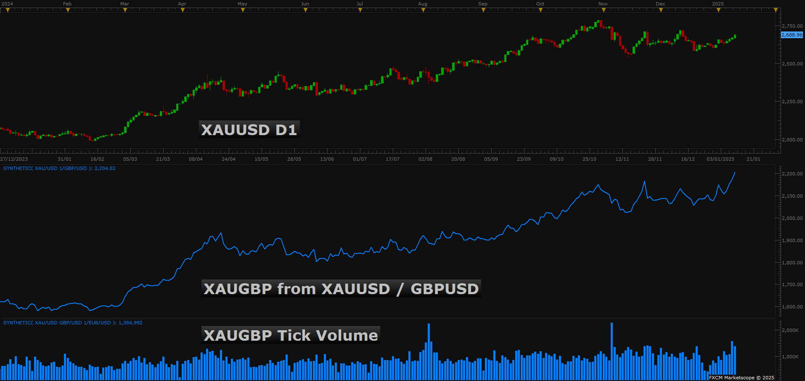
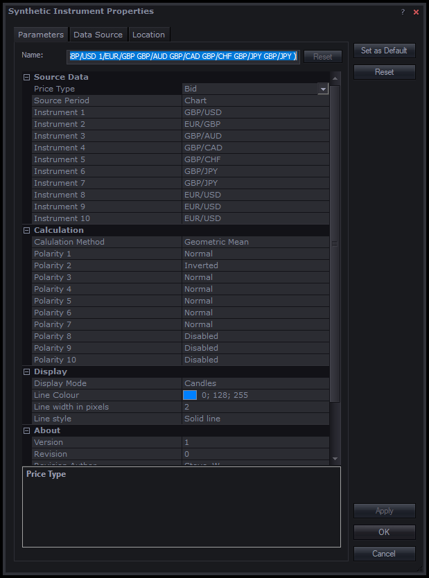
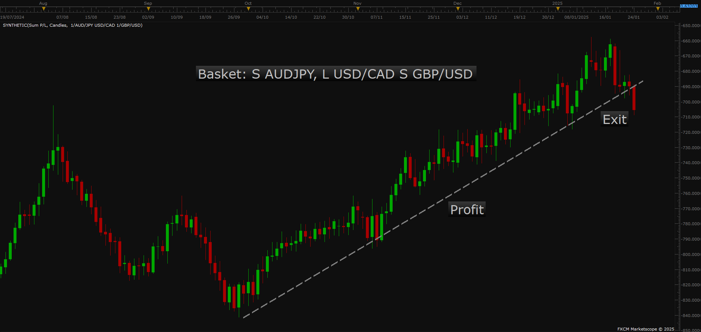
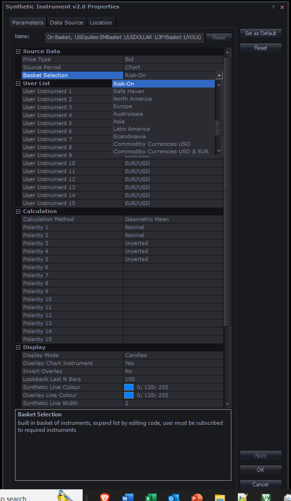

# Synthetic Instrument

> Source: https://fxcodebase.com/code/viewtopic.php?f=17&t=75486  
> Forum: 17 · Topic 75486 · 4 post(s)

---

## Synthetic Instrument

**Steve_W** · Sat Jan 11, 2025 8:27 am

Latest version - see post further below for info on directional volume

 [synthetic.lua](files/157753/synthetic.lua)

-----------------------------------------------------

This indicator allows the formulation of a synthetic instrument from a list of other instruments.
The method is similar to what is available on TradingView where you can enter a math function.
The indicator allows two modes: "Linear Product" or "Geometric Mean"

Linear product allows direct conversion of pairs to a new pair
For Example Gold in GBP: XAUGBP = XAUUSD / GBPUSD

Geometric Mean is more suitable to create an index of several components priced in different measurements (see Wikipedia for math description).
For example European Stocks = (GER30 x FRA40 x UK100 x ESP35 x ESTX50)^(1/5)
ie. the product of the Indices raised to the power of 0.2 ...as in 1/(number of instruments)

It can also be used to generate a currency strength:
GBP Strength = (GBPUSD / EURGBP x GBPCAD x GBPCHF x GBPAUD x GBPJPY x GBPNZD)^(1/7)
The numerators being GBP and denominators other currencies - in this case EURGBP is inverted as defined in indicator parameters.
USD Strength = (1/EURUSD / GBPUSD x USDCAD x USDCHF x USDJPY / AUDUSD / NZDUSD)^(1/7)
it could be extended by adding other currencies outside the Majors such a USDCNH, USDNOK, etc..
The code is limited to 10 currencies.
Edit this line at start of code to change: "local MAX_INSTRUMENTS = 10;"

Other ideas might be
Averaged Oil = (USOil x UKOil)^(1/2)
Oil not in Dollars = (USOil / USDOLLAR)
Scandinavia strength = (1/USDNOK / USDSEK / EURNOK / EURSEK)^(1/4)
and so on...

Examples of output shown below.
- the indicator allows bid/ask source data and for different timeframes
- output is selectable a candles, open, high, low, close, median, typical, weighted
- high/low are via an approximation so may not be accurate unless short timeframe data is used
- volume is also available via sum of sum of input instrument volumes
- output streams are available external to the indicator either as a candle stream or singly as a selected stream. This should allow adding existing indicators to the chart.

Hope it works - have fun

Steve

 [synthetic.lua](files/157753/synthetic%20%282%29.lua)

 

*Gold priced in GBP*

 

*European Stock Indices*

 

*European Stock Indices Tick Volume*

 

*GBP Currency Strength*

 

*Parameters*

---

## Re: Synthetic Instrument

**Steve_W** · Fri Jan 24, 2025 12:57 pm

Here's some code additions to the indicator

Added:
Sum Pips -useful for tracking net profit on a group of parallel trades
Sum P/L - as above but taking into account PipCost of each instrument
Harmonic Mean - another way of averaging
Overlay - main chart instrument may be added to indicator
% Change
Basket Options - a pre-defined list of instrument baskets to save having to configure each time

The basket options are:
Majors strength: "USD", "EUR", "GBP", "CAD", "AUD", "NZD", "JPY", "CHF"
Exotics strength: "NOK", "SEK", "ZAR", "HUF", "TRY"
Extended baskets: "USD Extended", "EUR Extended"
Stock indices by time zone: "US Stock Indices", "European Stock Indices", "Asia Stock Indices"
Risk on/off feeling: "Risk-On", "Safe Haven"
Currency strength by region: "North America", "Europe", "Australasia", "Asia", "Latin America", "Scandinavia"
Special currency baskets: "Commodity Currencies USD", "Commodity Currencies USD & EUR"
Oil: "Oil"
Gold etc..: "Monetary Metals", "Gold Majors", "Silver Majors"
Commodity Metals: "Metals Complex"
Commodity Softs: "Softs"

Baskets require specific instruments to be subscribed. The indicator will note which are missing. It shouldn't throw an error but the basket will be incomplete.

The actual construction of these baskets is down to personal preference - code is quite easy to edit. Geometric Mean is probably the go to averaging method - if using large diverse baskets - though often all methods give very similar output. Geometric mean has analogies with Log function and can provide linear trends or support/resistance in many cases, even though it may involve a large number of instruments.

Keep in mind the larger a basket and more instances of the indicator will possibly overload the application or bar-data availability. So generally, don't simultaneously use too many indicator instances with large baskets.

There are some bugs - the indicator sometimes requires refreshing - timeframe change or zooming out... work in progress

 [synthetic.lua](files/158006/synthetic.lua)

 

*SPX500 compared to risk-on basket*

 

*basket example in Sum P/L for three hypothetical trades*

 

*new parameter options*

---

## Re: Synthetic Instrument

**Steve_W** · Sat Jan 25, 2025 3:09 pm

Here's an updated version.
Hopefully code stability is improved - there were some errors causing occasional display hanging and some other bugs

Also a couple more additions: RMS, Heronian mean, energy complex

The instrument overlay function could be improved - at the moment it is based on max/min over a range but this is not totally optimal when comparing market over/under performance.

 [synthetic.lua](files/158011/synthetic.lua)

---

## Re: Synthetic Instrument

**Steve_W** · Thu Feb 13, 2025 7:01 pm

Latest update for this indicator
- it now includes a directional volume estimate
- some new pre-configured baskets
- bug fixes + code tidy - should be more solid on not crashing

The directional volume looks at volume for each component of the basket, together with the candle directions. The volumes are summed or subtracted depending on each candle direction.
The net result is then filtered to give overall +/-Ve volume.
Additionally each volume can be weighted via a ratio of |(Close-Open)/(High-Low)| which aims to represent the volume fraction that caused the Close-Open move.

The default parameters give coloured candles depending on volume direction - but this may be configured to off. Set EMA/MVA filter length to suit.
Price type used for directional volume may be changed to use: open/close/high/low/median/weighted/typical - this may help noise

With regards to basket selection options:
1) Chart Pair = main chart instrument separated into numerator and denominator pairs... so GBP/USD would be Geometric Mean of 6 GBP pairs, 6 1/USD pairs and GBP/USD = 13 pairs
Directional volume uses all 13 pairs to give overall directional volume consensus
The chart will look the same shape as GBP/USD but with more noise

2) Chart Pair Numerator: for GBP/USD would configure all GBP pairs - 7 off - GBP strength

3) Chart Pair Denominator: for GBP/USD would configure all USD pairs - 7 off - USD strength

4) Some new additional baskets pre-configured such as Gold/Silver, Dow/Gold, etc...

 [synthetic.lua](files/158243/synthetic.lua)

Examples below to illustrate how the directional volume works

 

*GBP/USD D1 showing directional volume via 13 pairs*

 

*XAU/USD / SPX400 H4 with directional volume via the the 2 instruments*
