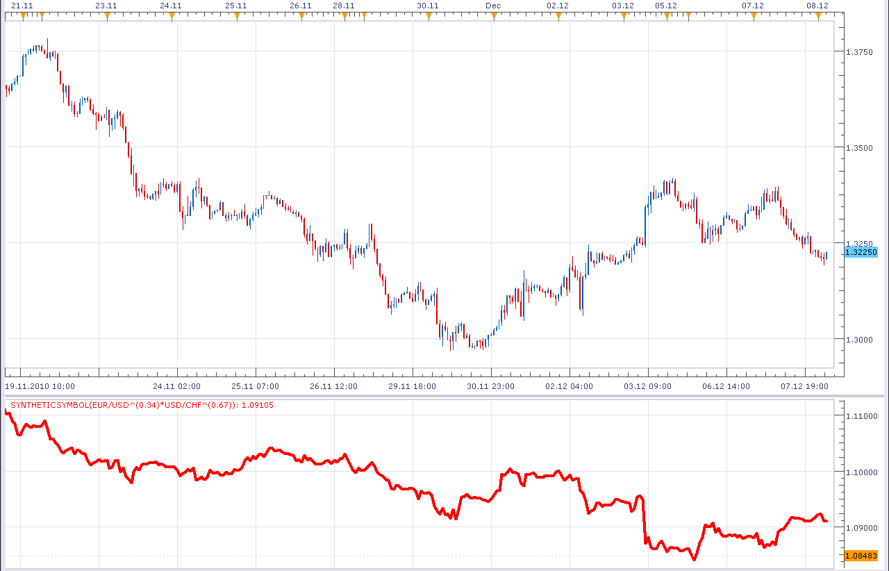
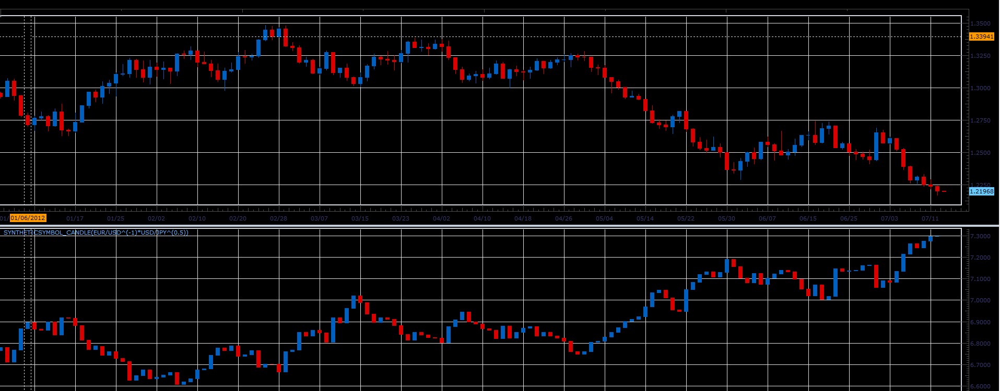
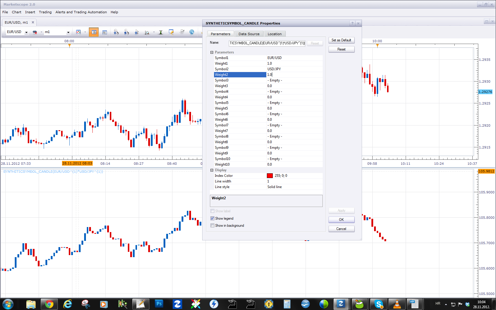

# Synthetic Symbol indicator.

> Source: https://fxcodebase.com/code/viewtopic.php?f=17&t=2900  
> Forum: 17 · Topic 2900 · 12 post(s)

---

## Synthetic Symbol indicator.

**Alexander.Gettinger** · Wed Dec 08, 2010 3:50 am

Indicator calculate synthetic symbol currency against a basket of currencies.
For EUR/USD, USD/JPY, GBP/USD, USD/CAD, USD/SEK, USD/CHF with their weightes can be calculated US dollar index ([viewtopic.php?f=17&t=609&p=4719](https://fxcodebase.com/code/viewtopic.php?f=17&t=609&p=4719)).

 

Download:

 [SyntheticSymbol.lua](files/6623/SyntheticSymbol.lua)

The indicator was revised and updated

---

## Re: Synthetic Symbol indicator.

**plastic_change** · Mon Sep 12, 2011 8:39 pm

Hi,

I am new here, so first thanks your effort guys programming these indicators.

Would it be possible to modify this indicator to show candlestick chart?

thanks

---

## Re: Synthetic Symbol indicator.

**Alexander.Gettinger** · Thu Jul 12, 2012 4:35 pm

Synthetic symbol indicator with candlestick chart.

 

Download:

 [SyntheticSymbol_Candle.lua](files/36823/SyntheticSymbol_Candle.lua)

---

## Re: Synthetic Symbol indicator.

**mjf1288** · Mon Nov 26, 2012 4:39 am

how do we figure out how the weights for any given basket? Don't these weights have to be recalculated on a regular basis?

---

## Re: Synthetic Symbol indicator.

**Apprentice** · Wed Nov 28, 2012 4:00 am

No need for recalculation.
Currency pairs and their weights are set by user.

---

## Re: Synthetic Symbol indicator.

**mjf1288** · Wed Nov 28, 2012 6:19 pm

> **Apprentice wrote:**
>
>
> Untitled.png
>
>
>
> No need for recalculation.
> Currency pairs and their weights are set by user.

right, I know the user sets the weights, but what I was asking was how the weights should be set. What basis are the weights for the basket set?

I think that if you are trying to hedge a synthetic symbol, the weights do need to be recalculated on a regular basis, due to the fact that the pairs in the basket may loose cointegration.

---

## Re: Synthetic Symbol indicator.

**Apprentice** · Thu Nov 29, 2012 4:05 am

Yes, I think that equal weight or one for all is the best choice for weights.

---

## Re: Synthetic Symbol indicator.

**Himalaya** · Tue May 21, 2013 2:14 am

I am able to download this file but when I try to import it I get an error. Am I doing something wrong?

Himalaya

---

## Re: Synthetic Symbol indicator.

**Apprentice** · Tue May 21, 2013 5:17 am

Bug is eliminated.

---

## Re: Synthetic Symbol indicator.

**Himalaya** · Tue May 21, 2013 9:35 am

Mnogo Hvala Apprentice

The FXCM brand is Greatly enhanced by yourself and the others performing the services that you are.

Himalaya

---

## Re: Synthetic Symbol indicator.

**Himalaya** · Wed Jul 24, 2013 6:24 pm

Apprentice,

Is there any way that this indicator could be made to plot in real time instead of lagging by 1 bar?

Thanks in advance,
Himalaya

---

## Re: Synthetic Symbol indicator.

**Apprentice** · Thu Jun 01, 2017 10:41 am

Indicator was revised and updated.
