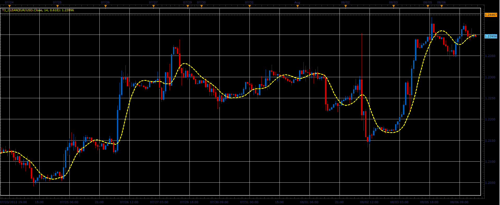

# T3 Clean indicator

> Source: https://fxcodebase.com/code/viewtopic.php?f=17&t=22108  
> Forum: 17 · Topic 22108 · 3 post(s)

---

## T3 Clean indicator

**Alexander.Gettinger** · Mon Aug 06, 2012 4:41 pm

This indicator is a ported MQL4 indicator from [viewtopic.php?f=27&t=21695](https://fxcodebase.com/code/viewtopic.php?f=27&t=21695)

Formulas:
T3[i]=c1*ae6[i]+c2*ae5[i]+c3*ae4[i]+c4*ae3[i], where
ae6[i]=w1*ae5[i]+w2*ae6[i-1],
ae5[i]=w1*ae4[i]+w2*ae5[i-1],
ae4[i]=w1*ae3[i]+w2*ae4[i-1],
ae3[i]=w1*ae2[i]+w2*ae3[i-1],
ae2[i]=w1*ae1[i]+w2*ae2[i-1],
ae1[i]=w1*Price[i]+w2*ae1[i-1],
c1=-b*b*b,
c2=3*(b*b+b*b*b),
c3=-3*(2*b*b+b+b*b*b),
c4=1+3*b+b*b*b+3*b*b,
w1=4/(3+Period),
w2=1-w1.

 

Download:

 [T3_Clean.lua](files/38282/T3_Clean.lua)

The indicator was revised and updated

---

## Re: T3 Clean indicator

**biggiesmalls** · Wed Aug 08, 2012 7:34 am

Thanks Alexander

---

## Re: T3 Clean indicator

**Apprentice** · Thu Apr 06, 2017 4:07 pm

Indicator was revised and updated.
