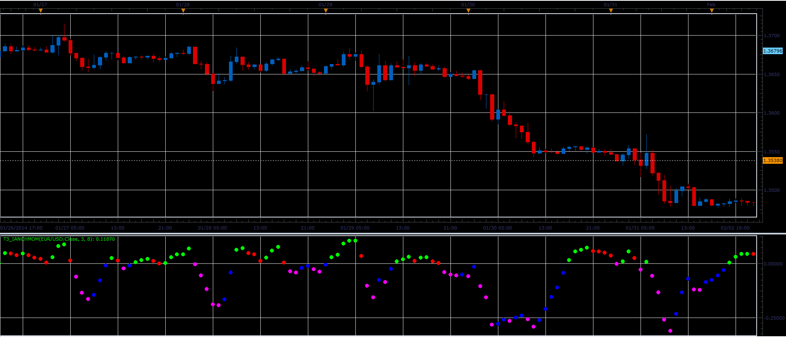

# T3_iAnchMom oscillator

> Source: https://fxcodebase.com/code/viewtopic.php?f=17&t=60365  
> Forum: 17 · Topic 60365 · 2 post(s)

---

## T3_iAnchMom oscillator

**Alexander.Gettinger** · Thu Feb 27, 2014 10:50 am

This indicator is a ported MQL5 indicator from [http://www.mql5.com/ru/code/2076](http://www.mql5.com/ru/code/2076) (in Russian).

 

Download:

 [T3_iAnchMom.lua](files/92926/T3_iAnchMom.lua)

The indicator was revised and updated

---

## Re: T3_iAnchMom oscillator

**Apprentice** · Fri Jun 02, 2017 6:50 am

Indicator was revised and updated.
