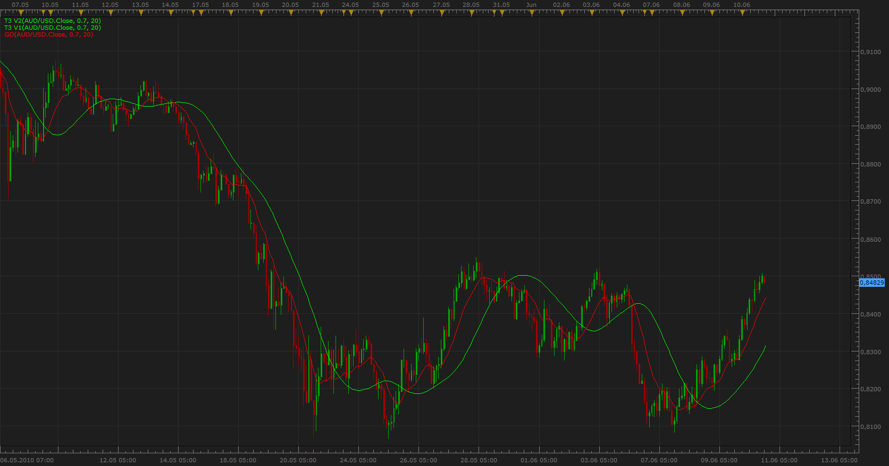
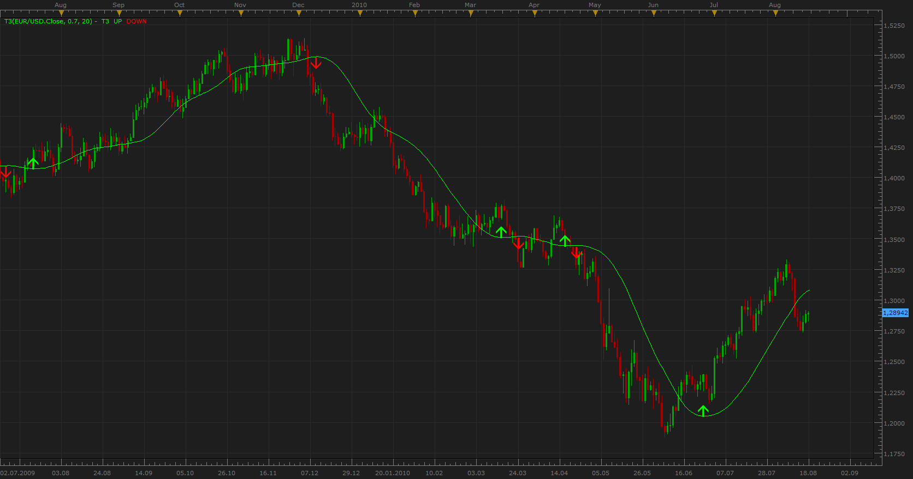

# T3 moving average & Generalized DEMA

> Source: https://fxcodebase.com/code/viewtopic.php?f=17&t=1302  
> Forum: 17 · Topic 1302 · 26 post(s)

---

## T3 moving average & Generalized DEMA

**Apprentice** · Thu Jun 10, 2010 5:07 pm

*T3*

**T3 moving average**
T3 moving average is presented by Tim Tillson in S&C Magazine, 01/1998
Is a triple smoothed combination of the DEMA

T3 advantages
Less lag time, Line is much smoother, gives early entry signals, have smaller number of false signals.

**Generalized DEMA**
 GD[period] = (1-v)*EMA[period] + v*DEMA[period]

T3 Average apply Generalized DEMA three times.

T3[period] = GD[period] of GD[period] of GD[period]

**Volume factor**

A “volume factor” (default 0.7) controls how much of the DEMA is used.
The factor ranges from 0 which gives a plain EMA and 1 which gives a full DEMA.

0 - T3 is simply a tripled EMA (see EMA of EMA of EMA).
1 - T3 is a DEMA of DEMA of DEMA

 [T3.lua](files/2487/T3.lua)

 [GD.lua](files/2487/GD.lua)

The indicator was revised and updated

---

## Re: T3 moving average & Generalized DEMA

**Apprentice** · Thu Jun 10, 2010 5:18 pm

This is another implementation of this indicator, it gives the same final results.

**Calculation**
Volume factor = b;

EMA1[period]= EMA(Source);
EMA2[period]= EMA(EMA1[period]);
EMA3[period]= EMA(EMA2[period]);
EMA4[period]= EMA(EMA3[period]);
EMA5[period]= EMA(EMA4[period]);
EMA6[period]= EMA(EMA5[period]);

c1= -b*b*b;
c2= 3*b*b+3*b*b*b;
c3= -6*b*b-3*b-3*b*b*b;
c4= 1+3*b+b*b*b+3*b*b;
T3MA= c1*EMA6[period]+c2*EMA5[period]+c3*EMA4[period]+c4*EMA3[period];

 [T3 v2.lua](files/2489/T3%20v2.lua)

---

## Re: T3 moving average & Generalized DEMA

**Apprentice** · Fri Jun 11, 2010 9:11 am

T3 Moving Averege name Update

---

## Re: T3 moving average & Generalized DEMA

**Apprentice** · Wed Aug 18, 2010 5:06 am

Added arrow option.

 [T3.lua](files/3702/T3.lua)

---

## Re: T3 moving average & Generalized DEMA

**Hailkayy** · Mon Apr 16, 2012 6:29 pm

Hey yow apprentice what'sup ?!
Nice breakfast ?!

Was exploring this website resources, fantastic mate lol.
Ok i checked this and i liked it

Could you produce T3 Overlay ? I Like what's clear and beautiful, are you beautiful ?
Lol just kidding
Thanks mate

---

## Re: T3 moving average & Generalized DEMA

**Apprentice** · Tue Apr 17, 2012 3:37 am

T3 & GD, moving averages are supported.
There are two methods.
The position of the closing price in relation to the moving average,
Moving average slope.

 [T3 Overlay.lua](files/30196/T3%20Overlay.lua)

---

## Re: T3 moving average & Generalized DEMA

**Hailkayy** · Tue Apr 17, 2012 6:45 pm

Much thanks.

---

## Re: T3 moving average & Generalized DEMA

**rtsayers** · Mon Apr 23, 2012 4:10 pm

I would love to see a strategy based on these indicators! Thanks

---

## Re: T3 moving average & Generalized DEMA

**Apprentice** · Tue Apr 24, 2012 2:34 am

Can you define Entry, Exit Signals.

---

## Re: T3 moving average & Generalized DEMA

**rtsayers** · Tue Apr 24, 2012 12:23 pm

I would like the entry:

GD crosses over T3 for a buy
T3 crosses over GD for a sell
Exit the trade when the next buy or sell happens then into the new trade.

Thanks

---

## Re: T3 moving average & Generalized DEMA

**Apprentice** · Wed Apr 25, 2012 4:30 am

Requested can be found here.
[viewtopic.php?f=31&t=16943](https://fxcodebase.com/code/viewtopic.php?f=31&t=16943)

---

## Re: T3 moving average & Generalized DEMA

**Apprentice** · Thu Aug 16, 2012 12:54 pm

This indicator provides Audio & Email Alerts.
If we have Price / Line1 or Price / line2 and Line1/Line2 Crossover.

 [T3 Cross.lua](files/38772/T3%20Cross.lua)

Compatibility issue fixed.
_Alert Helper is not longer needed.

---

## Re: T3 moving average & Generalized DEMA

**texbill79** · Thu Aug 16, 2012 8:15 pm

Thank You! This looks to be perfect. I haven't got it to give an alarm yet...still waiting, sure it will though, thanks. This will be very helpful

Thank you, Bill

---

## Re: T3 moving average & Generalized DEMA

**biggiesmalls** · Mon Aug 20, 2012 9:19 am

I have been testing out the indicator and when I turn on the arrow feature, I have had some minor repainting of the arrows. Is this normal for this indicator? What are the requirements for the indicator to give an arrow/signal?

---

## Re: T3 moving average & Generalized DEMA

**virgilio** · Tue Aug 21, 2012 6:05 pm

Is it possible to include the T3 moving average amongst the possible options for the STRATEGY BUILDER?
Thank you in advance.

---

## Re: T3 moving average & Generalized DEMA

**Apprentice** · Wed Aug 22, 2012 1:47 am

Your request is added to the development list.

---

## Re: T3 moving average & Generalized DEMA

**virgilio** · Wed Aug 22, 2012 2:48 pm

Thank you!

---

## Re: T3 moving average & Generalized DEMA

**fxcode000** · Fri Jan 25, 2013 12:30 pm

Hi everyone. Can anyone help? When I import this indicator into the Trading Station II, I get the following error message ([string "T3.lua"]:52: The indicator with id GD is not found). Any information will be gladly received. thanks

---

## Re: T3 moving average & Generalized DEMA

**Apprentice** · Mon Jan 28, 2013 1:49 pm

Please download and install GD indicator.
You can find it on first, topmost post on this topic.

---

## Re: T3 moving average & Generalized DEMA

**Apprentice** · Sun Sep 07, 2014 3:07 am

Style Option Added.

---

## Re: T3 moving average & Generalized DEMA

**Alexander.Gettinger** · Fri Feb 20, 2015 5:39 pm

MQL4 version of indicators: [viewtopic.php?f=38&t=61849](https://fxcodebase.com/code/viewtopic.php?f=38&t=61849).

---

## Re: T3 moving average & Generalized DEMA

**Apprentice** · Tue Apr 21, 2015 5:20 am

Bump Up.

---

## Re: T3 moving average & Generalized DEMA

**Apprentice** · Mon Dec 07, 2015 7:54 am

Compatibility issue fixed.
_Alert Helper is not longer needed.

---

## Re: T3 moving average & Generalized DEMA

**Apprentice** · Fri May 06, 2016 3:29 am

MT4 version is available here.
[viewtopic.php?f=38&t=63063&p=106118#p106118](https://fxcodebase.com/code/viewtopic.php?f=38&t=63063&p=106118#p106118)

---

## Re: T3 moving average & Generalized DEMA

**Apprentice** · Sat Nov 05, 2016 5:11 am

Major update.

---

## Re: T3 moving average & Generalized DEMA

**Apprentice** · Sun Feb 19, 2017 3:08 pm

Indicator was revised and updated.
