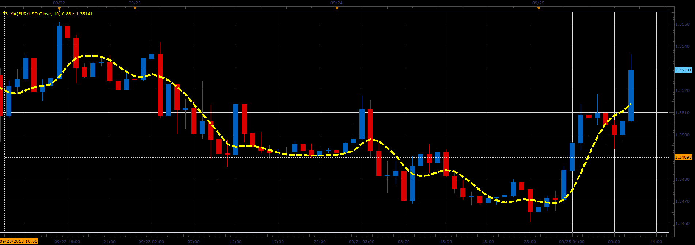

# T3 moving average

> Source: https://fxcodebase.com/code/viewtopic.php?f=17&t=59576  
> Forum: 17 · Topic 59576 · 6 post(s)

---

## T3 moving average

**Alexander.Gettinger** · Wed Sep 25, 2013 2:19 pm

The T3 MA is an adaptive moving average created by Tim Tillson and presented in his article "Smoothing techniques for more accurate signals."

Formulas:
T3 MA = c1*EMA6+c2*EMA5+c3*EMA4+c4*EMA3, where
EMA6 = EMA(EMA5),
EMA5 = EMA(EMA4),
EMA4 = EMA(EMA3),
EMA3 = EMA(EMA2),
EMA2 = EMA(EMA1),
EMA1 - EMA(Price),
c1 = -b^3,
c2 = 3*(b^2+b^3),
c3 = -3*(2*b^2+b+b^3),
c4 = 1+3*b+b^3+3*b^2.

 

Download:

 [T3_MA.lua](files/89688/T3_MA.lua)

The indicator was revised and updated

---

## Re: T3 moving average

**Alexander.Gettinger** · Wed Sep 25, 2013 2:21 pm

MQL4 version of T3 moving average: [viewtopic.php?f=38&t=59577](https://fxcodebase.com/code/viewtopic.php?f=38&t=59577).

---

## Re: T3 moving average

**mulligan** · Mon Oct 14, 2013 2:04 pm

This is a fantastic indicator. A simple strategy of buy or sell as it moves up or down would be greatly appreciated if you have the time. Thanks for the tools you provide for us.

---

## Re: T3 moving average

**Apprentice** · Thu Oct 17, 2013 3:34 am

Your request is added to the development list.

---

## Re: T3 moving average

**Apprentice** · Fri Nov 08, 2013 6:11 am

Requested can be found here.
[viewtopic.php?f=31&t=59818](https://fxcodebase.com/code/viewtopic.php?f=31&t=59818)

---

## Re: T3 moving average

**Apprentice** · Sat Jun 17, 2017 3:50 am

The indicator was revised and updated.
