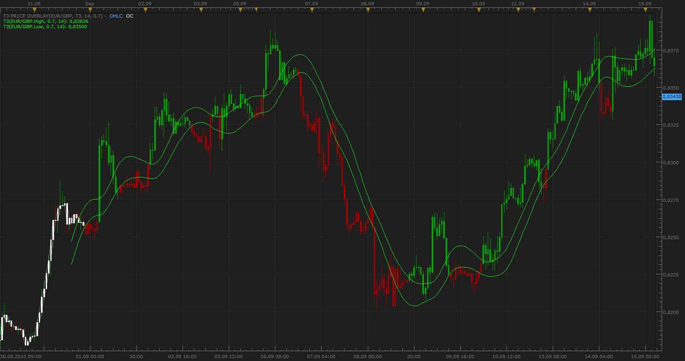

# T3 Price OverLay

> Source: https://fxcodebase.com/code/viewtopic.php?f=17&t=2217  
> Forum: 17 · Topic 2217 · 2 post(s)

---

## T3 Price OverLay

**Apprentice** · Sun Sep 19, 2010 4:29 am

Long (GREEN)
Cross of Close above T3 applied on High

Short (RED)
Cross of Close below T3 applied on Low

 [T3 Price Overlay.lua](files/4619/T3%20Price%20Overlay.lua)

In order for this indicator work, please install the T3 and GD indicators, which can be found here.
[http://www.fxcodebase.com/code/viewtopi ... =17&t=1302](http://www.fxcodebase.com/code/viewtopic.php?f=17&t=1302)

The indicator was revised and updated

MT4/MQ4 version is available here.
[viewtopic.php?f=38&t=64060](https://fxcodebase.com/code/viewtopic.php?f=38&t=64060)

---

## Re: T3 Price OverLay

**Apprentice** · Sat Nov 05, 2016 5:07 am

Major update.
