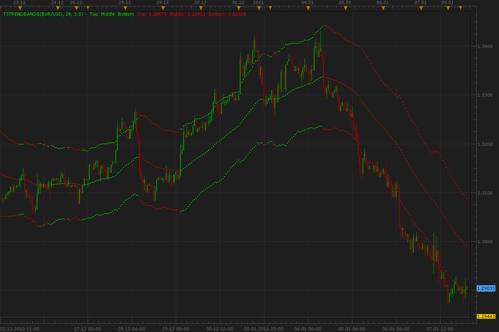
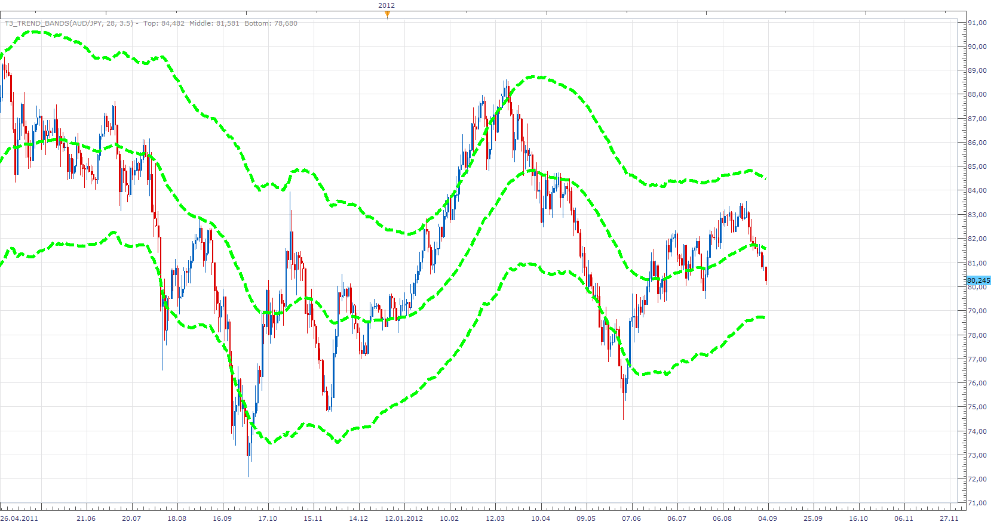

# T3Trend Bands

> Source: https://fxcodebase.com/code/viewtopic.php?f=17&t=3128  
> Forum: 17 · Topic 3128 · 8 post(s)

---

## T3Trend Bands

**Alexander.Gettinger** · Mon Jan 10, 2011 4:25 am

Formulas:
MiddleLine[i]=(MiddleLine[i-1]*(BandBars-1)+Close[i])/BandBars,
TopLine[i]=MiddleLine[i]+SmoothRange[i],
BottomLine[i]=MiddleLine[i]-SmoothRange[i], where
SmoothRange[i]=(SmoothRange[i-1]*(BandBars-1)+High[i]-Low[i])/BandBars.

MiddleLine[0]=Close[0],
SmoothRange[0]=High[0]-Low[0].

 



Download:

 [T3TrendBands.lua](files/7304/T3TrendBands.lua)

The indicator was revised and updated

---

## Re: T3Trend Bands

**aytacasan** · Mon Jan 10, 2011 8:48 pm

Sory but translation is not true. I translate but there is a bug but i don't find it. Can you help me?

---

## Re: T3Trend Bands

**aytacasan** · Mon Jan 10, 2011 8:51 pm

Sory but translation is not true. I translate but there is a bug and i can't fix it. Can you help me?

**INDICATOR CODE:**

```lua
-- Indicator profile initialization routine
-- Defines indicator profile properties and indicator parameters
-- TODO: Add minimal and maximal value of numeric parameters and default color of the streams
function Init()
    indicator:name(resources:get("name"));
    indicator:description(resources:get("description"));
    indicator:requiredSource(core.Bar);
    indicator:type(core.Indicator);
    indicator:setTag("group", "İndikatörlerim");

    indicator.parameters:addGroup("Calculation");
    indicator.parameters:addInteger("BandDays", resources:get("param_BandDays_name"), resources:get("param_BandDays_description"), 28);
    indicator.parameters:addDouble("DevConstant", resources:get("param_DevConstant_name"), resources:get("param_DevConstant_description"), 3.5);
    indicator.parameters:addGroup("Style");
    indicator.parameters:addColor("TrendBandTop_color", resources:get("param_TrendBandTop_color_name"), resources:get("param_TrendBandTop_color_description"), core.rgb(0, 0, 0));
    indicator.parameters:addInteger("TrendBandTop_width", resources:get("param_TrendBandTop_width_name"), resources:get("param_TrendBandTop_width_description"), 2, 1, 5);
    indicator.parameters:addInteger("TrendBandTop_style", resources:get("param_TrendBandTop_style_name"), resources:get("param_TrendBandTop_style_description"), core.LINE_SOLID);
    indicator.parameters:setFlag("TrendBandTop_style", core.FLAG_LINE_STYLE);
    indicator.parameters:addColor("TrendBandMiddle_colorUp", resources:get("param_TrendBandMiddle_colorUp_name"), resources:get("param_TrendBandMiddle_colorUp_description"), core.rgb(0, 255, 0));
    indicator.parameters:addColor("TrendBandMiddle_colorDown", resources:get("param_TrendBandMiddle_colorDown_name"), resources:get("param_TrendBandMiddle_colorDown_description"), core.rgb(255, 0, 255));
    indicator.parameters:addInteger("TrendBandMiddle_width", resources:get("param_TrendBandMiddle_width_name"), resources:get("param_TrendBandMiddle_width_description"), 2, 1, 5);
    indicator.parameters:addInteger("TrendBandMiddle_style", resources:get("param_TrendBandMiddle_style_name"), resources:get("param_TrendBandMiddle_style_description"), core.LINE_SOLID);
    indicator.parameters:setFlag("TrendBandMiddle_style", core.FLAG_LINE_STYLE);
    indicator.parameters:addColor("TrendBandBottom_color", resources:get("param_TrendBandBottom_color_name"), resources:get("param_TrendBandBottom_color_description"), core.rgb(0, 0, 0));
    indicator.parameters:addInteger("TrendBandBottom_width", resources:get("param_TrendBandBottom_width_name"), resources:get("param_TrendBandBottom_width_description"), 2, 1, 5);
    indicator.parameters:addInteger("TrendBandBottom_style", resources:get("param_TrendBandBottom_style_name"), resources:get("param_TrendBandBottom_style_description"), core.LINE_SOLID);
    indicator.parameters:setFlag("TrendBandBottom_style", core.FLAG_LINE_STYLE);
end

-- Indicator instance initialization routine
-- Processes indicator parameters and creates output streams
-- TODO: Refine the first period calculation for each of the output streams.
-- TODO: Calculate all constants, create instances all subsequent indicators and load all required libraries
-- Parameters block
local BandDays;
local DevConstant;

local first;
local source = nil;

-- Streams block
local TrendBandTop = nil;
local TrendBandMiddleUp = nil;
local TrendBandMiddleDown = nil;
local TrendBandBottom = nil;

-- Routine
function Prepare()
    BandDays = instance.parameters.BandDays;
    DevConstant = instance.parameters.DevConstant;
    source = instance.source;
    first = source:first();

    local name = profile:id() .. "(" .. source:name() .. ", " .. BandDays .. ", " .. DevConstant .. ")";
    instance:name(name);
    TrendBandTop = instance:addStream("TrendBandTop", core.Line, name .. ".TrendBandTop", "TrendBandTop", instance.parameters.TrendBandTop_color, first);
    TrendBandTop:setWidth(instance.parameters.TrendBandTop_width);
    TrendBandTop:setStyle(instance.parameters.TrendBandTop_style);
    TrendBandMiddleUp = instance:addStream("TrendBandMiddleUp", core.Line, name .. ".TrendBandMiddleUp", "TrendBandMiddleUp", instance.parameters.TrendBandMiddle_colorUp, first);
    TrendBandMiddleUp:setWidth(instance.parameters.TrendBandMiddle_width);
    TrendBandMiddleUp:setStyle(instance.parameters.TrendBandMiddle_style);
    TrendBandMiddleDown = instance:addStream("TrendBandMiddleDown", core.Line, name .. ".TrendBandMiddleDown", "TrendBandMiddleDown", instance.parameters.TrendBandMiddle_colorDown, first);
    TrendBandMiddleDown:setWidth(instance.parameters.TrendBandMiddle_width);
    TrendBandMiddleDown:setStyle(instance.parameters.TrendBandMiddle_style);
    TrendBandBottom = instance:addStream("TrendBandBottom", core.Line, name .. ".TrendBandBottom", "TrendBandBottom", instance.parameters.TrendBandBottom_color, first);
    TrendBandBottom:setWidth(instance.parameters.TrendBandBottom_width);
    TrendBandBottom:setStyle(instance.parameters.TrendBandBottom_style);
end

local serial = nil;
local bOBLow = 0.0;
local bOBHigh = 0.0;
local expSmoothPrice = 0;
local expSmoothRange = 0;
local crossOver = false;
local crossUnder = false;
local directionUp = false;

-- Indicator calculation routine
-- TODO: Add your code for calculation output values
function Update(period)
    if period > first and source:hasData(period - 1) and serial ~= source:serial(period) then
        if period == first + 1 then
            expSmoothPrice = source.close[period - 1];
            expSmoothRange = source.high[period - 1] - source.low[period - 1];
            if source.open[period - 1] > expSmoothPrice then
                directionUp = true;
            end
        else
            expSmoothPrice = (expSmoothPrice * (BandDays - 1) + source.close[period - 1]) / BandDays;
            expSmoothRange = (expSmoothRange * (BandDays - 1) + (source.high[period - 1] - source.low[period - 1])) / BandDays;
        end

        TrendBandTop[period] = expSmoothPrice + (expSmoothRange * DevConstant);
        if directionUp then
            TrendBandMiddleUp[period] = expSmoothPrice;
        else
            TrendBandMiddleDown[period] = expSmoothPrice;
        end
        TrendBandBottom[period] = expSmoothPrice - (expSmoothRange * DevConstant);

        if bOBHigh > 0 and source.close[period - 1] > bOBHigh then
            directionUp = true;
            bOBHigh = 0;
        elseif bOBLow > 0 and source.close[period - 1] < bOBLow then
            directionUp = false;
            bOBLow = 0;
        end
         
        if crossOver and source.high[period - 1] >= expSmoothPrice and source.low[period - 1] >= expSmoothPrice then
            bOBHigh = source.high[period - 1];
            crossOver = false;
        elseif crossUnder and source.high[period - 1] <= expSmoothPrice and source.low[period - 1] <= expSmoothPrice then
            bOBLow = source.low[period - 1];
            crossUnder = false;
        end

        if directionUp and core.crossesUnder(source.close, TrendBandMiddleUp, 1) then
            crossUnder = true;
        elseif not(directionUp) and core.crossesOver(source.close, TrendBandMiddleDown, 1) then
            crossOver = true;
        end

        serial = source:serial(period);
    end
end

[b]RESOURCE CODE:[/b]

default=enu
[enu]
codepage=1252
name=TrendBands
description=TrendBands
param_BandDays_name=BandDays
param_BandDays_description=BandDays
param_DevConstant_name=DevConstant
param_DevConstant_description=DevConstant
param_TrendBandTop_color_name=Color of TrendBandTop
param_TrendBandTop_color_description=Color of TrendBandTop
param_TrendBandTop_width_name=Width of TrendBandTop
param_TrendBandTop_width_description=Width of TrendBandTop
param_TrendBandTop_style_name=Style of TrendBandTop
param_TrendBandTop_style_description=Style of TrendBandTop
param_TrendBandMiddle_colorUp_name=Up Color of TrendBandMiddle
param_TrendBandMiddle_colorUp_description=Up Color of TrendBandMiddle
param_TrendBandMiddle_colorDown_name=Down Color of TrendBandMiddle
param_TrendBandMiddle_colorDown_description=Down Color of TrendBandMiddle
param_TrendBandMiddle_width_name=Width of TrendBandMiddle
param_TrendBandMiddle_width_description=Width of TrendBandMiddle
param_TrendBandMiddle_style_name=Style of TrendBandMiddle
param_TrendBandMiddle_style_description=Style of TrendBandMiddle
param_TrendBandBottom_color_name=Color of TrendBandBottom
param_TrendBandBottom_color_description=Color of TrendBandBottom
param_TrendBandBottom_width_name=Width of TrendBandBottom
param_TrendBandBottom_width_description=Width of TrendBandBottom
param_TrendBandBottom_style_name=Style of TrendBandBottom
param_TrendBandBottom_style_description=Style of TrendBandBottom
```

---

## Re: T3Trend Bands

**Alexander.Gettinger** · Wed Jan 12, 2011 5:25 am

I not found error in your indicator. At me it works.
My indicator corresponds to your now.

---

## Re: T3Trend Bands

**aytacasan** · Wed Jan 12, 2011 7:25 am

Alexander i examine your indicator and it is completely wrong. My indicator source right but there is bug. Bug is middle band color not changing correctly. I try to explain concept. Also I added attachment that I wrote this indicator for Ninja Trader Trading Platform and working correctly.

**CAB**= Cross Above Bar (**When trend is down**, cross above middle band bar is CAB)
**CBB**= Cross Below Bar (**When trend is up**, cross below middle band bar is CBB)
**BOB**= Break of Bar (**After cross** which bar compalitly above or below middle band)
**COB**= Continuation Bar (**After BOB detection**, which bar closed higher or lower BOB high or low)

---

## Re: T3Trend Bands

**briansummy** · Mon Sep 03, 2012 12:36 pm

Neat indicator. Can you add the option to increase dot width? I'll try changing color for now. Thanks!

---

## Re: T3Trend Bands

**Apprentice** · Mon Sep 03, 2012 1:34 pm



Style Option Added.

 [T3_Trend_Bands.lua](files/39581/T3_Trend_Bands.lua)

---

## Re: T3Trend Bands

**Apprentice** · Wed Apr 12, 2017 5:31 am

Indicator was revised and updated.
